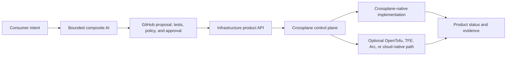

# AI-Powered Infrastructure as a Product — Marketplace Edition

> **IaaS is what we buy; infrastructure-as-a-product is what we build.**

## Why this accelerator

- **Product contract first:** Consumers request governed outcomes rather than Terraform modules, TFE workspaces, state backends, or provider-native resource kinds.
- **Composite AI with bounded authority:** Specialized agents can interpret intent, review proposals, diagnose sanitized status, and assemble evidence without direct infrastructure write access.
- **Crossplane product control plane:** Stable product APIs can select and continuously reconcile AWS, GCP, Azure, Kubernetes, or alternative implementation paths.
- **Replaceable execution:** Crossplane-native providers, OpenTofu, Terraform, TFE, cloud-native APIs, Azure Arc, and GitOps can be used where they add value behind the contract.
- **Evidence first:** Product requests, policy, approvals, reconciliation, operations, and teardown can emit machine-readable proof.
- **Offline and credential-free entry point:** The bounded POC portfolio can validate contracts, policy, AI authority, and simulated reconciliation before live-cloud credentials are introduced.
- **Product discipline:** Product ownership, contract, lifecycle, runbooks, known errors, roadmap, evidence, and investment decisions are treated as first-class deliverables.

## Architecture

## POC portfolio

| Repository | Role |
|---|---|
| [`crossplane-multicloud-seed-poc`](https://github.com/SAABOLImpactVenture/crossplane-multicloud-seed-poc) | Minimal trusted Crossplane seed. |
| [`multicloud-foundation-product-poc`](https://github.com/SAABOLImpactVenture/multicloud-foundation-product-poc) | Stable AWS/GCP `CloudFoundationEnvironment` product contract. |
| [`composite-ai-infrastructure-product-poc`](https://github.com/SAABOLImpactVenture/composite-ai-infrastructure-product-poc) | Bounded request, review, operations, and evidence agents. |
| [`multicloud-foundation-poc-integration`](https://github.com/SAABOLImpactVenture/multicloud-foundation-poc-integration) | Credential-free integrated acceptance and evidence harness. |
| [`ai-powered-infrastructure-as-a-product`](https://github.com/SAABOLImpactVenture/ai-powered-infrastructure-as-a-product) | Thesis, architecture, operating model, and preserved accelerator assets. |

## Preserved accelerator capabilities

The repository continues to include useful prior implementation assets:

- Backstage catalog and scaffolder patterns;
- Terraform modules and policy tests;
- Azure Arc onboarding and GitOps;
- MCP concepts and agent workflows;
- OPA, Gatekeeper, Kyverno, Checkov, and TFLint;
- Cosign, SBOM, and provenance controls;
- observability and evidence pipelines; and
- OSCAL-oriented compliance material.

These assets are preserved as optional implementation patterns rather than presented as the only strategic architecture.

## Evaluation stages

| Stage | Evidence question |
|---|---|
| Credential-free POC | Can the seed, product contract, bounded AI, policy, reconciliation, evidence, and teardown operate without TFE or cloud credentials? |
| Live sandbox | Can the same product contract create and operate real AWS and GCP resources through workload identity? |
| Live model | Does model-backed composite AI improve outcomes without expanding authority? |
| Execution comparison | How do Crossplane-native, TFE-centered, and retained-HCL/OpenTofu paths compare using the same observed scenarios? |
| Investment decision | Does TFE's residual unique value justify platform-level lifecycle cost? |

## Try it now

Start with the repository documentation and the bounded POC chain rather than assuming live-cloud authority:

1. Read [`README.md`](README.md) and [`docs/THESIS.md`](docs/THESIS.md).
2. Deploy the minimal seed from `crossplane-multicloud-seed-poc`.
3. Validate the product contract in `multicloud-foundation-product-poc`.
4. Run the composite-AI evaluations.
5. Execute the integration harness and retain its evidence artifacts.

The original offline and Azure Arc/Terraform accelerator material remains available through [the preserved V1 pattern](docs/architecture/v1-azure-arc-terraform-pattern.md) and existing implementation directories.

## Licensing

- See [`LICENSE`](LICENSE) for the repository license.
- Review any additional component-specific licensing files before commercial distribution or reuse.

## Links

- Documentation: [`README.md`](README.md)
- Thesis: [`docs/THESIS.md`](docs/THESIS.md)
- Current architecture: [`docs/architecture/product-control-plane.md`](docs/architecture/product-control-plane.md)
- Preserved V1 pattern: [`docs/architecture/v1-azure-arc-terraform-pattern.md`](docs/architecture/v1-azure-arc-terraform-pattern.md)
- Support: [`SUPPORT.md`](SUPPORT.md)
- Security: [`SECURITY.md`](SECURITY.md)
