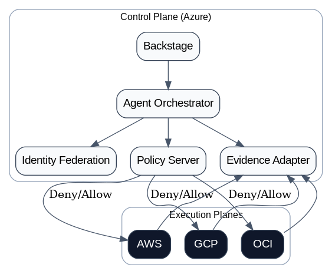

<p align="center">
  
</p>

<h1 align="center">AI-Powered Infrastructure-as-a-Product (IaaP) — Multi-Cloud Accelerator</h1>

<p align="center">
  Azure as control plane • AWS/GCP/OCI as execution planes • Autonomous Agents as productizers • Backstage delivers the DX
</p>

<p align="center">
  <a href="#features">Features</a> ·
  <a href="#quickstart">Quickstart</a> ·
  <a href="#architecture">Architecture</a> ·
  <a href="#ci--security">CI & Security</a> ·
  <a href="#compliance--evidence">Compliance & Evidence</a> ·
  <a href="#marketplace--premium-offer">Marketplace & Premium Offer</a> ·
  <a href="#roadmap">Roadmap</a> ·
  <a href="#contributing">Contributing</a>
</p>

---

## Vision

This accelerator turns **governed cloud services** into **secure, productized modules** that developers can consume “off‑the‑shelf” via **Backstage**. Azure is the **control plane** (identity, policy, evidence). AWS/GCP/OCI are **execution planes** running productized modules. Autonomous **agents** wire policy, documentation, and guardrails and emit **OSCAL** evidence for audits.

## Features

- **Backstage Product Templates** (golden paths): Azure Landing Zones, K8s clusters (AKS/EKS/GKE), Data platforms
- **Multi‑Cloud CI/CD** with **GitHub Actions** and **OIDC** (no publish profiles)
- **Security & Policy‑as‑Code**: tfsec, checkov, OPA/Conftest, Kyverno/Gatekeeper bundles
- **Evidence Automation**: transforms scanner outputs → **NIST OSCAL assessment-results**
- **Immutable Evidence Lake**: WORM (legal hold) + CMK; queryable (ADX or S3+Athena)
- **Attestations**: provenance (SLSA‑style), artifact signing (supply‑chain hardening)

## Repository Layout

```
.
├── .github/
│   └── workflows/
│       ├── ci.yml                  # Lint, scan, test; uploads SARIF to GH Security
│       ├── deploy-azure.yml        # Control-plane deploy via OIDC
│       ├── deploy-multicloud.yml   # Fan-out deploy to AWS/GCP/OCI (if secrets present)
│       └── evidence.yml            # Build OSCAL assessment-results + push to immutable storage
├── backstage/
│   └── templates/
│       └── azure-landing-zone/
│           ├── template.yaml       # Backstage scaffolder template
│           └── skeleton/           # Minimal working skeleton
├── policies/
│   ├── opa/                        # OPA rego policies
│   └── kyverno/                    # Kyverno policies
├── tools/
│   ├── oscal/
│   │   └── convert_sarif_to_oscal.py
│   └── scripts/
│       └── validate_policies.sh
├── src/
│   ├── modules/                    # Terraform/Bicep product modules
│   └── apps/                       # Example app infra
├── architecture-flow.png           # Embedded in README
└── README.md
```

> **Note:** Workflows are resilient: if a directory is missing, steps are skipped instead of failing the entire job.

## Quickstart

1. **Clone**:
   ```bash
   gh repo clone SAABOLImpactVenture/ai-powered-infrastructure-as-a-product
   cd ai-powered-infrastructure-as-a-product
   ```

2. **Required repo secrets** (set in GitHub → Settings → Secrets and variables → Actions):
   - `AZURE_CLIENT_ID`, `AZURE_TENANT_ID`, `AZURE_SUBSCRIPTION_ID`
   - Optional evidence: `AZURE_RESOURCE_GROUP`, `AZURE_STORAGE_ACCOUNT`, `EVIDENCE_CONTAINER` (e.g., `evidence`)
   - Optional AWS: `AWS_ROLE_TO_ASSUME`, `AWS_REGION`
   - Optional GCP: `GCP_WORKLOAD_IDP`, `GCP_SERVICE_ACCOUNT`
   - Optional OCI: `OCI_TENANCY_OCID`, `OCI_USER_OCID`, `OCI_FINGERPRINT`, `OCI_PRIVATE_KEY_BASE64`, `OCI_REGION`

3. **Kick CI**:
   ```bash
   git checkout -b feature/hello
   echo "# hello" > examples/hello.md
   git add . && git commit -m "smoke: trigger CI" && git push --set-upstream origin feature/hello
   ```

## Architecture

- **Azure Control Plane**: Entra ID (federated OIDC), policy services, evidence adapters (to Blob/ADX).
- **Execution Planes**: AWS/GCP/OCI run modules using least‑privilege identities, remote state, and guardrails.
- **Backstage**: one‑click product scaffolding and docs.
- **Agents**: codify productization, link policy & evidence, and emit OSCAL.

The README uses a **PNG** diagram (see header) to ensure consistent rendering in GitHub.

## CI & Security

- `ci.yml`: format, lint, unit tests; run **tfsec**, **checkov**; upload SARIF; run **OPA** tests if `policies/opa` exists.
- `deploy-azure.yml`: OIDC login to Azure; deploy control‑plane infra (Bicep/Terraform) if `src/modules` exists.
- `deploy-multicloud.yml`: a matrix deploy that runs only if corresponding secrets are present.
- `evidence.yml`: gather scanner outputs + OPA results; run `tools/oscal/convert_sarif_to_oscal.py`; push to immutable Blob (WORM).

## Compliance & Evidence

Implements parts of: **CA‑7**, **RA‑5**, **AU‑12**, **CM‑3**. Evidence pipeline produces **OSCAL assessment-results** for auditors and persists artifacts to **immutable storage** with **CMK** and **legal hold**.

## Marketplace & Premium Offer

- Clear **workflows**, **backstage templates**, and **policy packs** allow packaging as a **GitHub Premium Offer**.
- Licensing: prefer a single permissive license (e.g., Apache‑2.0) plus a **premium terms** doc for paid add‑ons.
- Remove duplicate or conflicting licenses; keep third‑party attributions within respective folders.

## Roadmap

- **P1** Harden CI + OSCAL evidence + minimal product templates shipped
- **P2** Add full product catalog; policy bundles (Kyverno/Gatekeeper); scorecards in Backstage
- **P3** Attestations (SLSA), SBOM capture, provenance signing; marketplace packaging

## Contributing

Issues and PRs are welcome. Please run `./tools/scripts/validate_policies.sh` and CI locally where possible.

## License

See `LICENSE` in the repository root.
