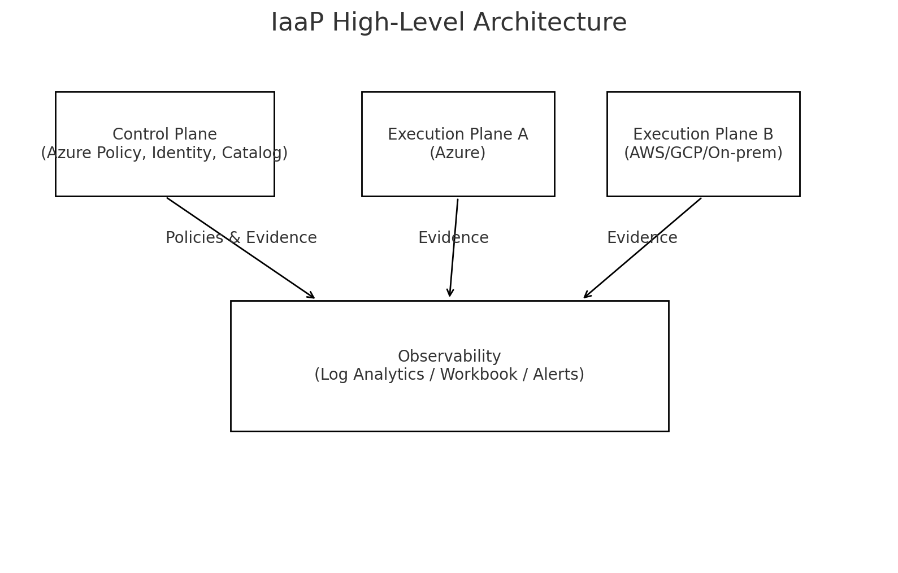
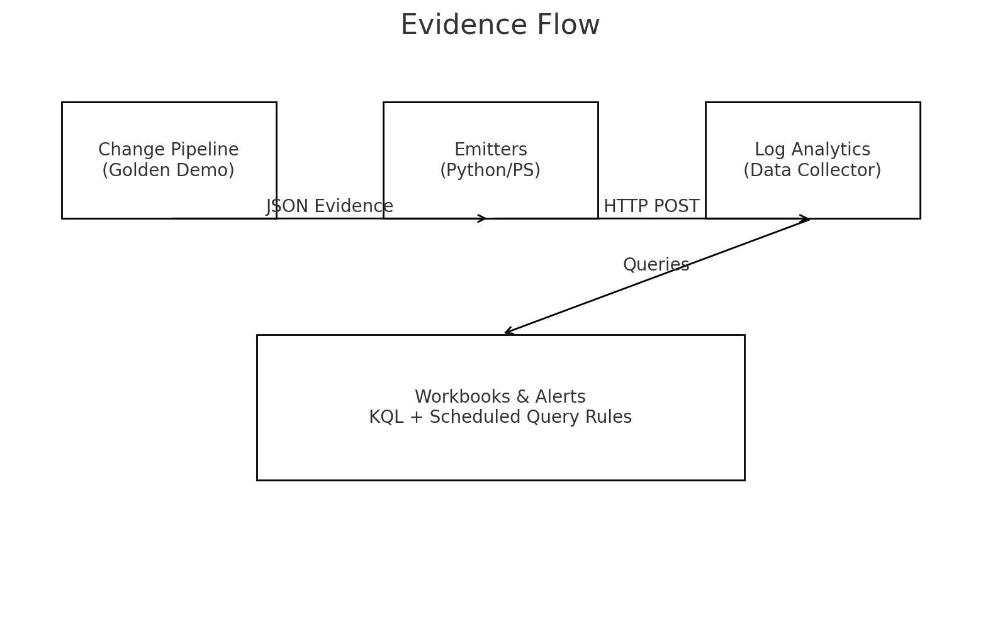

# AI-Powered Infrastructure-as-a-Product (IaaP)

An accelerator that treats **infrastructure as a product** with golden demos, operational evidence, and AI/observability hooks. Everything is self-contained—no external downloads required.

> Status: **Production-ready starter**. Cloud integrations are opt-in via environment variables and never block local runs.

## Why this exists

Most teams ship raw building blocks (VMs, clusters, networks) and stop there. Product teams, however, need a curated, **reliable experience** with documentation, SLAs, and evidence. This repo demonstrates how to:
- rehearse changes safely with a **Golden Demo**,
- produce **machine-readable evidence** for audits and SLOs,
- centralize **observability** using KQL, workbooks, and alert rules,
- and keep everything runnable **fully offline**.

## Architecture (at a glance)



**Control Plane (Azure)** provides policy/identity/conformance.
**Execution Planes** can be Azure, AWS, GCP, or on‑prem. Evidence flows back to a single pane of glass.

## Quickstart

Requires: Python 3.10+, Terraform (optional for demo), Docker (optional for containerized mock server).

```bash
# 1) Create & activate a venv
python -m venv .venv
. .venv/bin/activate  # Windows: .\.venv\Scripts\activate

# 2) Install demo deps (mock server)
pip install -r example/golden-demo/mock-server/requirements.txt

# 3) Start the mock server (http://127.0.0.1:5000/health)
python example/golden-demo/mock-server/app.py
```

In another terminal:

```bash
# 4) Validate local readiness
python scripts/validate_agents_readiness.py

# 5) Run the mock Terraform change
cd example/golden-demo/mock-change
terraform init
terraform apply -auto-approve
```

### Optional: Emit to Azure Log Analytics

Set env vars (if you have a workspace):

- `LA_WORKSPACE_ID` – Log Analytics Workspace ID (GUID)
- `LA_SHARED_KEY` – Primary/Secondary shared key
- `LA_LOG_TYPE` – Custom log table name (defaults to `IaapInfraEvidence_CL`)
- `LA_ENDPOINT` – (optional) Data Collector API URL override

Then:

```bash
python scripts/emitters/infra-evidence/emit_evidence_to_log_analytics.py   --kind "validate" --status "success" --detail "Terraform mock change applied"
```

Without env vars, emitters run in **local mode**, printing the payload and writing to `./.local-outbox/`.

## CI/CD Workflows

See `.github/workflows/`:
- `golden-demo-e2e.yml` – PR + push flow running the full demo.
- `validators-hosted.yml` – quick hosted validations (lint-like checks).
- `validators-selfhosted.yml` – deep validation, including Terraform plan, for self‑hosted runners.

## Evidence & Observability

- **KQL:** `docs/observability/infra-evidence/kql/infra_evidence_queries.kql`
- **Workbook:** `docs/observability/infra-evidence/workbooks/infra-evidence-workbook.json`
- **Alerts:** drift freshness & verify failures; AOAI latency examples.

See diagram: 

## Contents

- `scripts/` – readiness validator and emitters (Python + PowerShell).
- `docs/observability/` – KQL, alerts, workbook, ADRs, **diagrams**.
- `workloads/` – ADRs, glossary, reference notes.
- `example/golden-demo/` – mock server, Backstage template, Terraform change.

## Troubleshooting

- **`terraform` not found**: install HashiCorp Terraform and ensure it’s on PATH.
- **Emitter fails**: missing `requests`? Install via `pip install requests` or rely on local mode.
- **Ports**: mock server binds to `127.0.0.1:5000`; ensure port is free.

## License

MIT.
