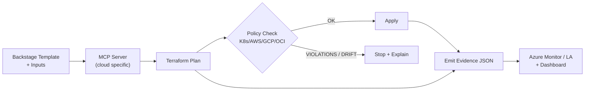
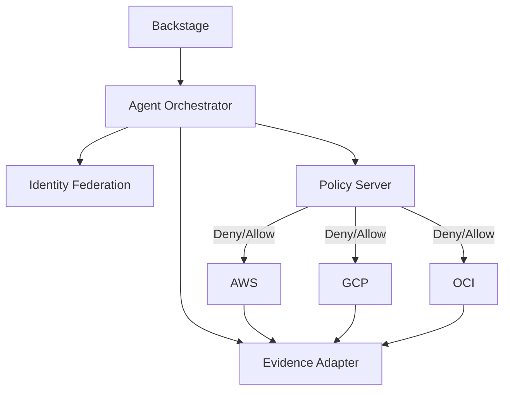

<p align="center">
  
</p>

<h1 align="center">Agent-Driven IaaP — from Idea to Governed Multi‑Cloud in Minutes</h1>

<p align="center">
  Azure orchestrates • AWS/GCP/OCI execute • Autonomous agents productize services • Backstage delivers the DX
</p>

<p align="center">
  <a href="https://saabolimpactventure.github.io/ai-powered-infrastructure-as-a-product/">
    
  </a>
</p>

<p align="center">
  <a href="#10-minute-hands-on">⏱ 10‑Minute Hands‑On</a> •
  <a href="#why-this-exists">Why this exists</a> •
  <a href="#how-it-hangs-together">How it hangs together</a> •
  <a href="#security--gov-ready">Security & Gov‑Ready</a> •
  <a href="#whats-in-the-box">What’s in the box</a>
</p>

---

## One-liner

Give developers an **off‑the‑shelf multi‑cloud experience** (pick a product → plan → policy → apply) with **agents** and **policy‑as‑code** enforcing **secure‑by‑default** across Azure (control plane) + AWS/GCP/OCI (execution planes). Evidence is emitted as **OSCAL**.

---

## Show me the flow



---

## 10‑Minute Hands‑On

1. **Start the stack (dev‑only):**
   ```bash
   docker compose up -d
   ```
2. **Create a plan:**
   ```bash
   curl -X POST http://localhost:8080/plan -d '{"workload":"sample-aws","env":"dev"}' -H 'Content-Type: application/json'
   ```
3. **Open the Policy Dashboard:** http://localhost:8090 (bound to `127.0.0.1` in dev).
4. **Apply after green policy:** environment‑protected workflow performs `terraform apply` from the artifacted plan.

---

## How it hangs together

**Agents**: Product Manager, Delivery Architect, Responsible Engineer, Security & Identity Expert.  
**Control Plane (Azure)**: orchestrates identity, policy, and evidence sinks.  
**Execution Planes (AWS/GCP/OCI)**: run productized modules with remote state & locking.  
**Policy Packs**: FedRAMP overlays for cloud + Kubernetes (Gatekeeper/Kyverno).  
**Evidence Lake**: ADX or S3+Athena; exported to OSCAL assessment-results for auditors.

<!-- IMPORTANT:
  1) Keep a blank line before and after the code fence.
  2) Ensure the fence is exactly ```mermaid (lowercase), left-aligned (no indentation).
  3) Do not include any non-Mermaid text inside the fence.
-->



---

## Security & Gov‑Ready

- **OIDC / Workload Identity** only; no long‑lived keys.
- **Remote state backends** with encryption, locking, versioning, immutability.
- **Policy gates** (OPA/Conftest, Checkov, TFLint) **block** non‑compliant changes.
- **Cosign + SBOM (Syft)** for signed, attested images; **Kyverno** verifies at admission.
- **OSCAL evidence** emitted automatically to an immutable store.

---
---

## Table of Contents

1. [Architecture at a Glance](#architecture-at-a-glance)  
2. [Workloads & Roles](#workloads--roles)  
3. [Reference End-to-End Flow](#reference-end-to-end-flow)  
4. [Backstage Developer Experience](#backstage-developer-experience)  
5. [Policy, Guardrails & Supply Chain](#policy-guardrails--supply-chain)  
6. [Azure Arc + Multi-Cloud Control Plane](#azure-arc--multi-cloud-control-plane)  
7. [Model Context Protocol (MCP) Servers](#model-context-protocol-mcp-servers)  
8. [AI Agents (RAG + Tools) Blueprint](#ai-agents-rag--tools-blueprint)  
9. [Security & Compliance](#security--compliance)  
10. [Observability & Operability](#observability--operability)  
11. [Environments & Tenancy](#environments--tenancy)  
12. [Readiness Checklist](#readiness-checklist)  
13. [Appendix – Example Artifacts](#appendix--example-artifacts)

---

## Architecture at a Glance

The solution exposes **productized IaaS/PaaS building blocks** (IaaP) through **Backstage templates**.  
AI Agents (Architect, Responsible Engineer, Product Manager, DevOps Engineer, Security Expert) coordinate via a **shared plan** to generate, validate, and publish platform resources across **Azure, AWS, GCP, OCI**—with **Azure Arc** providing a unifying control plane. **OPA/Gatekeeper** enforces policies pre- and post-provisioning. **MCP Servers** expose domain tools/data to agents in a standard way.


+-------------------------+ +------------------------+
| Developers             | | Platform Engineers     |
| (Backstage)            | | & Agents (AI)          |
+-----------+-------------+ +------------+-----------+
            | Backstage Templates / Scaffolder      |
            v                                        |
+--------+---------------------------+               |
| IaaP Product Catalog (Golden Paths)|<--(PRs/Reviews)----+
+--------+---------------------------+               |
            | GitOps (per cloud)                      |
            v                                        v
+--------+---------+   +----------+   +---------+   +-----------+
| Azure (Arc Mgmt) |   | AWS      |   | GCP     |   | OCI       |
+--------+---------+   +----------+   +---------+   +-----------+
            | Policy (OPA/Gatekeeper)
            v
Posture / Drift / Evidence -> Observability (logs, traces, metrics)


**Key tenets**

- **Product Thinking:** IaaP composed as versioned products with SLAs, docs, and contracts.
- **Guardrails First:** Policy-as-Code (pre-deploy, admission, runtime) as a non-negotiable baseline.
- **AI-Assisted:** Agents accelerate authoring, reviews, and drift remediation with MCP-backed tools.
- **GitOps:** Source of truth for infra; Backstage drives scaffolding; changes flow via PRs.
- **Multi-Cloud via Arc:** Azure Arc as the federated control plane for inventory, policy, and ops.

---

## Workloads & Roles

**Agents/Bots**
- **Architect** – designs product boundaries, reference patterns, dependency graph.
- **Responsible Engineer (RE)** – owns product quality, golden paths, and breaking changes.
- **Product Manager (PM)** – backlog, versioning, lifecycle, adoption metrics.
- **DevOps Engineer** – CI/CD, release orchestration (pipelines left out of this addendum).
- **Security Expert** – policy libraries, exceptions workflow, attestations, supply chain.

**Human counterparts** mirror these roles; agents propose, humans approve.

---

## Reference End-to-End Flow

1. **Developer** picks a Backstage template → fills parameters (env, cloud, tags, region).  
2. **Scaffolder** generates a repo (or folder) using IaaP product modules and policy overlays.  
3. **Agents** open a PR with infra + docs + policies; **OPA/Conftest** gates run.  
4. On merge, **GitOps** applies across target clouds (Arc-attached where applicable).  
5. **Gatekeeper** enforces admission rules; **Cosign/SBOM** verify artifacts.  
6. **Arc** feeds inventory & compliance; **AI Agents** watch drift and propose fixes via PR.

---

## Backstage Developer Experience

### 1) System & Component modeling (Backstage)

- **System:** `ai-iaap-accelerator`  
- **Components:** `product-*` (IaaP products), `policy-*`, `catalog-*`, `mcp-*`, `agent-*`

Example **Backstage Catalog** entities:

```yaml
# catalog/catalog-info.yaml
apiVersion: backstage.io/v1alpha1
kind: System
metadata:
  name: ai-iaap-accelerator
  title: AI IaaP Accelerator
  description: Productized multi-cloud infrastructure delivered via Backstage.
spec:
  owner: platform-team
  domain: platform

---
apiVersion: backstage.io/v1alpha1
kind: Component
metadata:
  name: product-sample-network-azure
  description: Opinionated VNet/VNG + guardrails as IaaP
  tags: [iaap, azure, network, golden-path]
spec:
  type: service
  lifecycle: experimental
  owner: platform-team
  system: ai-iaap-accelerator
```

```
2) Scaffolder Template (simplified)
# catalog/templates/product-network-azure/template.yaml
apiVersion: scaffolder.backstage.io/v1beta3
kind: Template
metadata:
  name: product-network-azure
  title: Product: Azure Network (VNet)
  description: Scaffold a network product with guardrails and tests
spec:
  owner: platform-team
  type: service
  parameters:
    - title: Product Inputs
      properties:
        name: { type: string }
        subscriptionId: { type: string }
        location: { type: string, default: eastus }
        environment: { type: string, enum: [dev, test, prod] }
  steps:
    - id: fetch-base
      name: Fetch Base
      action: fetch:template
      input:
        url: ./skeleton
    - id: render
      name: Render IaC
      action: templating:render
    - id: publish
      name: Publish
      action: publish:github
      input:
        repoUrl: github.com?owner=${{ parameters.owner }}&repo=${{ parameters.name }}
```

---

## Policy, Guardrails & Supply Chain

**Layers**

- **Design-time** – Conftest/OPA on PR (prevent misconfig early).
- **Admission** – Gatekeeper (Kubernetes, GitOps controllers, Azure Policy where applicable).
- **Runtime** – Continuous evidence (OSCAL), drift detection, exception workflow.

Example **OPA/Conftest** for Terraform providers:

```rego
# policy/terraform/providers.rego
package terraform.providers

deny[msg] {
  input.resource.type == "azurerm_resource_group"
  not input.provider.version
  msg := "Provider version pinning is required"
}
```

**K8s Gatekeeper: enforce tags on namespaces:**

```yaml
# policy/gatekeeper/k8s/required-labels-template.yaml
apiVersion: templates.gatekeeper.sh/v1beta1
kind: ConstraintTemplate
metadata:
  name: k8srequiredlabels
spec:
  crd:
    spec:
      names:
        kind: K8sRequiredLabels
  targets:
    - target: admission.k8s.gatekeeper.sh
      rego: |
        package k8srequiredlabels
        violation[{"msg": msg}] {
          required := {"owner","cost-center","env"}
          provided := {k | k := input.review.object.metadata.labels[_]}
          missing := required - provided
          count(missing) > 0
          msg := sprintf("Missing labels: %v", [missing])
}
---
apiVersion: constraints.gatekeeper.sh/v1beta1
kind: K8sRequiredLabels
metadata:
  name: ns-must-have-labels
spec:
  match:
    kinds: [{ apiGroups: [""], kinds: ["Namespace"] }]
```

**Supply Chain highlights**

- Cosign verify images/attestations (gate in PR + admission).
- SBOM present (SPDX/CycloneDX) and scanned.
- Provenance recorded for IaC modules and templates.

---

## Azure Arc + Multi-Cloud Control Plane

**Why Arc?**

- Central inventory of clusters/VMs/data services across clouds/on-prem.
- Policy assignment (Azure Policy/Guest Config) and updates.
- Hybrid Kubernetes governance (GitOps, extensions, Gatekeeper).

**Pattern**

- Attach non-Azure resources to Arc.
- Use Arc GitOps for desired state; Backstage template outputs GitOps config.
- Feed compliance signals back to Agents.

---

## Model Context Protocol (MCP) Servers

MCP provides a standard interface for tools/data to AI Agents. We expose:

- **mcp-terraform** – lint/plan/graph/query.
- **mcp-azure** – subscription/resource graph, policy query.
- **mcp-opa** – evaluate policies, explain failures.
- **mcp-backstage** – catalog CRUD, template discovery.
- **mcp-observability** – query logs/metrics (read-only).

Example **MCP Server** manifest (conceptual):

```yaml
# mcp/servers/terraform/server.yaml
name: mcp-terraform
capabilities: [tools, prompts, resources]
tools:
  - name: tf_validate
    input: { type: object, properties: { path: { type: string } }, required: [path] }
  - name: tf_plan
    input: { type: object, properties: { path: { type: string } }, required: [path] }
resources:
  - name: module_registry
    uri: file://modules/
```

---

## AI Agents (RAG + Tools) Blueprint

**Shared capabilities**

- RAG over repo docs (policies, modules, templates, ADRs).
- Tools via MCP: terraform, az, gatekeeper, backstage, observability.
- Planner orchestrates multi-step tasks.

**Agent responsibilities**

- **Architect Agent** – Suggests product boundaries, calls mcp-terraform graph, proposes ADRs.
- **Responsible Engineer Agent** – Ensures breaking changes are versioned; runs impact analysis.
- **PM Agent** – Drafts release notes, update guides, user-facing docs.
- **DevOps Agent** – (pipeline-focused, out of scope here) triggers CI hints.
- **Security Agent** – Runs mcp-opa, suggests countermeasures, opens exceptions workflow.

**ADR skeleton (to be generated by agents)**

```
# ADR-0001: Introduce Azure Arc as Control Plane

- Status: Proposed
- Context: Need unified inventory/governance across multi-cloud.
- Decision: Use Azure Arc for hybrid registration, GitOps, and policy hooks.
- Consequences: Arc agents on targets, policy mapping, cost in mgmt plane.
```

---

## Security & Compliance

- **Identity:** Workload identity federation (OIDC) for CI; managed identities in runtime.
- **Least Privilege:** Cloud-specific IAM roles scoped to resource groups/projects.
- **Data Boundaries:** No secrets in repos; use vaults (Key Vault/Secrets Manager/SM).
- **Auditability:** Signed commits, verified images, attestations, immutable logs.
- **Exceptions:** Time-boxed, ticketed, policy-recorded; auto-reminders for expiry.

---

## Observability & Operability

- **Golden Telemetry:** standardized logs/metrics/traces for each product.
- **SRE Hand-offs:** runbooks embedded in Backstage component pages.
- **Drift:** scheduled tf plan + Arc inventory diffs with agent-opened PRs.
- **SLIs/SLOs:** availability of control loops, policy compliance %, MTTR for drift.

---

## Environments & Tenancy

- **Envs:** dev → test → prod with separate accounts/subscriptions/projects.
- **Tenancy:** project per product per env; shared services isolated; network guardrails central.
- **Promotion:** immutable product versions; templates pin versions; roll-forward preferred.

---

## Readiness Checklist

- [ ] Backstage system + initial catalog entities committed.
- [ ] At least one product template per cloud with guardrails.
- [ ] Baseline OPA/Gatekeeper policies active and tested.
- [ ] Azure Arc connectivity verified for target fleets.
- [ ] MCP servers registered and reachable by agents.
- [ ] ADRs for Arc, OPA, Backstage, RAG data boundaries.
- [ ] Observability dashboards seeded per product.

---

## Appendix – Example Artifacts

**A) Backstage Template Skeleton (files)**
```
catalog/templates/product-network-azure/
 ├─ template.yaml
 └─ skeleton/
    ├─ README.md
    ├─ infra/
    │  ├─ main.tf
    │  ├─ variables.tf
    │  └─ versions.tf
    ├─ policy/
    │  ├─ conftest/
    │  │  └─ terraform.rego
    │  └─ gatekeeper/
    │     ├─ required-labels-template.yaml
    │     └─ required-labels-constraint.yaml
    └─ backstage/
       └─ component.yaml
```

**infra/versions.tf (pin providers)**
```hcl
terraform {
  required_version = ">= 1.8.0, < 2.0.0"
  required_providers {
    azurerm = {
      source  = "hashicorp/azurerm"
      version = "~> 3.118"
    }
  }
}
provider "azurerm" {
  features {}
}
```

**policy/conftest/terraform.rego (sample)**
```rego
package terraform.security

deny[msg] {
  input.resource.type == "azurerm_storage_account"
  input.resource.properties.allowBlobPublicAccess == true
  msg := "Public blob access is not allowed"
}
```

**backstage/component.yaml**
```yaml
apiVersion: backstage.io/v1alpha1
kind: Component
metadata:
  name: ${{ values.name }}
  description: Azure network product instance
  tags: [azure, network, iaap]
spec:
  type: service
  lifecycle: experimental
  owner: ${{ values.owner | default("platform-team") }}
  system: ai-iaap-accelerator
```

**B) Arc GitOps Config (Kubernetes cluster)**
```yaml
# arc/gitops/network-product-source.yaml
apiVersion: clusterconfig.azure.com/v1beta1
kind: GitOpsConfig
metadata:
  name: product-network-azure
spec:
  repositoryRef:
    url: https://github.com/ORG/REPO
    branch: main
    path: clusters/prod/network
  operatorInstanceName: flux
  operatorNamespace: flux-system
  syncIntervalInSeconds: 120
```

**C) Cosign Policy Gate (conceptual)**
```yaml
apiVersion: policy.sigstore.dev/v1alpha1
kind: ClusterImagePolicy
metadata:
  name: signed-images-only
spec:
  images:
    - glob: "ghcr.io/org/*"
  authorities:
    - key:
        kms: azurekms://subscriptions/xxx/.../keys/cosign-key
```


## What’s in the box

- `/workloads/*` — agents‑MCP‑AOAI, IaaP, Identity, Multi‑Cloud (productized modules)
- `/policy/*` — OPA, Gatekeeper, Kyverno + FedRAMP overlays
- `/observability/*` — ADX / S3+Athena sinks + dashboards
- `/docker/*` — dev‑only compose (localhost bound, resource‑capped)

---

## Contributing

We welcome PRs that improve **security defaults**, **docs**, and **developer ergonomics**. Please discuss sizeable changes via issues first.

---

## License

MIT
