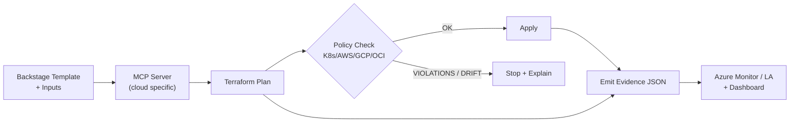

<p align="center">
  
</p>

<h1 align="center">Agent-Driven IaaP — from Idea to Governed Multi‑Cloud in Minutes</h1>

<p align="center">
  Azure orchestrates • AWS/GCP/OCI execute • Autonomous agents productize services • Backstage delivers the DX
</p>

<p align="center">
  <a href="https://saabolimpactventure.github.io/ai-powered-infrastructure-as-a-product/">
    
  </a>
</p>

<p align="center">
  <a href="#10-minute-hands-on">⏱ 10‑Minute Hands‑On</a> •
  <a href="#why-this-exists">Why this exists</a> •
  <a href="#how-it-hangs-together">How it hangs together</a> •
  <a href="#security--gov-ready">Security & Gov‑Ready</a> •
  <a href="#whats-in-the-box">What’s in the box</a>
</p>

---

## One-liner

Give developers an **off‑the‑shelf multi‑cloud experience** (pick a product → plan → policy → apply) with **agents** and **policy‑as‑code** enforcing **secure‑by‑default** across Azure (control plane) + AWS/GCP/OCI (execution planes). Evidence is emitted as **OSCAL**.

---

## Show me the flow



---

## 10‑Minute Hands‑On

1. **Start the stack (dev‑only):**
   ```bash
   docker compose up -d
   ```
2. **Create a plan:**
   ```bash
   curl -X POST http://localhost:8080/plan -d '{"workload":"sample-aws","env":"dev"}' -H 'Content-Type: application/json'
   ```
3. **Open the Policy Dashboard:** http://localhost:8090 (bound to `127.0.0.1` in dev).
4. **Apply after green policy:** environment‑protected workflow performs `terraform apply` from the artifacted plan.

---

## How it hangs together

- **Agents:** Product Manager, Delivery Architect, Responsible Engineer, Security & Identity Expert.
- **Control Plane (Azure):** orchestrates identity, policy, and evidence sinks.
- **Execution Planes (AWS/GCP/OCI):** run productized modules with remote state & locking.
- **Policy Packs:** FedRAMP overlays for cloud + Kubernetes (Gatekeeper/Kyverno).
- **Evidence Lake:** ADX or S3+Athena; exported to **OSCAL assessment‑results** for auditors.

```mermaid
flowchart TB
  subgraph Control Plane (Azure)
    P[Backstage] --> A[Agent Orchestrator]
    A --> I[Identity Federation]
    A --> Pol[Policy Server]
    A --> Evi[Evidence Adapter]
  end
  subgraph Execution Planes
    AWS[AWS]:::cloud
    GCP[GCP]:::cloud
    OCI[OCI]:::cloud
  end
  Pol -->|Deny/Allow| AWS
  Pol -->|Deny/Allow| GCP
  Pol -->|Deny/Allow| OCI
  AWS --> Evi
  GCP --> Evi
  OCI --> Evi
  classDef cloud fill:#0f172a,stroke:#334155,color:#fff;
```

---

## Security & Gov‑Ready

- **OIDC / Workload Identity** only; no long‑lived keys.
- **Remote state backends** with encryption, locking, versioning, immutability.
- **Policy gates** (OPA/Conftest, Checkov, TFLint) **block** non‑compliant changes.
- **Cosign + SBOM (Syft)** for signed, attested images; **Kyverno** verifies at admission.
- **OSCAL evidence** emitted automatically to an immutable store.

---

## What’s in the box

- `/workloads/*` — agents‑MCP‑AOAI, IaaP, Identity, Multi‑Cloud (productized modules)
- `/policy/*` — OPA, Gatekeeper, Kyverno + FedRAMP overlays
- `/observability/*` — ADX / S3+Athena sinks + dashboards
- `/docker/*` — dev‑only compose (localhost bound, resource‑capped)

---

## Contributing

We welcome PRs that improve **security defaults**, **docs**, and **developer ergonomics**. Please discuss sizeable changes via issues first.

---

## License

MIT
