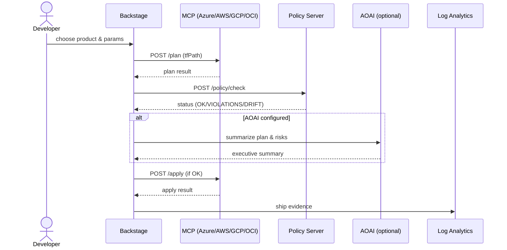
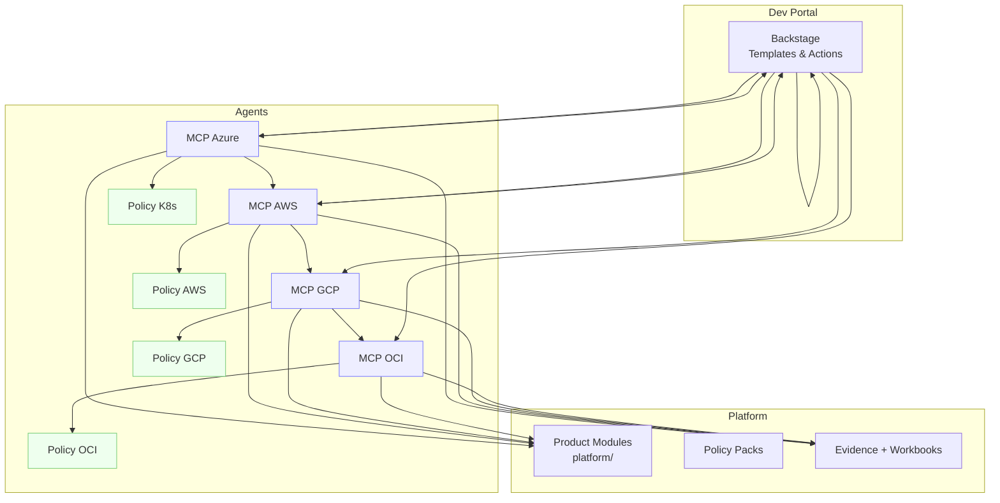

<p align="center">
  
</p>

<h1 align="center">Agent‑Driven IaaP — from Idea to Governed Multi‑Cloud in Minutes</h1>
<p align="center">
  Azure orchestrates • AWS/GCP/OCI execute • Autonomous agents productize services • Backstage delivers the DX
</p>

<p align="center">
  <a href="#10-minute-hands-on">⏱ 10‑Minute Hands‑On</a> •
  <a href="#why-this-exists">Why this exists</a> •
  <a href="#how-it-hangs-together">How it hangs together</a> •
  <a href="#security--gov-ready">Security & Gov‑Ready</a> •
  <a href="#whats-in-the-box">What’s in the box</a>
</p>

---

## One‑liner

**Give developers an off‑the‑shelf multi‑cloud experience** (pick a product → plan → policy → apply) while platform teams keep **governance, evidence, and velocity**.

## Show me the flow

```mermaid
flowchart LR
  A[Backstage Template<br/> + Inputs] --> B[MCP Server<br/>(cloud specific)]
  B --> C[Terraform Plan]
  C --> D{Policy Check<br/>K8s/AWS/GCP/OCI}
  D -->|OK| E[Apply]
  D -->|VIOLATIONS/DRIFT| F[Stop + Explain]
  E --> G[Emit Evidence JSON]
  C --> G
  G --> H[Azure Monitor / LA<br/>+ Dashboard]
```



## Why this exists

- **Reduce time‑to‑first‑commit**: golden paths + productized modules.  
- **Keep guardrails on**: preventive policy across clouds and clusters.  
- **Own your evidence**: signed, structured, queryable.  
- **Meet gov standards**: FedRAMP overlays, NSA/CISA K8s, SBOM/signing, OSCAL.

## How it hangs together



## 10‑Minute Hands‑On

```bash
# 1) Bring up agents + policy dashboard
docker compose -f docker/docker-compose.yml up --build

# 2) Plan a module (Azure sample)
curl -sS -X POST http://localhost:8080/plan -H 'content-type: application/json'   -d '{"path":"platform/azure/observability/log_analytics"}' | jq

# 3) Check policy (K8s/AWS/GCP/OCI)
open http://localhost:8090   # live status

# 4) Optionally run the agentic orchestrator
node --experimental-modules workloads/agents-mcp-aoai/service/agent-orchestrator.ts azure platform/azure/observability/log_analytics
```

## Security & Gov‑Ready

- **FedRAMP packs**: `policies/*/fedramp/` (Azure Policy, AWS Config/SecHub, GCP Org Policy/SCC, OCI Cloud Guard)  
- **NSA/CISA K8s overlay**: deny hostPID/hostNetwork, require seccomp RuntimeDefault, read‑only root FS, runAsNonRoot, allowed registries  
- **Supply chain**: SBOM (SPDX via syft) + cosign attestations; tfsec & checkov with SARIF in CI  
- **OSCAL export**: `tools/oscal-export/export.py` builds `assessment-results` from evidence

> Short‑lived identity only (OIDC/WIF). No `null_resource` / `local-exec` in product modules.

## What’s in the box

- **Workloads**: `workloads/agents-mcp-aoai`, `workloads/iaap`, `workloads/identity`, `workloads/multi-cloud`
- **Agents**: `servers/mcp/*` and `servers/mcp-policy/*`
- **Policies**: `policies/kubernetes/**`, `policies/*/fedramp/**`
- **Evidence**: schema + ingestion & workbook under `observability/**`
- **Dev Portal**: Backstage templates/actions + Policy Status card and backend proxy
- **Docs**: Government deployment notes, readme quickstarts, diagrams

## Who gets what

| Persona | Value |
|---|---|
| Developer | One‑click product provisioning, explainable plans, fast feedback |
| Platform | Guardrails + evidence + golden paths, multi‑cloud at scale |
| Security/AO | FedRAMP overlays, continuous policy checks, OSCAL export |

---

### Next
- Add your first product module or consume ours in `workloads/iaap/modules/*`  
- Point the **Policy Status Card** to `/api/policy/aggregate`  
- Roll out the **NSA/CISA overlay** to clusters and turn on the **FedRAMP packs** in CI
