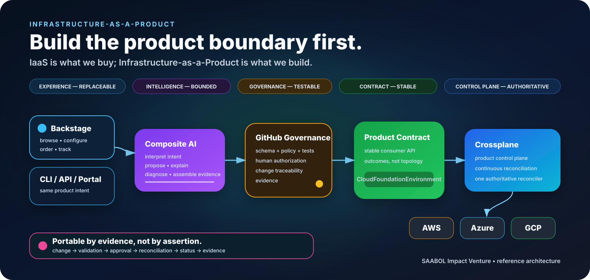
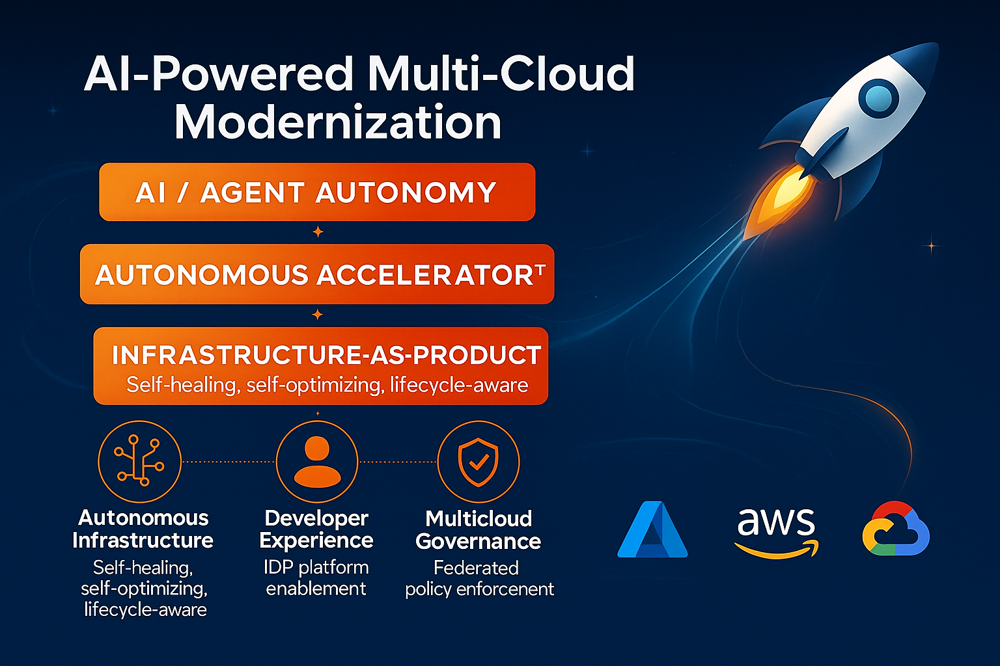
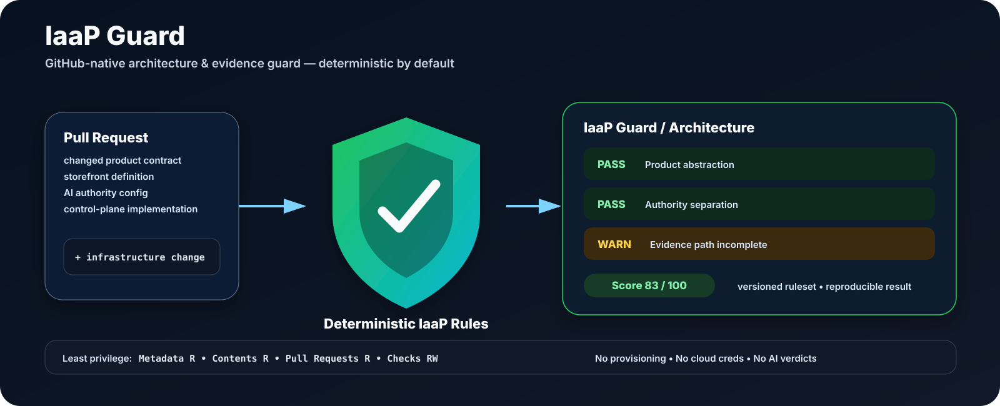
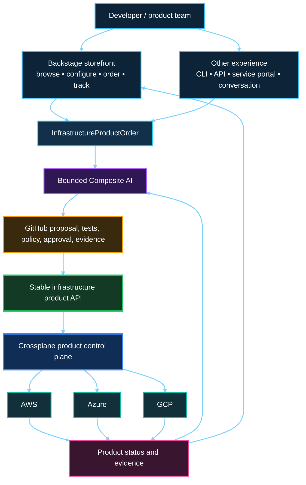
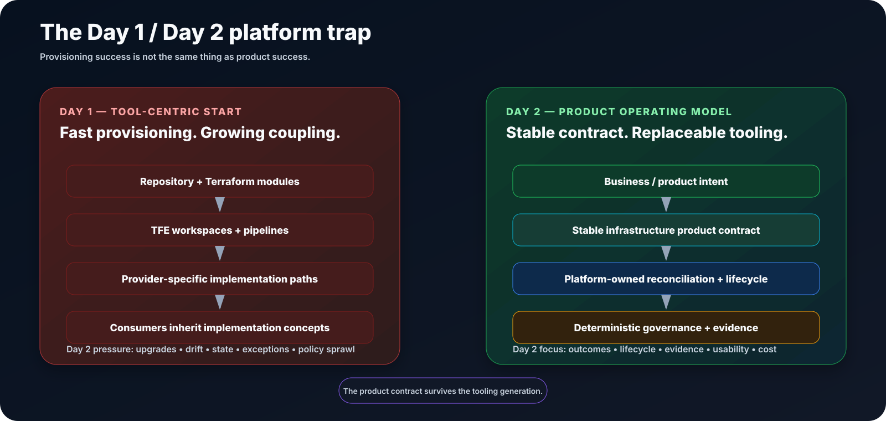
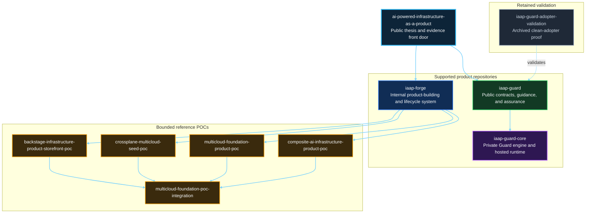
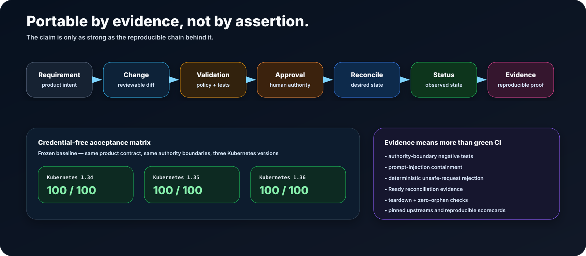

<p align="center">
  
</p>

<h1 align="center">AI-Powered Infrastructure as a Product</h1>

<p align="center"><strong>IaaS is what we buy; infrastructure-as-a-product is what we build.</strong></p>

<p align="center"><strong>Backstage is where developers shop; Crossplane is where the product is controlled.</strong></p>

<p align="center">Composite AI • Crossplane • Backstage storefront • GitHub governance • deterministic policy • multi-cloud evidence</p>

<details>
<summary><strong>Original multi-cloud reference visual</strong></summary>
<p align="center">
  
</p>
</details>

---

## Infrastructure is experienced as a product

Application developers should order a finished infrastructure product—not assemble the raw cloud resources used to build it. Backstage is the storefront: developers choose a standard product with a stable contract, while Forge, Guard, GitHub governance, Crossplane, and the cloud providers handle the governed lifecycle behind that contract.

<p align="center">
  
</p>

<p align="center"><em>Developers order the outcome—not the ingredients.</em></p>

Platform value is therefore measured at the consumer boundary. Lines of infrastructure code, modules built, and tickets closed are engineering activity; developers care about time to provision, product health, time to diagnose, time to restore, adoption, exception rate, and their overall experience.

<p align="center">
  
</p>

<p align="center"><em>Measure the developer experience—not the activity behind it.</em></p>

---

## Get IaaP Guard

**IaaP Guard** is the installable GitHub-native Infrastructure-as-a-Product architecture and evidence guard built from this program's deterministic product rules.

> **IaaS is what you buy. Infrastructure-as-a-Product is what you build. IaaP Guard makes sure you keep building it that way.**

Its central question is:

> **Is this infrastructure actually being designed, delivered, and governed as a product?**

**[Install IaaP Guard](https://github.com/apps/iaap-guard/installations/new)** · [View the GitHub App](https://github.com/apps/iaap-guard) · [V1 guide](docs/IAAP-GUARD.md) · [Release v1.0.2](https://github.com/SAABOLImpactVenture/iaap-guard/releases/tag/v1.0.2)

The supported V1 release evaluates pull requests and publishes an **`IaaP Guard / Architecture`** Check. It is deliberately narrow: deterministic architecture/evidence evaluation in GitHub, not infrastructure provisioning and not a generic IaC vulnerability scanner.

**Guard now connects architecture evidence to planning.** When a repository produces WARNING or FAIL findings, IaaP Guard can generate an evidence-traceable improvement plan with measurable Objectives and Key Results, Epics mapped to those KRs, Features, candidate User Stories and Tasks, and acceptance evidence. This lets platform teams move from architecture assessment into backlog preparation without turning Guard into a sprint-management or infrastructure-execution tool.

```text
Architecture Evidence → OKRs → Epics → Features → Candidate Stories → Candidate Tasks
```

Every proposed planning item remains traceable to the deterministic Guard rule and repository evidence that justified it. PASS/no-finding results do not invent backlog work.

<p align="center">
  
</p>

| Permission | Access |
|---|---|
| Metadata | Read |
| Contents | Read |
| Pull requests | Read |
| Checks | Read/write |

IaaP Guard requires **no customer cloud, Kubernetes, Terraform/TFE, AI, or PAT credentials**. It does not execute repository code, provision infrastructure, auto-remediate findings, merge pull requests, or generate AI verdicts.

GitHub Marketplace is not required to install V1. IaaP Guard completed its bounded product roadmap through external-adoption validation and the supported `v1.0.2` release. Future Forge development remains separate from Guard. The retained Guard evidence and support policies live in the [`iaap-guard`](https://github.com/SAABOLImpactVenture/iaap-guard) repository.

---

## Build with IaaP Forge

**IaaP Forge** consumes frozen Guard evidence and turns approved intent into stable infrastructure-product proposals, bounded Composite AI advice, GitHub-governed change, and Crossplane lifecycle artifacts.

[View IaaP Forge](https://github.com/SAABOLImpactVenture/iaap-forge) · [Guard-to-Forge transition](docs/FORGE-TRANSITION.md) · [Pinned reconciliation evidence](artifacts/phase-20/forge-reconciliation.json)

Forge Phases 11–19 are accepted at immutable revision [`6fb587cb3f521e99c33039c61090fe8b738836cc`](https://github.com/SAABOLImpactVenture/iaap-forge/commit/6fb587cb3f521e99c33039c61090fe8b738836cc). Phase 19 retained bounded non-production **PASS** evidence for AWS, Azure, and GCP workload-identity reconciliation, Vertex AI model-adapter validation with synthetic fixtures, and an HCP Terraform Free remote-run proxy, with sanitized evidence and verified teardown. The proxy does **not** validate Terraform Enterprise; no production deployment, certification, assessment conclusion, or ATO is authorized or claimed.

### Accepted synthetic release chain

The current synthetic compatibility lock is [`artifacts/phase-21/accepted-release-lock.json`](artifacts/phase-21/accepted-release-lock.json): Guard `v1.0.2` → Guard Core `f8daf68` → Console `v0.1.1` → Forge `v1.3.1`. The exact chain passed the trusted-`main` journey at integration revision [`7a5f4fa`](https://github.com/SAABOLImpactVenture/multicloud-foundation-poc-integration/commit/7a5f4fa484e09b3605e81da5fec3550fd521fb9c) in [run 33576400709](https://github.com/SAABOLImpactVenture/multicloud-foundation-poc-integration/actions/runs/33576400709). This remains synthetic-only, nonproduction, non-authoritative, and `CONTINUE_VALIDATION`.

---

## The modern accelerator

This repository is the **thesis, architecture, governance, operating-model, and evidence front door** for a modern Infrastructure-as-a-Product (IaaP) accelerator.

The maintained reference architecture is intentionally small and opinionated:

- **Infrastructure product contracts** define the stable consumer boundary.
- **Backstage** is the optional reference storefront for browse, configure, order, and track.
- **Crossplane** is the product control plane and reconciliation layer.
- **Composite AI** interprets intent, proposes changes, explains policy, diagnoses sanitized status, and assembles evidence.
- **GitHub** governs product change, review, traceability, and evidence.
- **Deterministic policy and tests** decide what is valid.
- **Authorized people** approve material changes.
- **Cloud-native IAM and controls** remain the ultimate enforcement boundary.

The earlier accelerator embedded Backstage together with Terraform/TFE, Azure Arc, legacy execution MCP servers, and cloud-specific implementation code. That embedded stack is superseded and preserved on `archive/legacy-accelerator-v1`.

A **new bounded Backstage storefront** now lives independently in [`backstage-infrastructure-product-storefront-poc`](https://github.com/SAABOLImpactVenture/backstage-infrastructure-product-storefront-poc). It is an experience layer, not an inherited control-plane dependency.

> **The accelerator demonstrates the product model without requiring the historical implementation stack.**

---

## Strategic architecture


```mermaid
flowchart TB
  DEV[Developer / product team]
  STORE[Backstage storefront\nbrowse • configure • order • track]
  ALT[Other experience\nCLI • API • service portal • conversation]
  ORDER[InfrastructureProductOrder]
  AI[Bounded Composite AI]
  GIT[GitHub proposal, tests, policy, approval, evidence]
  API[Stable infrastructure product API]
  XP[Crossplane product control plane]
  AWS[AWS]
  AZ[Azure]
  GCP[GCP]
  STATUS[Product status and evidence]

  DEV --> STORE
  DEV --> ALT
  STORE --> ORDER
  ALT --> ORDER
  ORDER --> AI
  AI --> GIT
  GIT --> API
  API --> XP
  XP --> AWS
  XP --> AZ
  XP --> GCP
  AWS --> STATUS
  AZ --> STATUS
  GCP --> STATUS
  STATUS --> AI
  STATUS --> STORE

  classDef experience fill:#0D2438,stroke:#38BDF8,stroke-width:2px,color:#F8FAFC
  classDef intent fill:#12304A,stroke:#22D3EE,stroke-width:2px,color:#F8FAFC
  classDef intelligence fill:#2E1752,stroke:#A855F7,stroke-width:2px,color:#F8FAFC
  classDef governance fill:#3A2A0D,stroke:#F59E0B,stroke-width:2px,color:#F8FAFC
  classDef contract fill:#123A24,stroke:#22C55E,stroke-width:3px,color:#F8FAFC
  classDef control fill:#102D55,stroke:#3B82F6,stroke-width:3px,color:#F8FAFC
  classDef cloud fill:#12303A,stroke:#14B8A6,stroke-width:2px,color:#F8FAFC
  classDef evidence fill:#3A1530,stroke:#EC4899,stroke-width:2px,color:#F8FAFC
  class DEV,STORE,ALT experience
  class ORDER intent
  class AI intelligence
  class GIT governance
  class API contract
  class XP control
  class AWS,AZ,GCP cloud
  class STATUS evidence
  linkStyle default stroke:#7DD3FC,stroke-width:2px
```

The architectural center is the **product contract**, not a workspace, module, portal, pipeline, or execution engine.

Backstage is deliberately replaceable. A different storefront can submit the same product intent without changing the product contract or Crossplane control plane.

### Authority chain


```mermaid
flowchart LR
  S[Storefront captures product intent] --> A[AI proposes and explains]
  A --> D[Schema, policy, and tests validate]
  D --> H[Authorized people approve]
  H --> X[Crossplane reconciles]
  X --> C[Cloud-native controls enforce]

  classDef experience fill:#0D2438,stroke:#38BDF8,stroke-width:2px,color:#F8FAFC
  classDef intelligence fill:#2E1752,stroke:#A855F7,stroke-width:2px,color:#F8FAFC
  classDef governance fill:#3A2A0D,stroke:#F59E0B,stroke-width:2px,color:#F8FAFC
  classDef human fill:#47270F,stroke:#FB923C,stroke-width:2px,color:#F8FAFC
  classDef control fill:#102D55,stroke:#3B82F6,stroke-width:2px,color:#F8FAFC
  classDef enforcement fill:#123A24,stroke:#22C55E,stroke-width:2px,color:#F8FAFC
  class S experience
  class A intelligence
  class D governance
  class H human
  class X control
  class C enforcement
  linkStyle default stroke:#94A3B8,stroke-width:2px
```

Neither the storefront nor AI receives direct cloud administrator, Kubernetes administrator, Terraform/TFE, merge, approval, or unrestricted remediation authority.

---

## What the developer sees

The first reference storefront product is **Cloud Foundation Environment**.

The developer supplies product/business intent such as:

- order name;
- cloud (`aws` or `gcp` in the current POC);
- approved region;
- application;
- business unit;
- owner/team; and
- cost center.

The developer does **not** choose:

- Crossplane XRDs or Compositions;
- ProviderConfig;
- cloud credentials;
- provider versions;
- IAM policy JSON;
- Terraform/TFE workspaces;
- raw network implementation; or
- Kubernetes namespaces.

This is the practical expression of infrastructure-as-a-product: the consumer orders an outcome, not an implementation topology.

---

## Foundation establishment model

The modern sequence is not "finish three landing zones, then productize them."


```mermaid
flowchart LR
  S[Minimal trusted seed] --> P[Product control plane]
  P --> F[Foundation capabilities as products]
  F --> M[Minimum viable multi-cloud foundation]
  M --> C[Consumer infrastructure products]
  C --> E[Evidence-led continuous evolution]

  classDef seed fill:#1F2937,stroke:#94A3B8,stroke-width:2px,color:#F8FAFC
  classDef control fill:#102D55,stroke:#3B82F6,stroke-width:2px,color:#F8FAFC
  classDef product fill:#123A24,stroke:#22C55E,stroke-width:2px,color:#F8FAFC
  classDef foundation fill:#12303A,stroke:#14B8A6,stroke-width:2px,color:#F8FAFC
  classDef consumer fill:#0D2438,stroke:#38BDF8,stroke-width:2px,color:#F8FAFC
  classDef evidence fill:#3A1530,stroke:#EC4899,stroke-width:2px,color:#F8FAFC
  class S seed
  class P control
  class F product
  class M foundation
  class C consumer
  class E evidence
  linkStyle default stroke:#7DD3FC,stroke-width:2px
```

A minimal seed establishes only the irreducible trust boundary needed for Crossplane and governed delivery to operate. Foundation capabilities can then be established and evolved through product APIs.

The storefront can expose those products as they mature without becoming part of their implementation.

The [IaaP Bootstrap and Foundation Readiness](docs/bootstrap-foundation-readiness/README.md)
package defines the customer decisions, detailed prerequisites, Composite AI
advisory boundary, readiness gates, evidence, and provider guidance needed to
move safely from assessment through a separately authorized cloud pilot.

### Cloud-native foundation target and vending

Cloud-native vending is represented by the separately versioned [`FoundationTarget`](docs/bootstrap-foundation-readiness/schemas/foundation-target.md) successor product rather than being hidden inside `CloudFoundationEnvironment` or a provider tool.

- `attach-existing` binds a reviewed existing AWS account, Azure subscription, or Google Cloud project.
- `vend-new` creates a governed provider-native fulfillment request for a new target.
- A formal typed `FoundationTarget` reference is passed to the successor `CloudFoundationEnvironment` contract.
- Lifecycle, drift, retry, retirement review, and sanitized evidence remain explicit.
- AWS Organizations/Control Tower, Azure Resource Manager/subscription aliases, Google Cloud Resource Manager, Crossplane/Upbound, and HCP Terraform/TFE remain replaceable execution integrations.

The public [`FoundationTarget` architecture contract](docs/bootstrap-foundation-readiness/schemas/foundation-target.md) is the sanitized capability and implementation-status reference. Separately protected Forge successor increments implement the v1alpha1 contract, credential-free adapter simulations, synthetic reconciliation, and an inert external-executor protocol. These remain synthetic, nonproduction validation artifacts compatible with the `CONTINUE_VALIDATION` evidence disposition; that disposition grants no execution or production authority. The credentialed customer-hosted executor that performs provider mutations is not implemented or authorized. Frozen Guard V1, Forge V1, and Console V1 contracts remain unchanged.

---

## The Day 1 / Day 2 platform trap

A platform can look successful on Day 1 while quietly creating its largest operating burden for Day 2.

A team may successfully provision a landing zone, configure Terraform Enterprise workspaces, establish repository automation, and publish reusable modules. Those are legitimate accomplishments. The strategic question is whether the organization has created an **infrastructure product** or merely accumulated an increasingly sophisticated implementation system that the platform team must operate indefinitely.

The risk is not Terraform, TFE, pipelines, modules, or policy-as-code themselves.

> **The risk is allowing implementation machinery to become the product boundary.**

<p align="center">
  
</p>

### Day 1 success can hide Day 2 cost

A tool-centric platform often begins with visible engineering velocity:

```text
repository
    ↓
Terraform modules
    ↓
TFE workspace
    ↓
pipeline
    ↓
cloud resources
```

The difficult questions appear later:

- Who upgrades and retests the growing module portfolio as providers and cloud APIs evolve?
- Who owns workspace proliferation, state failures, imports, migrations, and exception handling?
- What happens when users make changes outside the expected execution path?
- How many implementation concepts must consumers understand before they can request infrastructure?
- How much policy logic must be duplicated or synchronized across clouds, pipelines, modules, and teams?
- Can the underlying execution technology change without forcing consumers to change how they order infrastructure?
- Does the platform team spend its time improving products, or maintaining provisioning machinery?

This is the Day 2 test.

A platform architecture should therefore optimize not merely for **how quickly infrastructure can first be provisioned**, but for how safely and economically the infrastructure product can evolve for years.

### Redefining the platform benchmark

The benchmark changes when infrastructure is treated as a product.

| Tool-centric platform starting point | Infrastructure-as-a-Product operating model |
|---|---|
| Success is provisioning infrastructure through the approved toolchain. | Success is delivering a governed infrastructure outcome through a stable product contract. |
| Reusable modules are the primary abstraction. | The infrastructure product contract is the primary abstraction. |
| Consumers learn variables, modules, workspace conventions, and implementation constraints. | Consumers express approved product and business intent. |
| Execution topology becomes part of the consumer experience. | Execution topology remains a platform implementation concern. |
| Multi-cloud commonly becomes multiple provider-specific delivery paths. | One product contract can map intent into cloud-specific implementations. |
| Policy is frequently attached to individual tools and pipelines. | Deterministic policy protects the product contract and authority boundaries. |
| Platform value is measured by provisioning automation. | Platform value is measured by product outcomes, lifecycle, evidence, usability, and operating cost. |
| Changing execution technology risks changing the consumer contract. | Execution technology can evolve behind the product boundary. |

The architectural objective is therefore not to eliminate infrastructure tooling.

It is to **prevent infrastructure tooling from becoming the infrastructure product**.

### Composite AI changes the experience boundary

Composite AI introduces another important shift.

The consumer should not need to become an expert in every syntax, provider schema, policy implementation, or cloud-specific dependency simply to request an approved infrastructure product.

In this architecture, AI may:

- interpret business and product intent;
- identify missing information;
- propose a structured product request;
- explain deterministic policy results;
- map intent to approved product capabilities;
- diagnose sanitized product status; and
- assemble evidence.

AI does **not** replace deterministic validation, human authorization, the product contract, the reconciler, or cloud-native enforcement.


```mermaid
flowchart LR
  INTENT[Business / product intent]
  AI[Bounded Composite AI]
  CONTRACT[Stable product contract]
  POLICY[Deterministic policy]
  APPROVAL[Human authorization]
  CONTROL[Crossplane control plane]
  CLOUD[Cloud implementation]

  INTENT --> AI
  AI --> CONTRACT
  CONTRACT --> POLICY
  POLICY --> APPROVAL
  APPROVAL --> CONTROL
  CONTROL --> CLOUD

  classDef intent fill:#0D2438,stroke:#38BDF8,stroke-width:2px,color:#F8FAFC
  classDef intelligence fill:#2E1752,stroke:#A855F7,stroke-width:2px,color:#F8FAFC
  classDef contract fill:#123A24,stroke:#22C55E,stroke-width:3px,color:#F8FAFC
  classDef governance fill:#3A2A0D,stroke:#F59E0B,stroke-width:2px,color:#F8FAFC
  classDef human fill:#47270F,stroke:#FB923C,stroke-width:2px,color:#F8FAFC
  classDef control fill:#102D55,stroke:#3B82F6,stroke-width:2px,color:#F8FAFC
  classDef cloud fill:#12303A,stroke:#14B8A6,stroke-width:2px,color:#F8FAFC
  class INTENT intent
  class AI intelligence
  class CONTRACT contract
  class POLICY governance
  class APPROVAL human
  class CONTROL control
  class CLOUD cloud
  linkStyle default stroke:#7DD3FC,stroke-width:2px
```

The important change is that implementation syntax moves farther away from the consumer while product intent becomes more important.

### The executive investment question

This creates a different question for infrastructure leadership.

The question is no longer:

> **Can we build a multi-cloud provisioning platform using Terraform, TFE, pipelines, modules, and policy tooling?**

Of course an organization can.

The more important question is:

> **Should those implementation mechanisms define the platform architecture that the organization will operate, fund, govern, and evolve for the next several years?**

The Infrastructure-as-a-Product alternative is to establish the stable product boundary first and make execution technologies replaceable behind it.

That allows engineering talent to concentrate increasingly on:

- improving infrastructure products;
- reducing consumer friction;
- expanding governed capabilities;
- improving reliability and lifecycle behavior;
- optimizing cost and performance;
- strengthening evidence and authorization;
- improving developer experience; and
- evolving implementation technology without redesigning the consumer contract.

A useful strategic test is:

> **If replacing TFE, Terraform, a portal, a pipeline engine, or another implementation technology requires redesigning what consumers order, then the implementation has probably become the product.**

The desired architecture makes the opposite true:

> **The product contract survives the tooling generation.**

---

## Repository portfolio

This repository is the public front door for a deliberately separated product system. The inventory below includes every repository that currently implements, operates, demonstrates, or retains acceptance evidence for this Infrastructure-as-a-Product program. Unrelated SAABOL Impact Venture repositories are outside this portfolio.


```mermaid
flowchart TB
  FRONT["ai-powered-infrastructure-as-a-product<br/>Public thesis and evidence front door"]

  subgraph PRODUCTS["Supported product repositories"]
    GUARD["iaap-guard<br/>Public contracts, guidance, and assurance"]
    CORE["iaap-guard-core<br/>Private Guard engine and hosted runtime"]
    FORGE["iaap-forge<br/>Internal product-building and lifecycle system"]
  end

  subgraph POCS["Bounded reference POCs"]
    STORE["backstage-infrastructure-product-storefront-poc"]
    SEED["crossplane-multicloud-seed-poc"]
    FOUNDATION["multicloud-foundation-product-poc"]
    COMPOSITE["composite-ai-infrastructure-product-poc"]
    INTEGRATION["multicloud-foundation-poc-integration"]
  end

  subgraph RETAINED["Retained validation"]
    ADOPTER["iaap-guard-adopter-validation<br/>Archived clean-adopter proof"]
  end

  FRONT --> GUARD
  FRONT --> FORGE
  GUARD --> CORE
  FORGE --> STORE
  FORGE --> SEED
  FORGE --> FOUNDATION
  FORGE --> COMPOSITE
  STORE --> INTEGRATION
  SEED --> INTEGRATION
  FOUNDATION --> INTEGRATION
  COMPOSITE --> INTEGRATION
  ADOPTER -. validates .-> GUARD

  classDef front fill:#0D2438,stroke:#38BDF8,stroke-width:3px,color:#F8FAFC
  classDef public fill:#123A24,stroke:#22C55E,stroke-width:2px,color:#F8FAFC
  classDef private fill:#2E1752,stroke:#A855F7,stroke-width:2px,color:#F8FAFC
  classDef internal fill:#102D55,stroke:#3B82F6,stroke-width:2px,color:#F8FAFC
  classDef poc fill:#3A2A0D,stroke:#F59E0B,stroke-width:2px,color:#F8FAFC
  classDef archived fill:#1F2937,stroke:#94A3B8,stroke-width:2px,color:#CBD5E1

  class FRONT front
  class GUARD public
  class CORE private
  class FORGE internal
  class STORE,SEED,FOUNDATION,COMPOSITE,INTEGRATION poc
  class ADOPTER archived
  linkStyle default stroke:#7DD3FC,stroke-width:2px
```

### Supported product repositories

| Repository | Visibility / status | Responsibility |
|---|---|---|
| **This repository** | Public · active | Thesis, architecture, decisions, operating model, evidence baseline, investment framing, and proven-revision reconciliation. |
| [`iaap-guard`](https://github.com/SAABOLImpactVenture/iaap-guard) | Public · active | IaaP Guard product, adoption, interface, schema, support, security, and sanitized assurance surface. The former public Action is retired. |
| [`iaap-guard-core`](https://github.com/SAABOLImpactVenture/iaap-guard-core) | Private · active | Protected deterministic engine, rules, GitHub App runtime, deployment assets, internal fixtures, tests, and operational evidence. The link is visible only to authorized collaborators. |
| [`iaap-forge`](https://github.com/SAABOLImpactVenture/iaap-forge) | Internal · active | Guard consumption, bounded Composite AI, stable product contracts, GitHub governance, Crossplane lifecycle, evidence, and product outcomes. |

### Bounded reference POCs

| Repository | Visibility / status | Responsibility |
|---|---|---|
| [`backstage-infrastructure-product-storefront-poc`](https://github.com/SAABOLImpactVenture/backstage-infrastructure-product-storefront-poc) | Internal · active | Optional developer storefront for browse, configure, order, and track. It has no provisioning authority. |
| [`crossplane-multicloud-seed-poc`](https://github.com/SAABOLImpactVenture/crossplane-multicloud-seed-poc) | Internal · active | Minimal trusted Crossplane seed and control-plane bootstrap boundary. |
| [`multicloud-foundation-product-poc`](https://github.com/SAABOLImpactVenture/multicloud-foundation-product-poc) | Internal · active | Stable `CloudFoundationEnvironment` product API and cloud-specific implementations. |
| [`composite-ai-infrastructure-product-poc`](https://github.com/SAABOLImpactVenture/composite-ai-infrastructure-product-poc) | Internal · active | Bounded request, review, operations, and evidence agents without autonomous execution authority. |
| [`multicloud-foundation-poc-integration`](https://github.com/SAABOLImpactVenture/multicloud-foundation-poc-integration) | Internal · active | Credential-free integrated acceptance and evidence harness, including the storefront handoff. |

### Retained validation repository

| Repository | Visibility / status | Responsibility |
|---|---|---|
| [`iaap-guard-adopter-validation`](https://github.com/SAABOLImpactVenture/iaap-guard-adopter-validation) | Public · archived | Retained clean-adopter validation evidence. It is not a supported runtime, distribution, or active development repository. |

See [POC Portfolio](docs/poc-portfolio.md) for the implementation boundaries and pinned evidence relationships.

### Product-system shorthand

```text
Backstage = where the consumer shops
Product API = what the consumer is ordering
Composite AI = where intent and evidence are interpreted
GitHub = where change is governed
Crossplane = where the product lifecycle is controlled
Cloud = where the product is realized
```

---

## Integrated consumer path

The integration harness already contains the storefront handoff as a bounded upstream dependency.


```mermaid
flowchart LR
  DEV[Developer] --> STORE[Backstage]
  STORE --> ORDER[InfrastructureProductOrder]
  ORDER --> AI[Composite AI review]
  AI --> POLICY[Deterministic policy]
  POLICY --> HUMAN[Human approval boundary]
  HUMAN --> CFE[CloudFoundationEnvironment]
  CFE --> XP[Crossplane simulated reconciliation]
  XP --> EVID[Status + evidence]
  EVID --> STORE

  classDef consumer fill:#0D2438,stroke:#38BDF8,stroke-width:2px,color:#F8FAFC
  classDef intent fill:#12304A,stroke:#22D3EE,stroke-width:2px,color:#F8FAFC
  classDef intelligence fill:#2E1752,stroke:#A855F7,stroke-width:2px,color:#F8FAFC
  classDef governance fill:#3A2A0D,stroke:#F59E0B,stroke-width:2px,color:#F8FAFC
  classDef human fill:#47270F,stroke:#FB923C,stroke-width:2px,color:#F8FAFC
  classDef contract fill:#123A24,stroke:#22C55E,stroke-width:3px,color:#F8FAFC
  classDef control fill:#102D55,stroke:#3B82F6,stroke-width:2px,color:#F8FAFC
  classDef evidence fill:#3A1530,stroke:#EC4899,stroke-width:2px,color:#F8FAFC
  class DEV,STORE consumer
  class ORDER intent
  class AI intelligence
  class POLICY governance
  class HUMAN human
  class CFE contract
  class XP control
  class EVID evidence
  linkStyle default stroke:#7DD3FC,stroke-width:2px
```

The harness verifies that storefront and AI-rendered runtime contracts remain equivalent, implementation details do not leak into the product manifest, invalid storefront requests fail closed, and the human-approval boundary remains intact.

This closes the **consumer-experience gap** without weakening the control-plane boundary.

---

## Evidence already established

<p align="center">
  
</p>

The frozen credential-free baseline passed across Kubernetes **1.34, 1.35, and 1.36**, with a **100/100** acceptance score on each matrix entry. It demonstrated:

- a bounded Crossplane 2.3.0 seed;
- enforced ingress and egress NetworkPolicy controls;
- one AWS/GCP infrastructure-product contract;
- deterministic rejection of unsafe requests;
- proposal-and-evidence-only composite-AI authority;
- prompt-injection containment;
- reconciliation to Ready simulated products; and
- teardown with zero simulated product-component orphans.

The integration harness has since been extended to include the independent Backstage storefront as a pinned upstream and requires a `storefront-order-handoff` acceptance control.

That proves **TFE is not mandatory for the demonstrated product path**. Forge has additionally demonstrated bounded non-production cloud reconciliation and teardown across AWS, Azure, and GCP, plus a synthetic-only Vertex AI adapter and an HCP Terraform Free remote-run proxy. These results do not validate Terraform Enterprise, production readiness, certification, an assessment conclusion, or an ATO.

See [Credential-Free Baseline](docs/poc-baselines/2026-08-07-credential-free-multicloud-foundation.md), [POC Portfolio](docs/poc-portfolio.md), and [ADR-0004](adr/ADR-0004-tfe-optional-for-multicloud-foundation.md).

---

## What was superseded

The earlier accelerator contained useful exploration and implementation IP around Terraform, Azure Arc, an embedded Backstage implementation, cloud-execution MCP servers, PromptFlow/Semantic Kernel implementations, and provider-specific automation.

Those components were removed from the maintained branch because carrying them beside the current architecture caused the repository to tell multiple architectural stories at once.

They are **not declared bad technologies**. They are simply no longer dependencies of this accelerator.

The independent Backstage storefront POC is different from the removed embedded Backstage stack: it has one bounded responsibility and no provisioning authority.

- Recovery branch: `archive/legacy-accelerator-v1`
- Frozen pre-supersession commit: `be5fa73c72f77043ac666d32868ec7b82f9e83b1`
- Decision record: [ADR-0005](adr/ADR-0005-supersede-legacy-implementation-stack.md)
- Detail: [Supersession Record](docs/SUPERSESSION.md)

---

## Enterprise interoperability

An enterprise may still use TFE, Terraform/OpenTofu, Backstage, Arc, cloud-native account factories, ticketing, CMDB, or other systems. The accelerator treats them as **external integrations or implementation choices**, not inherited product dependencies.

For Backstage specifically, the program now provides a bounded reference storefront that demonstrates the integration contract without putting Backstage inside the product control plane.

See [Interoperability](docs/INTEROPERABILITY.md).

---

## TFE investment question

The architecture no longer needs TFE to exist internally in order to evaluate TFE fairly.

The decision question is now:

> **After Crossplane, GitHub governance, deterministic policy, cloud-native identity, evidence, and composite AI supply the strategic infrastructure-product operating model, what remaining capabilities and workloads uniquely justify TFE's lifecycle cost?**

See [TFE Investment Evaluation](docs/TFE-INVESTMENT.md).

---

## Next evidence gates


```mermaid
flowchart LR
  G0[Credential-free control-plane proof] --> G1[Storefront-to-product proof]
  G1 --> G2[Forge credential-free V1+]
  G2 --> G3[Live AWS sandbox]
  G3 --> G4[Live Azure + GCP sandboxes]
  G4 --> G5[Vertex AI synthetic adapter]
  G5 --> G6[HCP Terraform Free proxy]
  G6 --> G7[Phase 20 architecture reconciliation]
  G7 --> G8[Production pilot]

  classDef complete fill:#123A24,stroke:#22C55E,stroke-width:2px,color:#F8FAFC
  classDef future fill:#1F2937,stroke:#64748B,stroke-width:2px,color:#CBD5E1
  class G0,G1,G2,G3,G4,G5,G6,G7 complete
  class G8 future
  linkStyle default stroke:#7DD3FC,stroke-width:2px
```

The storefront-to-product flow, Forge credential-free successor phases, bounded AWS/Azure/GCP live-cloud validations, Vertex AI synthetic model-adapter validation, HCP Terraform Free proxy comparison, and this Phase 20 public architecture reconciliation are complete with retained sanitized evidence and verified teardown. Terraform Enterprise remains unvalidated and is not required for the demonstrated product path. A production pilot remains a future gate requiring separate authority, cost, security, support, recovery, SLO, and evidence approvals.

---

## Repository map

```text
.
├── README.md
├── docs/
│   ├── THESIS.md
│   ├── architecture/product-control-plane.md
│   ├── OPERATING-MODEL.md
│   ├── INTEROPERABILITY.md
│   ├── TFE-INVESTMENT.md
│   ├── SUPERSESSION.md
│   ├── poc-portfolio.md
│   └── poc-baselines/
├── adr/
├── policies/opa/
├── tests/agents-evals/
├── artifacts/poc-baselines/
└── .github/workflows/
```

The bounded implementation repositories contain the runtime and experience code. This repository contains the durable product thesis and evidence architecture.

## License

Apache License 2.0. See [LICENSE](LICENSE).
