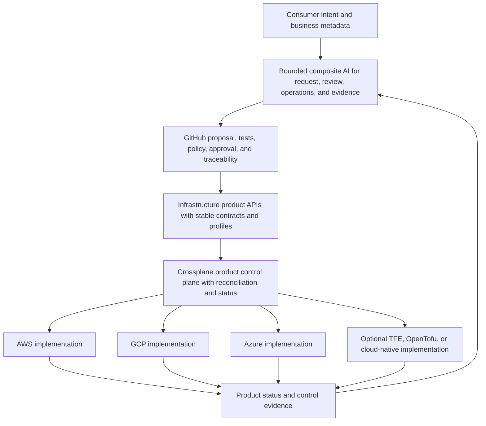
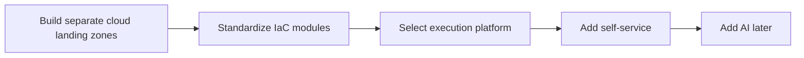
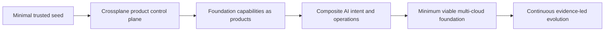
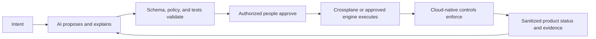
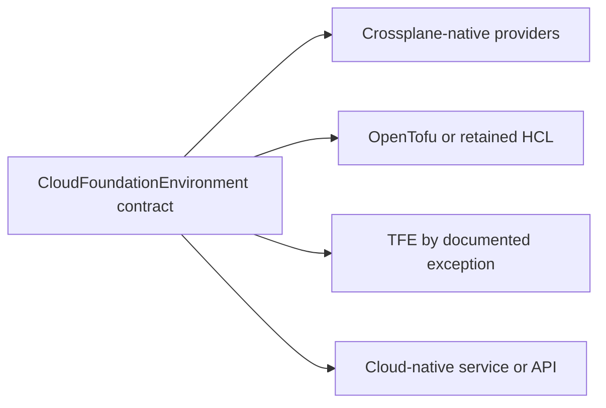
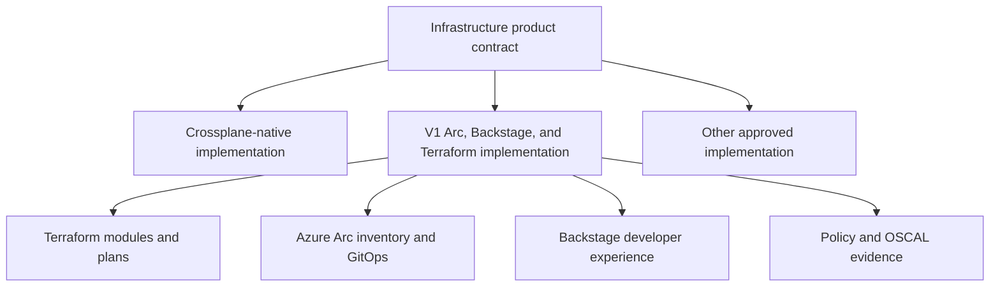
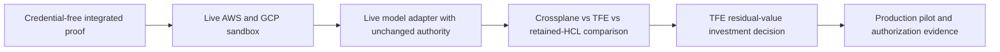

<p align="center">
  
</p>

<h1 align="center">AI-Powered Infrastructure as a Product</h1>

<p align="center">
  <strong>IaaS is what we buy; infrastructure-as-a-product is what we build.</strong>
</p>

<p align="center">
  Composite AI interprets intent and evidence • Crossplane exposes and reconciles product APIs • GitHub governs change • Cloud-native controls enforce the final boundary
</p>

<p align="center">
  <a href="https://saabolimpactventure.github.io/ai-powered-infrastructure-as-a-product/">
    
  </a>
  <a href="https://github.com/SAABOLImpactVenture/multicloud-foundation-poc-integration">
    
  </a>
  <a href="LICENSE">
    
  </a>
</p>

---

## The thesis

Cloud infrastructure is increasingly purchased as commodity **IaaS**, but the governed experience an enterprise gives its consumers must be deliberately designed and operated as a **product**.

That product is not a Terraform module, a TFE workspace, a cloud account, a pipeline, or a portal. Those may all help implement it. The product is a supported, versioned, governed capability with:

- a stable consumer contract;
- clear outcomes and approved profiles;
- policy, identity, security, cost, and evidence built into delivery;
- lifecycle management and live product status;
- an accountable owner, roadmap, operating model, and support boundary; and
- replaceable implementation mechanisms behind the contract.

This repository is the **program-level front door** for that thesis. It preserves the original Terraform, Azure Arc, Backstage, policy, observability, and evidence accelerator while reframing those assets as implementation patterns within a broader product-control-plane architecture.

> **Productization does not have to follow cloud-foundation establishment. Productization can be the mechanism through which the minimum viable foundation is established.**

Read the fuller position in [The Infrastructure-as-a-Product Thesis](docs/THESIS.md).

---

## The strategic architecture


```mermaid
flowchart TB
  CON[Consumer intent and business metadata]
  AI[Bounded composite AI for request, review, operations, and evidence]
  GIT[GitHub proposal, tests, policy, approval, and traceability]
  API[Infrastructure product APIs with stable contracts and profiles]
  XP[Crossplane product control plane with reconciliation and status]
  AWS[AWS implementation]
  GCP[GCP implementation]
  AZ[Azure implementation]
  OPT[Optional TFE, OpenTofu, or cloud-native implementation]
  EVID[Product status and control evidence]

  CON --> AI
  AI --> GIT
  GIT --> API
  API --> XP
  XP --> AWS
  XP --> GCP
  XP --> AZ
  XP --> OPT
  AWS --> EVID
  GCP --> EVID
  AZ --> EVID
  OPT --> EVID
  EVID --> AI
```

The architectural center is the **product contract and control plane**, not a mandatory infrastructure execution engine.

- **Composite AI** interprets, proposes, explains, diagnoses sanitized status, and assembles evidence.
- **Deterministic schema, policy, tests, and authorized reviewers** decide whether a proposal is acceptable.
- **Crossplane** exposes product APIs, selects implementations, continuously reconciles desired state, and reports product conditions.
- **Cloud IAM and native controls** remain the ultimate permission and enforcement boundaries.
- **TFE, OpenTofu, Terraform CLI, cloud-native services, and other mechanisms** may be selected behind the product boundary when they provide value.

See [Product-Control-Plane Architecture](docs/architecture/product-control-plane.md).

---

## Foundation establishment has changed

The traditional sequence was largely provider-first and tool-first:


```mermaid
flowchart LR
  A1[Build separate cloud landing zones] --> A2[Standardize IaC modules]
  A2 --> A3[Select execution platform]
  A3 --> A4[Add self-service]
  A4 --> A5[Add AI later]
```

The emerging product-led sequence begins with only the minimum trusted bootstrap required to operate safely:


```mermaid
flowchart LR
  B1[Minimal trusted seed] --> B2[Crossplane product control plane]
  B2 --> B3[Foundation capabilities as products]
  B3 --> B4[Composite AI intent and operations]
  B4 --> B5[Minimum viable multi-cloud foundation]
  B5 --> B6[Continuous evidence-led evolution]
```

The seed may contain the initial organization or tenant relationship, management cluster, federated identity, audit path, Git repository, and narrowly scoped execution authority. Crossplane and composite AI can then help establish and evolve selected minimum-viable-foundation capabilities as governed products, including:

- account, subscription, or project boundaries;
- workload identity;
- network zones and private connectivity patterns;
- logging and security-monitoring baselines;
- encryption, metadata, budget, quota, and regional guardrails; and
- complete workload foundation environments.

The principle is:

> **Bootstrap with the smallest trusted mechanism necessary; establish and operate the foundation through product APIs.**

---

## Repository portfolio

This repository now serves as the thesis, architecture, and portfolio hub for a set of deliberately bounded POCs.

| Repository | Role in the thesis |
|---|---|
| **[`ai-powered-infrastructure-as-a-product`](https://github.com/SAABOLImpactVenture/ai-powered-infrastructure-as-a-product)** | Program front door, thesis, architecture, preserved accelerator assets, product operating model, and roadmap. |
| **[`crossplane-multicloud-seed-poc`](https://github.com/SAABOLImpactVenture/crossplane-multicloud-seed-poc)** | Minimal trusted Crossplane seed. It proves the control-plane bootstrap can remain small, replaceable, non-production, and independent of TFE. |
| **[`multicloud-foundation-product-poc`](https://github.com/SAABOLImpactVenture/multicloud-foundation-product-poc)** | Defines the `CloudFoundationEnvironment` API and AWS/GCP implementations behind one stable consumer contract. |
| **[`composite-ai-infrastructure-product-poc`](https://github.com/SAABOLImpactVenture/composite-ai-infrastructure-product-poc)** | Proves bounded request, review, operations, and evidence agents without infrastructure execution authority. |
| **[`multicloud-foundation-poc-integration`](https://github.com/SAABOLImpactVenture/multicloud-foundation-poc-integration)** | Executable acceptance and evidence harness that consumes the other POCs at pinned commits and tests the complete credential-free flow. |

The detailed mapping is maintained in [POC Portfolio](docs/poc-portfolio.md).

### Current proof boundary

The repositories are intentionally honest about what is proven.

The credential-free integration harness is designed to demonstrate:

- exact upstream commit locks;
- clean-cluster Crossplane deployment without TFE or cloud credentials;
- active ingress and egress NetworkPolicy enforcement;
- accepted AWS and GCP development intent;
- deterministic rejection of unsafe or invalid requests;
- AI-generated product proposals reconciled through the simulated Crossplane implementation;
- no product-write authority for the AI service account;
- prompt-injection containment;
- machine-readable evidence; and
- teardown without simulated product orphans.

It does **not** yet establish live AWS/GCP provisioning, live model value, workload-identity-backed ProviderConfigs, live-cloud drift behavior, or a TFE investment verdict. Those are separate evidence gates rather than assumed conclusions.

---

## Product and authority boundaries


```mermaid
flowchart LR
  INTENT[Intent] --> AIP[AI proposes and explains]
  AIP --> DET[Schema, policy, and tests validate]
  DET --> HUMAN[Authorized people approve]
  HUMAN --> EXEC[Crossplane or approved engine executes]
  EXEC --> CLOUD[Cloud-native controls enforce]
  CLOUD --> STATUS[Sanitized product status and evidence]
  STATUS --> AIP
```

The operating rule is:

> **AI proposes and explains. Deterministic controls validate. Authorized people approve. Crossplane or another approved engine executes. Cloud-native controls enforce the final boundary.**

AI should not:

- approve or merge its own changes;
- create or expand privileged identities;
- read secrets, Terraform state, or unrestricted provider details;
- directly apply, remediate, or delete cloud infrastructure;
- modify its own tool or policy boundaries; or
- make an authorization or compliance determination by itself.

---

## TFE is an option, not an inherited dependency

This program does not claim that Terraform Enterprise is incapable or obsolete. It asks a more defensible architectural and economic question:

> **After the product control plane, GitHub governance, cloud-native identity, policy, evidence, and composite AI assume the strategic infrastructure-product responsibilities, what capabilities remain uniquely dependent on TFE, what workloads require them, and does that residual value justify platform-level investment?**

TFE may remain justified for:

- existing Terraform state and brownfield estates;
- specialized provider coverage;
- already accredited controls;
- migration economics;
- a bounded bootstrap responsibility; or
- an explicitly approved implementation lane.

It should not automatically become a required consumer-facing dependency merely because Terraform code exists.

The execution engine is an implementation detail when the product contract remains stable:


```mermaid
flowchart LR
  CONTRACT[CloudFoundationEnvironment contract]
  CONTRACT --> NATIVE[Crossplane-native providers]
  CONTRACT --> TOFU[OpenTofu or retained HCL]
  CONTRACT --> TFE[TFE by documented exception]
  CONTRACT --> CLOUDAPI[Cloud-native service or API]
```

One external resource must have **one authoritative owner**. Crossplane, TFE, OpenTofu, and cloud-native automation must never actively co-manage the same resource.

---

## Preserved implementation assets

The original accelerator remains valuable and is intentionally preserved rather than discarded.

It includes:

- Backstage catalog and scaffolder patterns;
- Terraform modules and policy examples;
- Azure Arc onboarding and GitOps assets;
- OPA, Gatekeeper, Kyverno, Checkov, TFLint, Cosign, and SBOM patterns;
- MCP server concepts;
- observability and OSCAL evidence pipelines;
- agent personas and operating-model material; and
- runbooks, ADRs, and cloud-specific implementation examples.

These assets are now framed as a **V1 Azure Arc and Terraform implementation pattern**, not as the only strategic target architecture. They may still sit behind an infrastructure-product contract where they are the best fit.

- [Preserved V1 Azure Arc and Terraform Pattern](docs/architecture/v1-azure-arc-terraform-pattern.md)
- [Original Azure Control-Plane Architecture](docs/architecture/target-architecture.md)
- [Azure Arc Detail](docs/AZURE-ARC.md)
- [Original Arc ADR](adr/ADR-0001-azure-arc-control-plane.md)
- [Product-Control-Plane ADR](adr/ADR-0002-product-control-plane.md)


```mermaid
flowchart TB
  PROD[Infrastructure product contract]
  PROD --> XPIMPL[Crossplane-native implementation]
  PROD --> V1[V1 Arc, Backstage, and Terraform implementation]
  PROD --> OTHER[Other approved implementation]
  V1 --> TF[Terraform modules and plans]
  V1 --> ARC[Azure Arc inventory and GitOps]
  V1 --> BS[Backstage developer experience]
  V1 --> OSCAL[Policy and OSCAL evidence]
```

---

## Product operating model

Infrastructure becomes a product only when the organizational model changes with the technology.

Each infrastructure product should have:

| Product concern | Required definition |
|---|---|
| Consumer | Who needs the capability and what outcome they need. |
| Contract | Stable API, profiles, required metadata, guarantees, and exclusions. |
| Ownership | Product owner, responsible engineer, operations owner, security reviewer. |
| Lifecycle | Versioning, upgrade, rollback, deprecation, deletion, and exception rules. |
| Governance | Schema, policy, approvals, identity, evidence, and resource-ownership boundaries. |
| Operations | Product health, conditions, runbooks, known errors, SLOs, and escalation paths. |
| Economics | Adoption, cost-to-serve, platform cost, avoided toil, and investment decisions. |
| Roadmap | Validated demand, product improvements, cloud coverage, and retirement decisions. |

This is why **IaaP is not simply a new name for IaC**. IaC is one implementation technique. Infrastructure as a Product is the complete product, governance, and operating model.

---

## Recommended evaluation sequence


```mermaid
flowchart LR
  P0[Credential-free integrated proof] --> P1[Live AWS and GCP sandbox]
  P1 --> P2[Live model adapter with unchanged authority]
  P2 --> P3[Crossplane vs TFE vs retained-HCL comparison]
  P3 --> P4[TFE residual-value investment decision]
  P4 --> P5[Production pilot and authorization evidence]
```

### Gate 0 — Credential-free integration

Prove the seed, product API, deterministic policy, bounded AI, reconciliation, evidence, and teardown as one system.

### Gate 1 — Live cloud sandbox

Preserve the same product contract while creating real resources in approved AWS and GCP sandboxes through workload identity.

### Gate 2 — Live composite AI

Add a live model adapter without expanding tools or authority. Compare it with the deterministic baseline using fixed evaluations.

### Gate 3 — Fair execution comparison

Run the same observed lifecycle scenarios through:

- Crossplane-native implementation;
- TFE-centered implementation; and
- Crossplane with retained HCL or OpenTofu.

### Gate 4 — Investment decision

Evaluate TFE based on actual unique capability, utilization, compliance value, contract cost, hosting, operations, specialist labor, integration, migration economics, and opportunity cost.

---

## Repository map

The repository is broad because it preserves a working accelerator and its supporting intellectual property.

```text
.
├── README.md                         # Current thesis and program front door
├── docs/
│   ├── THESIS.md                    # Strategic position
│   ├── poc-portfolio.md             # Related POC roles and evidence gates
│   ├── architecture/
│   │   ├── product-control-plane.md # Current target architecture
│   │   ├── v1-azure-arc-terraform-pattern.md
│   │   └── target-architecture.md   # Preserved original architecture
│   ├── agents/                      # Agent workflows and operating model
│   ├── assets/                      # Existing visual assets
│   └── runbooks/                    # Operational guidance
├── adr/                              # Architecture decisions, old and new
├── backstage/ and catalog/           # Developer-experience patterns
├── terraform/ and iac/               # Existing implementation assets
├── policy/                           # Policy-as-code and supply-chain controls
├── observability/ and evidence/      # Telemetry and compliance evidence
├── scripts/                          # Cloud, Arc, validation, and automation utilities
└── workloads/                        # Productized workload examples
```

No wholesale deletion is required to evolve the architecture. Existing assets are retained, labeled, and placed behind the current product mental model.

---

## Security and regulated-environment posture

The architecture is intended to support regulated environments, but repository content and POC evidence do not themselves constitute authorization.

Core expectations include:

- workload identity or federated identity rather than long-lived cloud keys;
- least privilege and separate identities for each cloud and responsibility;
- policy enforced before provisioning and continuously where appropriate;
- no secrets, credentials, raw state, or regulated data in AI prompts or evidence bundles;
- signed artifacts, SBOMs, provenance, immutable audit records, and controlled exceptions;
- machine-readable evidence tied to product contracts, tests, deployments, and operations; and
- explicit human accountability for material decisions.

---

## Where to start

For the current architecture, begin with the bounded POC chain:

1. Deploy and validate [`crossplane-multicloud-seed-poc`](https://github.com/SAABOLImpactVenture/crossplane-multicloud-seed-poc).
2. Apply the simulated or approved live profile from [`multicloud-foundation-product-poc`](https://github.com/SAABOLImpactVenture/multicloud-foundation-product-poc).
3. Validate bounded agent behavior in [`composite-ai-infrastructure-product-poc`](https://github.com/SAABOLImpactVenture/composite-ai-infrastructure-product-poc).
4. Run the complete evidence harness in [`multicloud-foundation-poc-integration`](https://github.com/SAABOLImpactVenture/multicloud-foundation-poc-integration).

For the preserved original accelerator and its local developer demo, see [Preserved V1 Azure Arc and Terraform Pattern](docs/architecture/v1-azure-arc-terraform-pattern.md) and the existing implementation folders in this repository.

---

## Contributing

Contributions should strengthen one or more of the following:

- product contracts and consumer outcomes;
- deterministic policy and security defaults;
- bounded composite-AI behavior and evaluations;
- Crossplane provider, Composition, and lifecycle quality;
- evidence generation and operational support;
- fair implementation comparison; or
- clarity about which assets are strategic defaults, optional implementations, experiments, or preserved prior patterns.

Discuss large architectural changes through an issue or ADR before implementation.

---

## License

Apache License 2.0. See [LICENSE](LICENSE).
