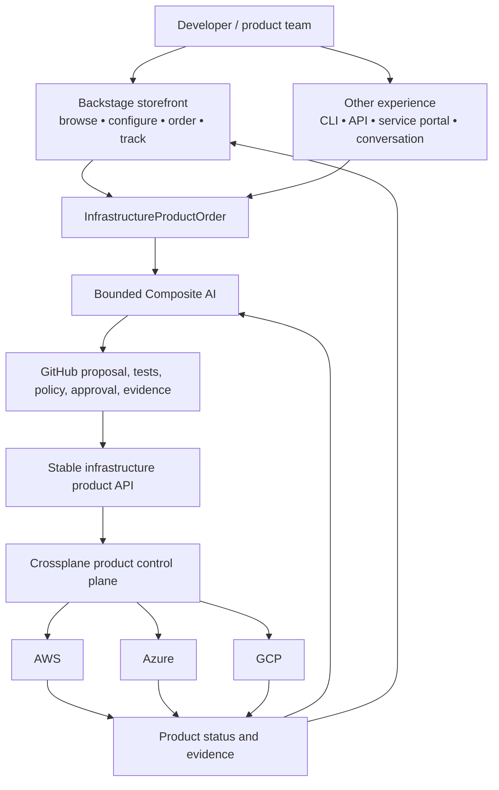
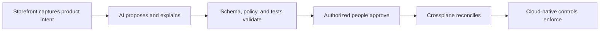
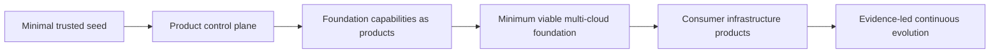
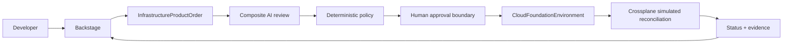
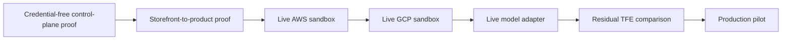

<p align="center">
  
</p>

<h1 align="center">AI-Powered Infrastructure as a Product</h1>

<p align="center"><strong>IaaS is what we buy; infrastructure-as-a-product is what we build.</strong></p>

<p align="center"><strong>Backstage is where developers shop; Crossplane is where the product is controlled.</strong></p>

<p align="center">Composite AI • Crossplane • Backstage storefront • GitHub governance • deterministic policy • multi-cloud evidence</p>

---

## The modern accelerator

This repository is the **thesis, architecture, governance, operating-model, and evidence front door** for a modern Infrastructure-as-a-Product (IaaP) accelerator.

The maintained reference architecture is intentionally small and opinionated:

- **Infrastructure product contracts** define the stable consumer boundary.
- **Backstage** is the optional reference storefront for browse, configure, order, and track.
- **Crossplane** is the product control plane and reconciliation layer.
- **Composite AI** interprets intent, proposes changes, explains policy, diagnoses sanitized status, and assembles evidence.
- **GitHub** governs product change, review, traceability, and evidence.
- **Deterministic policy and tests** decide what is valid.
- **Authorized people** approve material changes.
- **Cloud-native IAM and controls** remain the ultimate enforcement boundary.

The earlier accelerator embedded Backstage together with Terraform/TFE, Azure Arc, legacy execution MCP servers, and cloud-specific implementation code. That embedded stack is superseded and preserved on `archive/legacy-accelerator-v1`.

A **new bounded Backstage storefront** now lives independently in [`backstage-infrastructure-product-storefront-poc`](https://github.com/SAABOLImpactVenture/backstage-infrastructure-product-storefront-poc). It is an experience layer, not an inherited control-plane dependency.

> **The accelerator demonstrates the product model without requiring the historical implementation stack.**

---

## Strategic architecture


```mermaid
flowchart TB
  DEV[Developer / product team]
  STORE[Backstage storefront\nbrowse • configure • order • track]
  ALT[Other experience\nCLI • API • service portal • conversation]
  ORDER[InfrastructureProductOrder]
  AI[Bounded Composite AI]
  GIT[GitHub proposal, tests, policy, approval, evidence]
  API[Stable infrastructure product API]
  XP[Crossplane product control plane]
  AWS[AWS]
  AZ[Azure]
  GCP[GCP]
  STATUS[Product status and evidence]

  DEV --> STORE
  DEV --> ALT
  STORE --> ORDER
  ALT --> ORDER
  ORDER --> AI
  AI --> GIT
  GIT --> API
  API --> XP
  XP --> AWS
  XP --> AZ
  XP --> GCP
  AWS --> STATUS
  AZ --> STATUS
  GCP --> STATUS
  STATUS --> AI
  STATUS --> STORE
```

The architectural center is the **product contract**, not a workspace, module, portal, pipeline, or execution engine.

Backstage is deliberately replaceable. A different storefront can submit the same product intent without changing the product contract or Crossplane control plane.

### Authority chain


```mermaid
flowchart LR
  S[Storefront captures product intent] --> A[AI proposes and explains]
  A --> D[Schema, policy, and tests validate]
  D --> H[Authorized people approve]
  H --> X[Crossplane reconciles]
  X --> C[Cloud-native controls enforce]
```

Neither the storefront nor AI receives direct cloud administrator, Kubernetes administrator, Terraform/TFE, merge, approval, or unrestricted remediation authority.

---

## What the developer sees

The first reference storefront product is **Cloud Foundation Environment**.

The developer supplies product/business intent such as:

- order name;
- cloud (`aws` or `gcp` in the current POC);
- approved region;
- application;
- business unit;
- owner/team; and
- cost center.

The developer does **not** choose:

- Crossplane XRDs or Compositions;
- ProviderConfig;
- cloud credentials;
- provider versions;
- IAM policy JSON;
- Terraform/TFE workspaces;
- raw network implementation; or
- Kubernetes namespaces.

This is the practical expression of infrastructure-as-a-product: the consumer orders an outcome, not an implementation topology.

---

## Foundation establishment model

The modern sequence is not "finish three landing zones, then productize them."


```mermaid
flowchart LR
  S[Minimal trusted seed] --> P[Product control plane]
  P --> F[Foundation capabilities as products]
  F --> M[Minimum viable multi-cloud foundation]
  M --> C[Consumer infrastructure products]
  C --> E[Evidence-led continuous evolution]
```

A minimal seed establishes only the irreducible trust boundary needed for Crossplane and governed delivery to operate. Foundation capabilities can then be established and evolved through product APIs.

The storefront can expose those products as they mature without becoming part of their implementation.

---

## POC portfolio

This repository deliberately references bounded implementation POCs rather than duplicating them.

| Repository | Responsibility |
|---|---|
| [`backstage-infrastructure-product-storefront-poc`](https://github.com/SAABOLImpactVenture/backstage-infrastructure-product-storefront-poc) | Optional reference developer storefront: browse, configure, order, track. No provisioning authority. |
| [`crossplane-multicloud-seed-poc`](https://github.com/SAABOLImpactVenture/crossplane-multicloud-seed-poc) | Minimal trusted Crossplane seed. |
| [`multicloud-foundation-product-poc`](https://github.com/SAABOLImpactVenture/multicloud-foundation-product-poc) | Stable `CloudFoundationEnvironment` product API and cloud implementations. |
| [`composite-ai-infrastructure-product-poc`](https://github.com/SAABOLImpactVenture/composite-ai-infrastructure-product-poc) | Bounded request, review, operations, and evidence agents. |
| [`multicloud-foundation-poc-integration`](https://github.com/SAABOLImpactVenture/multicloud-foundation-poc-integration) | Credential-free integrated acceptance and evidence harness, including the storefront handoff. |
| **This repository** | Thesis, architecture, decisions, operating model, evidence baseline, and investment framing. |

See [POC Portfolio](docs/poc-portfolio.md).

### Product-system shorthand

```text
Backstage = where the consumer shops
Product API = what the consumer is ordering
Composite AI = where intent and evidence are interpreted
GitHub = where change is governed
Crossplane = where the product lifecycle is controlled
Cloud = where the product is realized
```

---

## Integrated consumer path

The integration harness already contains the storefront handoff as a bounded upstream dependency.


```mermaid
flowchart LR
  DEV[Developer] --> STORE[Backstage]
  STORE --> ORDER[InfrastructureProductOrder]
  ORDER --> AI[Composite AI review]
  AI --> POLICY[Deterministic policy]
  POLICY --> HUMAN[Human approval boundary]
  HUMAN --> CFE[CloudFoundationEnvironment]
  CFE --> XP[Crossplane simulated reconciliation]
  XP --> EVID[Status + evidence]
  EVID --> STORE
```

The harness verifies that storefront and AI-rendered runtime contracts remain equivalent, implementation details do not leak into the product manifest, invalid storefront requests fail closed, and the human-approval boundary remains intact.

This closes the **consumer-experience gap** without weakening the control-plane boundary.

---

## Evidence already established

The frozen credential-free baseline passed across Kubernetes **1.34, 1.35, and 1.36**, with a **100/100** acceptance score on each matrix entry. It demonstrated:

- a bounded Crossplane 2.3.0 seed;
- enforced ingress and egress NetworkPolicy controls;
- one AWS/GCP infrastructure-product contract;
- deterministic rejection of unsafe requests;
- proposal-and-evidence-only composite-AI authority;
- prompt-injection containment;
- reconciliation to Ready simulated products; and
- teardown with zero simulated product-component orphans.

The integration harness has since been extended to include the independent Backstage storefront as a pinned upstream and requires a `storefront-order-handoff` acceptance control.

That proves **TFE is not mandatory for the demonstrated product path**. It does not yet prove live cloud provisioning or production readiness.

See [Credential-Free Baseline](docs/poc-baselines/2026-08-07-credential-free-multicloud-foundation.md), [POC Portfolio](docs/poc-portfolio.md), and [ADR-0004](adr/ADR-0004-tfe-optional-for-multicloud-foundation.md).

---

## What was superseded

The earlier accelerator contained useful exploration and implementation IP around Terraform, Azure Arc, an embedded Backstage implementation, cloud-execution MCP servers, PromptFlow/Semantic Kernel implementations, and provider-specific automation.

Those components were removed from the maintained branch because carrying them beside the current architecture caused the repository to tell multiple architectural stories at once.

They are **not declared bad technologies**. They are simply no longer dependencies of this accelerator.

The independent Backstage storefront POC is different from the removed embedded Backstage stack: it has one bounded responsibility and no provisioning authority.

- Recovery branch: `archive/legacy-accelerator-v1`
- Frozen pre-supersession commit: `be5fa73c72f77043ac666d32868ec7b82f9e83b1`
- Decision record: [ADR-0005](adr/ADR-0005-supersede-legacy-implementation-stack.md)
- Detail: [Supersession Record](docs/SUPERSESSION.md)

---

## Enterprise interoperability

An enterprise may still use TFE, Terraform/OpenTofu, Backstage, Arc, cloud-native account factories, ticketing, CMDB, or other systems. The accelerator treats them as **external integrations or implementation choices**, not inherited product dependencies.

For Backstage specifically, the program now provides a bounded reference storefront that demonstrates the integration contract without putting Backstage inside the product control plane.

See [Interoperability](docs/INTEROPERABILITY.md).

---

## TFE investment question

The architecture no longer needs TFE to exist internally in order to evaluate TFE fairly.

The decision question is now:

> **After Crossplane, GitHub governance, deterministic policy, cloud-native identity, evidence, and composite AI supply the strategic infrastructure-product operating model, what remaining capabilities and workloads uniquely justify TFE's lifecycle cost?**

See [TFE Investment Evaluation](docs/TFE-INVESTMENT.md).

---

## Next evidence gates


```mermaid
flowchart LR
  G0[Credential-free control-plane proof] --> G1[Storefront-to-product proof]
  G1 --> G2[Live AWS sandbox]
  G2 --> G3[Live GCP sandbox]
  G3 --> G4[Live model adapter]
  G4 --> G5[Residual TFE comparison]
  G5 --> G6[Production pilot]
```

The storefront-to-product flow is now implemented in the integration harness. The next **live-cloud** technical milestone remains **AWS sandbox reconciliation using workload identity**, followed by the same evidence pattern in GCP.

---

## Repository map

```text
.
├── README.md
├── docs/
│   ├── THESIS.md
│   ├── architecture/product-control-plane.md
│   ├── OPERATING-MODEL.md
│   ├── INTEROPERABILITY.md
│   ├── TFE-INVESTMENT.md
│   ├── SUPERSESSION.md
│   ├── poc-portfolio.md
│   └── poc-baselines/
├── adr/
├── policies/opa/
├── tests/agents-evals/
├── artifacts/poc-baselines/
└── .github/workflows/
```

The bounded implementation repositories contain the runtime and experience code. This repository contains the durable product thesis and evidence architecture.

## License

Apache License 2.0. See [LICENSE](LICENSE).
