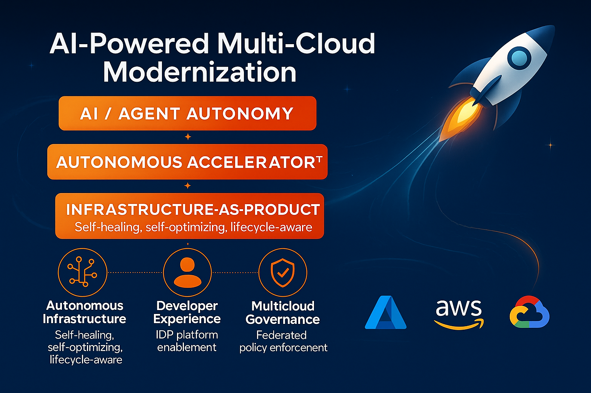

<p align="center">
  
</p>

<h1 align="center">Agent‑Driven Infrastructure‑as‑a‑Product (IaaP)</h1>
<p align="center">
  Azure orchestrates • AWS / GCP / OCI execute • Autonomous Agents productize services • Backstage delivers the developer experience
</p>

---


## TL;DR

This accelerator turns a multi‑cloud estate into **governed, productized modules** delivered through **Backstage** and operated by **autonomous agents**.

- **AI / Agent Autonomy** → MCP servers plan/apply and emit signed evidence.
- **Autonomous Accelerator** → “golden paths” for identity, networking, Kubernetes, and policies across Azure, AWS, GCP, OCI.
- **Infrastructure‑as‑Product** → secure‑by‑default modules with policy enforcement and developer‑friendly templates.


## Why this repo

Platform teams get a **federated control plane on Azure** with execution planes in AWS/GCP/OCI. Developers get an **off‑the‑shelf** experience: pick a product, fill a few inputs, and let agents plan → check policy → apply → emit evidence.


## How it works (at a glance)

1. **Backstage template** provisions a baseline (identity, networking, k8s, observability).  
2. **MCP server** for the target cloud runs `terraform plan` → **policy check** → `apply`.  
3. **Evidence** is written as JSON and optionally ingested to Azure Log Analytics via DCR.  
4. **Dashboards** show policy/evidence status across clouds.

```text
Backstage → MCP (plan/policy/apply) → Evidence → (optional) LA Workspace + Workbook
```

> Quick demo: `docker compose -f docker/docker-compose.yml up --build` then open the dashboard on http://localhost:8090


## What’s inside

- **Productized modules**: `platform/azure/*`, `platform/aws/*`, `platform/gcp/*`, `platform/oci/*`
- **MCP servers**: `servers/mcp/{azure,aws,gcp,oci}` (`/plan`, `/apply`) + policy servers `servers/mcp-policy/*` (`/policy/check`)
- **Backstage**: Scaffolder actions `mcp:plan`, `mcp:policyCheck`, templates in `examples/golden-demo/backstage/templates/*`
- **Policy packs**: Gatekeeper (K8s), AWS Config, GCP Org Policy, OCI IAM (`policies/**`)
- **Evidence**: schema + ingestion (DCR + Workbook) in `evidence/**` and `observability/**`
- **Docker Compose**: all servers + a lightweight policy dashboard in `docker/docker-compose.yml` and `tools/policy-dashboard/`


## Quickstart

```bash
# 1) Run everything locally (agents, policy servers, dashboard)
docker compose -f docker/docker-compose.yml up --build

# 2) Trigger a plan
curl -sS -X POST http://localhost:8080/plan   -H 'content-type: application/json'   -d '{"path":"platform/azure/observability/log_analytics"}' | jq

# 3) View policy status
open http://localhost:8090
```

> CI usage: use GitHub OIDC / Workload Identity to run `terraform validate/plan` for each cloud in PRs.


## Secure by default

- **Identity**: GitHub → Azure OIDC, AWS role federation, GCP Workload Identity, OCI dynamic groups.
- **Policies**: K8s Gatekeeper constraints; AWS Config/GCP Org/OCI IAM baselines.
- **Evidence**: structured JSON schema, optional hash, DCR ingestion, workbook visualization.
- **No `null_resource` / `local-exec`** in product modules.


## Repo map

- `platform/<cloud>/...` — product modules
- `servers/mcp/*` — plan/apply agents
- `servers/mcp-policy/*` — policy check agents
- `policies/*` — policy packs
- `examples/*` — golden demo & Backstage templates
- `evidence/*`, `observability/*` — evidence schema & ingestion
- `docker/docker-compose.yml` — one‑command demo


## Next steps

- Register the Backstage **Policy Status Card** and point it to `/api/policy/aggregate` (or the dashboard).  
- Wire CI to run `terraform validate/plan` across all product modules.  
- Ingest evidence to your Log Analytics workspace and pin the workbook.

