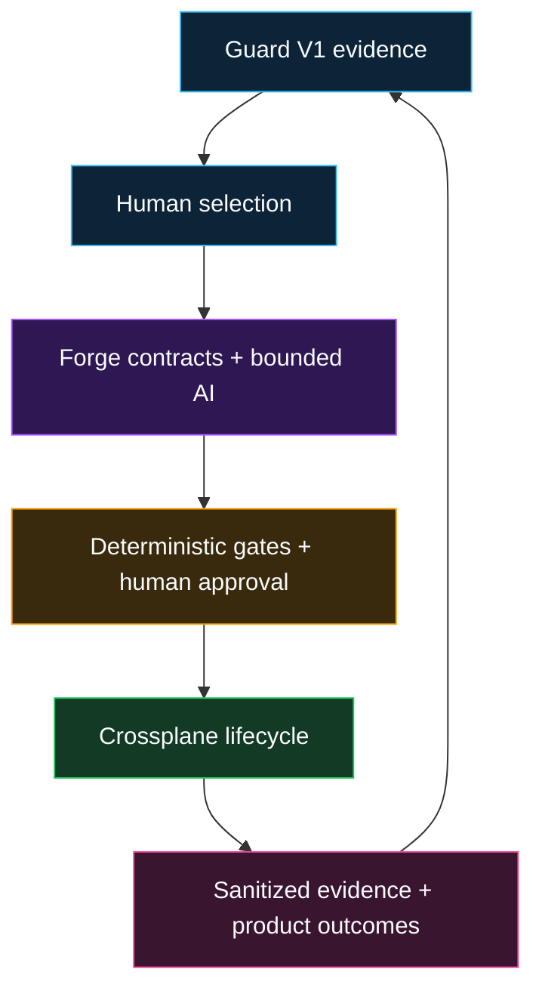

# IaaP Guard-to-Forge Transition

IaaP Guard V1 remains frozen at its supported boundary. Forge consumes Guard evidence but never rewrites it or treats it as authorization.

The accepted Forge implementation is maintained in a private repository. This public architecture hub records only the product boundary and sanitized capability evidence needed to explain the system.

## Proven capability

At the public architecture level, Forge has demonstrated:

- protected repository validation with retained sanitized evidence;
- bounded Composite AI that proposes and explains without approval or infrastructure-execution authority;
- API, CLI, and optional Backstage submission surfaces;
- a fail-closed Crossplane lifecycle and workload-identity boundary;
- a governed infrastructure-product API that consumes frozen Guard evidence and remains inert until required human and deterministic gates are satisfied;
- proposal-only infrastructure-product portfolio patterns;
- deterministic supply-chain and OSCAL-oriented interoperability;
- Guard reassessment and developer/product outcome evidence; and
- bounded non-production validation across AWS, Azure, and GCP, plus synthetic model-adapter and remote-run proxy evidence.

## Evidence boundary

Public evidence is intentionally narrower than the private implementation record. It may state the accepted outcome of bounded sandbox, model-adapter, interoperability, or teardown validation without publishing private repository revisions, internal role mechanics, entitlement implementation, deployment identifiers, or other implementation details that are unnecessary to substantiate the public claim.

The HCP Terraform result remains deliberately narrow: it validated a zero-resource remote-run proxy on HCP Terraform Free. Terraform Enterprise was not deployed, accessed, licensed, or validated, and TFE is not asserted as a dependency of the demonstrated product path.

Forge business, distribution, pricing, entitlement implementation, and final licensing strategy are outside the scope of this public architecture repository. Production remains unauthorized. No certification, assessment conclusion, ATO, customer-production, or production-readiness claim is made.

See [Public Publication Boundary](PUBLICATION-BOUNDARY.md) for the publication rule applied to current and future Guard, Forge, and Console material in this repository.
