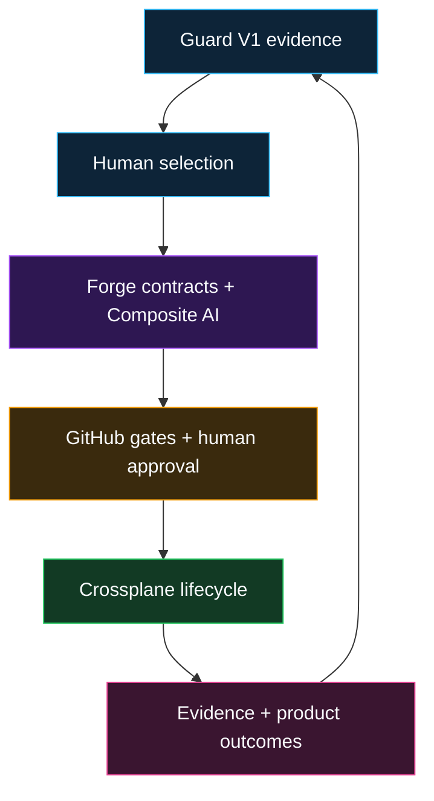

# IaaP Guard-to-Forge Transition

IaaP Guard V1 remains frozen at its supported boundary. Forge consumes Guard evidence but never rewrites it or treats it as authorization.

The credential-free Forge implementation is pinned here at [`313eb6ac1bf957e23d0d1a600569b7f1d6590e95`](https://github.com/SAABOLImpactVenture/iaap-forge/commit/313eb6ac1bf957e23d0d1a600569b7f1d6590e95).

## Proven capability

- Hardened protected repository validation and retained evidence.
- Native four-role bounded Composite AI runtime.
- Stable API, CLI, and optional Backstage submission surfaces.
- Fail-closed Crossplane lifecycle and workload-identity contracts.
- Five additional proposal-only infrastructure products.
- Deterministic supply-chain and OSCAL interoperability.
- Guard reassessment with Developer NPS, time-to-provision, adoption, exception, and operating-effort metrics.
- Offline commercial entitlement and paid-evaluation enforcement.
- Prepared, fail-closed live-sandbox preflight.

## Explicit blockers

Forge Phase 19 is `PREPARED_BLOCKED`. No AWS, Azure, GCP, model-adapter, or TFE live evidence has been produced by Forge. Credentials, costs, non-production confirmation, deployment authorization, third-party consent, and evidence-retention approval are required before scheduling those runs.

Commercial entitlement is technically implemented, but pricing, license/EULA, tax, payment activation, production signing-key custody, and Marketplace decisions remain external gates. No revenue, certification, assessment conclusion, ATO, or production readiness is claimed.
