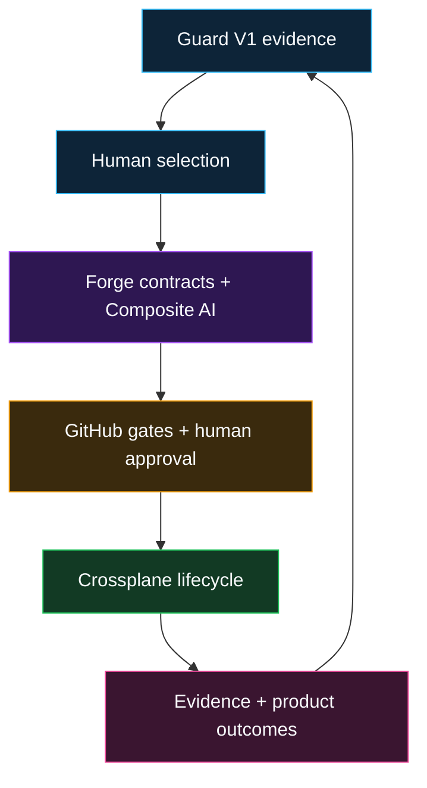

# IaaP Guard-to-Forge Transition

IaaP Guard V1 remains frozen at its supported boundary. Forge consumes Guard evidence but never rewrites it or treats it as authorization.

The credential-free Forge implementation is pinned here at [`1ecf0b76e3cfdb8bf0017651567ee7fb59fa9cd8`](https://github.com/SAABOLImpactVenture/iaap-forge/commit/1ecf0b76e3cfdb8bf0017651567ee7fb59fa9cd8).

## Proven capability

- Hardened protected repository validation and retained evidence.
- Native four-role bounded Composite AI runtime.
- Stable API, CLI, and optional Backstage submission surfaces.
- Fail-closed Crossplane lifecycle and workload-identity contracts.
- A guarded, namespaced Crossplane v2 infrastructure-product API that consumes frozen Guard evidence and remains inert until governed approval.
- Five additional proposal-only infrastructure products.
- Deterministic supply-chain and OSCAL interoperability.
- Guard reassessment with Developer NPS, time-to-provision, adoption, exception, and operating-effort metrics.
- Offline entitlement and evaluation controls.
- Prepared, fail-closed live-sandbox preflight.

## Live evidence and explicit blockers

Forge Phase 19 has retained **PASS** evidence for bounded AWS, Azure, and GCP non-production workload-identity reconciliation and verified teardown. The accepted evidence revision is [`a913cd708893e88800b942840ca32d91cebdb3b1`](https://github.com/SAABOLImpactVenture/iaap-forge/commit/a913cd708893e88800b942840ca32d91cebdb3b1).

Phase 19 remains open because the model-adapter and residual TFE targets are `PREPARED_BLOCKED`. Their credentials, processing or third-party consent, costs, non-production confirmation, deployment authorization, and evidence-retention approval are separate gates and are not satisfied by the cloud validations.

Forge business, distribution, and licensing strategy is outside the scope of this public architecture repository. No certification, assessment conclusion, ATO, or production readiness is claimed.
