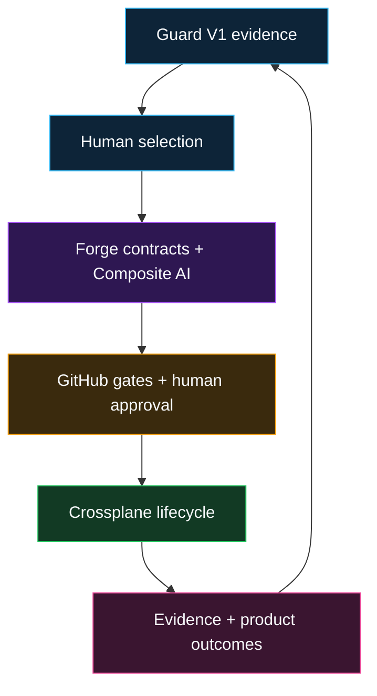

# IaaP Guard-to-Forge Transition

IaaP Guard V1 remains frozen at its supported boundary. Forge consumes Guard evidence but never rewrites it or treats it as authorization.

The accepted Forge implementation and retained Phase 19 evidence are pinned here at [`6fb587cb3f521e99c33039c61090fe8b738836cc`](https://github.com/SAABOLImpactVenture/iaap-forge/commit/6fb587cb3f521e99c33039c61090fe8b738836cc).

## Proven capability

- Hardened protected repository validation and retained evidence.
- Native four-role bounded Composite AI runtime.
- Stable API, CLI, and optional Backstage submission surfaces.
- Fail-closed Crossplane lifecycle and workload-identity contracts.
- A guarded, namespaced Crossplane v2 infrastructure-product API that consumes frozen Guard evidence and remains inert until governed approval.
- Five additional proposal-only infrastructure products.
- Deterministic supply-chain and OSCAL interoperability.
- Guard reassessment with Developer NPS, time-to-provision, adoption, exception, and operating-effort metrics.
- Offline entitlement and evaluation controls.
- Prepared, fail-closed live-sandbox preflight.
- Bounded AWS, Azure, and GCP non-production workload-identity reconciliation with verified teardown.
- Synthetic-only Vertex AI model-adapter validation under a fixed usage ceiling.
- HCP Terraform Free remote-run proxy validation with no infrastructure resources, sanitized evidence, and verified workspace/token teardown.

## Live evidence and explicit blockers

Forge Phase 19 is complete with retained **PASS** evidence for bounded AWS, Azure, and GCP non-production workload-identity reconciliation and verified teardown. The same accepted revision records a synthetic-only Vertex AI model-adapter **PASS** and an HCP Terraform Free remote-run `PROXY_PASS`: [`6fb587cb3f521e99c33039c61090fe8b738836cc`](https://github.com/SAABOLImpactVenture/iaap-forge/commit/6fb587cb3f521e99c33039c61090fe8b738836cc).

The HCP Terraform result is deliberately narrow. It validates a zero-resource remote-run proxy on HCP Terraform Free; Terraform Enterprise was not deployed, accessed, licensed, or validated. The evidence does not make TFE a dependency of the demonstrated product path.

Forge business, distribution, and licensing strategy is outside the scope of this public architecture repository. Production remains unauthorized. No certification, assessment conclusion, ATO, or production readiness is claimed.
