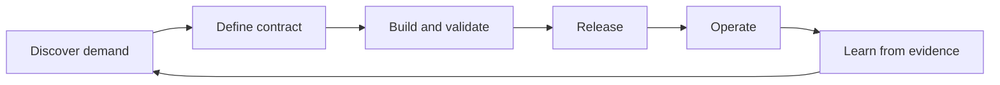

# Product Operating Model

Infrastructure becomes a product only when ownership and operations change with the technology.

| Concern | Required definition |
|---|---|
| Consumer | Who needs the capability and what outcome they need. |
| Contract | API, profiles, required metadata, guarantees, and exclusions. |
| Product ownership | Roadmap, adoption, lifecycle, economics, and outcome metrics. |
| Responsible engineering | Technical quality, compatibility, implementation health, and breaking changes. |
| Security | Identity, deterministic policy, exception criteria, and evidence. |
| Operations | Conditions, known errors, runbooks, incidents, upgrades, and support. |
| Composite-AI governance | Model/tool boundaries, evaluations, redaction, and prompt-injection controls. |
| Cloud implementation | Provider-specific correctness, permissions, quotas, and service behavior. |

## Product lifecycle

## Metrics

Useful measures include adoption, time to a Ready product, policy rejection rate, exception rate, failed reconciliation rate, mean time to diagnosis, upgrade success, teardown/orphan success, cost-to-serve, and human correction required for AI-generated proposals.
