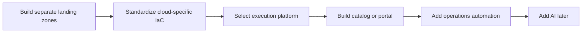
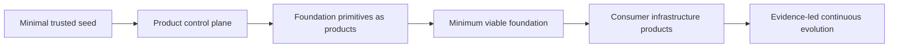
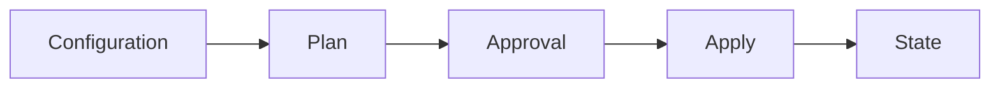
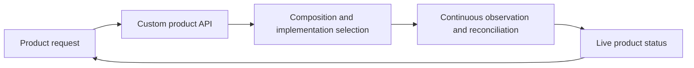
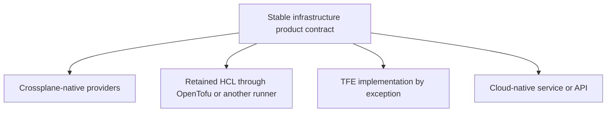

# The Infrastructure-as-a-Product Thesis

> **IaaS is what we buy; infrastructure-as-a-product is what we build.**

## Executive position

The rapid evolution of cloud APIs, Crossplane, GitOps, policy engines, workload identity, and composite AI changes not only how organizations consume infrastructure, but how they establish and evolve cloud foundations.

The traditional model generally assumes that an enterprise must first build largely complete provider-specific landing zones, standardize infrastructure-as-code modules, select a centralized execution platform, and then add self-service and intelligent automation afterward.

That sequence is no longer the only viable model.

A modern enterprise can establish a **minimal trusted seed**—enough identity, auditability, connectivity, policy, and execution authority to operate a governed control plane—and then use infrastructure products to establish and evolve the **minimum viable foundation** itself.

Crossplane can expose stable product APIs and continuously reconcile cloud-specific implementations. Composite AI can help interpret intent, sequence foundation work, review proposed changes, explain policy, diagnose sanitized product status, assemble evidence, and identify product improvements. Deterministic controls and accountable people remain authoritative.

Under this model, Terraform Enterprise, OpenTofu, Terraform CLI, cloud-native services, Azure Arc, Backstage, and other mechanisms may all remain useful. They become selectable implementation capabilities behind stable product contracts rather than mandatory architectural centers inherited by every product.

## The distinction that matters

### Infrastructure as a Service

IaaS is the provider capability an organization purchases:

- compute;
- storage;
- networks;
- identity services;
- managed databases;
- logging and security services;
- cloud APIs; and
- provider-specific governance features.

### Infrastructure as Code

IaC is a technique used to describe and automate infrastructure. It may include:

- Terraform or OpenTofu;
- cloud-native templates;
- Crossplane managed resources and Compositions;
- scripts and APIs;
- GitOps manifests; and
- policy-as-code.

IaC is important, but code alone does not create a product.

### Infrastructure as a Product

Infrastructure as a Product is the supported enterprise capability built from those services and techniques. It has:

- defined consumers and outcomes;
- a stable contract and approved profiles;
- a product owner and responsible engineer;
- lifecycle, versioning, upgrade, rollback, and deprecation rules;
- embedded policy, identity, security, cost, and evidence;
- live product status and operational support;
- runbooks, known-error records, and escalation boundaries;
- adoption and cost-to-serve measures; and
- a roadmap based on validated demand and operational evidence.

The product is not the module, workspace, pipeline, portal, account, subscription, project, or cluster. Those are implementation assets or runtime boundaries.

## The old sequence and the emerging sequence

### Traditional provider-first sequence

This model can work, but it often creates several problems:

- long foundation programs before consumers receive value;
- cloud-specific implementations exposed as consumer choices;
- self-service added after engineering rather than designed with it;
- governance duplicated across tools and clouds;
- workspaces, modules, pipelines, and state becoming part of the user experience;
- a centralized execution tool becoming an assumed permanent dependency; and
- AI used mainly to generate more implementation code within the old model.

### Product-led foundation sequence

This model does not eliminate landing-zone controls. It changes their order, abstraction, and lifecycle.

The organization establishes only the irreducible trust boundary first. It then delivers foundation capabilities through products that can be versioned, observed, reconciled, tested, and improved.

## Seed bootstrap versus minimum viable foundation

These are not the same layer.

### Minimal trusted seed

The seed exists only to make the product control plane safe enough to begin operating. Depending on the environment, it may include:

- the cloud organization, tenant, or management relationship;
- billing and initial administrative authority;
- a Kubernetes management environment;
- Crossplane installation;
- federated workload identity or tightly controlled bootstrap credentials;
- a Git repository and reviewed deployment path;
- initial audit logging;
- basic secrets management;
- network access to cloud APIs; and
- the first policy and approval boundary.

The seed should remain small, replaceable, and independently governed.

### Minimum viable foundation

The MVF is the first safe and useful set of reusable foundation capabilities. Depending on provider coverage and enterprise boundaries, it may include:

- account, subscription, and project products;
- organization or folder placement;
- workload identity products;
- network-zone and connectivity products;
- private DNS and egress patterns;
- logging and security-monitoring integrations;
- encryption and key-management profiles;
- regional, metadata, quota, and budget guardrails;
- policy distribution and evidence collection; and
- complete application foundation environments.

Crossplane can establish and continuously manage many of these capabilities after the seed is operating.

## Why Crossplane changes the model

Crossplane changes the architectural center from discrete execution runs to persistent product APIs and control loops.

### Pipeline-centered infrastructure

### Product-control-plane infrastructure

Crossplane enables the platform team to define a product API, hide cloud-specific details behind Compositions, select native or alternative implementations, and expose conditions that operations and composite AI can understand.

This does not make Crossplane automatically simpler. The organization must still operate Kubernetes, providers, Functions, credentials, package versions, policies, upgrades, and support processes. The value must be demonstrated through product outcomes and operating evidence.

## Why composite AI changes the model

Composite AI is more consequential than an assistant that generates HCL or scripts.

A bounded set of specialized agents can support different product responsibilities:

| Agent role | Bounded responsibility |
|---|---|
| Foundation architecture | Identify missing foundation capabilities, dependencies, reusable patterns, and provider differences. |
| Product request | Convert consumer intent and supplied metadata into a proposed product request. |
| Product definition | Propose contracts, profiles, guarantees, exclusions, and acceptance tests. |
| Policy explanation | Explain deterministic policy results without overriding them. |
| Change review | Summarize product impact, lifecycle implications, and material risk. |
| Operations | Diagnose sanitized product conditions, events, and known-error mappings. |
| Evidence | Connect requirements, controls, tests, approvals, deployments, and operational outcomes. |
| Product learning | Identify repeated exceptions, friction, and demand that should influence the roadmap. |

The authority rule remains:

> **AI proposes and explains. Deterministic controls validate. Authorized people approve. Crossplane or another approved engine executes. Cloud-native controls enforce the final boundary.**

Composite AI should not independently acquire credentials, expand its tools, approve its own work, modify policy, apply infrastructure, perform unrestricted remediation, or claim authorization.

## Multi-cloud does not mean lowest-common-denominator infrastructure

A multi-cloud product contract should preserve common consumer semantics while allowing provider-specific implementation differences.

For example, a `CloudFoundationEnvironment` can promise:

- a private network boundary;
- a private subnet;
- a workload identity;
- private encrypted object storage;
- approved metadata and lifecycle controls; and
- product-level health.

AWS and GCP can satisfy those outcomes with different resource kinds, identity structures, naming rules, and provider services. Those differences remain behind the contract unless a provider-specific capability is genuinely part of the product choice.

The goal is not to pretend every cloud is identical. It is to prevent the consumer and AI interaction layer from being coupled to unnecessary implementation detail.

## TFE optionality, not predetermined elimination

The thesis does not depend on proving that Terraform Enterprise is technically obsolete.

The question is whether TFE must remain the strategic center of infrastructure delivery when the product-control-plane architecture independently supplies:

- consumer abstraction;
- product APIs;
- continuous lifecycle management;
- identity and authorization;
- policy and approvals;
- auditability and evidence;
- multi-cloud implementation selection;
- live product status; and
- composite-AI interaction and operations.

TFE may remain valuable for:

- brownfield Terraform state;
- specialized providers;
- existing accredited controls;
- teams already organized around Terraform;
- migration periods;
- selected bootstrap tasks; or
- a workload whose migration has no favorable business case.

The correct investment question is:

> **After the strategic product responsibilities move to the product control plane, what capabilities and workloads remain uniquely dependent on TFE, and is their measurable value greater than TFE's complete lifecycle cost and opportunity cost?**

This separates protecting an existing Terraform investment from automatically expanding a TFE investment.

## Replaceable implementation is a product characteristic

The consumer contract should survive implementation changes. A product might begin with an existing HCL module, move selected components to native Crossplane resources, and later adopt a cloud-native service without requiring consumers to understand that migration.

One external resource must have one authoritative owner. No resource should be actively reconciled by Crossplane and TFE or another engine at the same time.

## What the POC portfolio is proving

The related repositories intentionally decompose the thesis:

1. **`crossplane-multicloud-seed-poc`** proves the seed can remain bounded and independent of TFE.
2. **`multicloud-foundation-product-poc`** proves one stable product contract can select AWS and GCP implementations.
3. **`composite-ai-infrastructure-product-poc`** proves AI can add request, review, operations, and evidence value without execution authority.
4. **`multicloud-foundation-poc-integration`** proves the components can be consumed at pinned commits as one credential-free acceptance and evidence flow.
5. **`ai-powered-infrastructure-as-a-product`** maintains the thesis, target architecture, preserved implementation patterns, operating model, and roadmap.

The portfolio does not claim live-cloud or investment proof before those experiments run.

## Evidence gates

A defensible progression is:

### Gate 0 — Credential-free integrated proof

Demonstrate the seed, product contract, policy, bounded AI, reconciliation, evidence, and teardown in a clean Kubernetes environment.

### Gate 1 — Live cloud sandbox

Create real AWS and GCP resources using workload identity while preserving the exact product contract.

Test create, update, external drift, permission failure, product upgrade, delete, and orphan detection.

### Gate 2 — Live model adapter

Add a model-backed agent implementation without expanding the existing tool and authority boundary.

Measure completion, hallucination, missing-information detection, policy bypass, diagnosis accuracy, evidence quality, time, and human correction.

### Gate 3 — Fair execution comparison

Run the same observed scenarios through Crossplane-native, TFE-centered, and retained-HCL/OpenTofu lanes.

Begin with unscored evidence fields. Do not assign comparison scores based on preference or marketing.

### Gate 4 — Investment decision

Compare unique capability, future utilization, compliance value, brownfield dependency, operational simplification, avoided migration cost, contract and hosting cost, specialist labor, and opportunity cost.

### Gate 5 — Production pilot

Establish authorization evidence, production support, SLOs, incident procedures, recovery, upgrade, and deprecation practices for a bounded product portfolio.

## Non-goals

This thesis does not propose:

- skipping cloud-native landing-zone controls;
- allowing AI to become root authority;
- forcing every cloud into an identical implementation;
- replacing every Terraform asset;
- making Crossplane the owner of resources it cannot support safely;
- co-managing external resources with multiple engines;
- treating a portal as the product;
- claiming that a POC equals production authorization; or
- selecting an investment outcome before observed evidence exists.

## Strategic statement

> **We are moving from building separate cloud foundations and productizing them later to establishing and evolving a multi-cloud foundation through governed infrastructure products, a persistent product control plane, and bounded composite AI.**

And the mental model remains:

> **IaaS is what we buy; infrastructure-as-a-product is what we build.**
