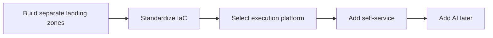
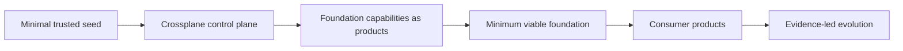

# Infrastructure-as-a-Product Thesis

> **IaaS is what we buy; infrastructure-as-a-product is what we build.**

## Position

Cloud providers sell infrastructure services. Enterprises still have to build the governed product that makes those services safe, supportable, consumable, evolvable, and measurable.

Infrastructure as a Product is therefore not synonymous with Terraform, IaC, a portal, a landing zone, a workspace, or a pipeline. Those are possible implementation mechanisms.

The product is a supported capability with:

- a defined consumer and outcome;
- a stable contract and approved profiles;
- policy, identity, security, cost, and evidence built into delivery;
- versioning, upgrade, rollback, deprecation, and deletion behavior;
- product health and operational status;
- an accountable product owner and responsible engineer;
- runbooks, known errors, and support boundaries;
- adoption and cost-to-serve measures; and
- a roadmap informed by demand and operational evidence.

## Foundation establishment has changed

The traditional sequence often looks like:

A product-led sequence can instead be:

The seed is not the complete foundation. It is only the irreducible identity, audit, connectivity, source, management-cluster, and policy boundary needed to operate safely.

Crossplane can then establish and continuously manage selected foundation capabilities as versioned products where provider support and authority allow.

## Composite AI changes the product lifecycle

Composite AI is most valuable when it works against a stable product model rather than generating more low-level infrastructure code.

Bounded agent responsibilities can include:

- translating supplied intent into a product request;
- detecting missing required information;
- explaining deterministic policy results;
- reviewing lifecycle and risk implications;
- diagnosing sanitized Crossplane conditions and known errors;
- assembling evidence; and
- identifying repeated friction or exceptions that should influence the roadmap.

The authority rule is fixed:

> **AI proposes and explains. Deterministic controls validate. Authorized people approve. Crossplane reconciles. Cloud-native controls enforce the final boundary.**

## Multi-cloud without lowest-common-denominator design

A product contract preserves common consumer semantics while allowing AWS, Azure, and GCP to implement those semantics differently.

The goal is not to pretend the clouds are identical. The goal is to prevent consumers from inheriting implementation complexity that is not part of the outcome they requested.

## Progressive legacy replacement

Progressive legacy replacement is a strategic IaaP use case, but IaaP is not an application-conversion product.

A government agency or regulated enterprise can keep a legacy system in mission service while replacement applications, services, and data stores are built by bounded business capability. The infrastructure-product system supplies a governed destination in which those replacements can be deployed, operated, evidenced, and moved across approved provider implementations without changing the consumer contract.

The transition follows four controlled states:

1. **Stabilize:** the legacy capability remains authoritative.
2. **Coexist:** the replacement operates through governed integration boundaries and may run in shadow or limited-service mode.
3. **Transfer:** transaction and data authority move by bounded domain under explicit approval, reconciliation, and rollback criteria.
4. **Retire:** legacy functions and stores are disabled only after dependencies, retention obligations, recovery requirements, and decommission evidence are satisfied.

The separation of responsibility is deliberate:

- AI-assisted discovery, business-rule extraction, transformation, and equivalence testing can provide approved inputs.
- Application and domain authorities own business semantics, target decomposition, data migration, functional equivalence, cutover, and retirement.
- IaaP owns the stable infrastructure-product boundary, approved profiles, lifecycle, portability model, and infrastructure evidence.
- Guard owns deterministic infrastructure-product assessment and evidence decisions within its declared scope.
- Forge converts approved intent into bounded product proposals and lifecycle artifacts.
- Vanguard carries authority, custody, safeguard-continuity, rollback, and continuous-assurance references across the coexistence path.
- Crossplane reconciles approved infrastructure-product claims but does not rewrite applications, migrate business data, or authorize retirement.

One system must remain authoritative for each governed transaction and data element at every stage. New applications should integrate through APIs, events, controlled batch contracts, or approved data-replication boundaries rather than creating fresh direct coupling to legacy data stores.

Success is measured by both modern-product outcomes and verified legacy reduction: write paths removed, batch jobs and interfaces retired, shared-data dependencies eliminated, infrastructure capacity and licenses released, and portability and recovery tests passed.

This position expresses a desired capability and operating model. It does not extend the current evidence baseline into claims of live mainframe migration, functional equivalence, production cutover, autonomous authority, certification, or ATO.

## Implementation optionality

The modern accelerator itself does not contain Terraform/TFE, Arc, Backstage, or legacy execution-MCP implementations.

Enterprises may still use them externally when justified. Their absence from the accelerator is evidence that the product model does not require them.

## Strategic statement

> **We are moving from building provider-specific foundations and productizing them later to establishing and evolving a multi-cloud foundation through governed product APIs, a persistent Crossplane control plane, bounded composite AI, and executable evidence.**
