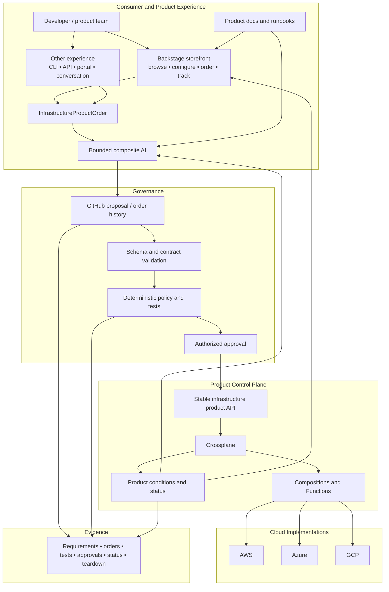
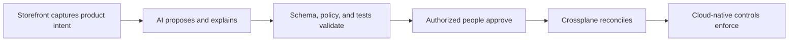
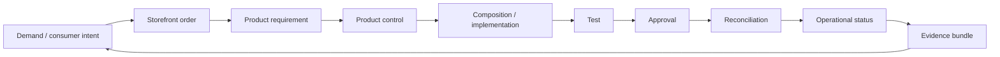

# Product-Control-Plane Architecture

## Purpose

The current architecture makes the **infrastructure product contract** the stable boundary and Crossplane the maintained product control plane.

Backstage is now represented through a separate bounded repository as the optional reference **storefront**. It is deliberately outside the control plane.

> **IaaS is what we buy; infrastructure-as-a-product is what we build. Backstage is where developers shop.**

## Logical architecture

## Layer responsibilities

### Experience layer — Backstage or another storefront

The experience layer lets a consumer discover, configure, order, and track an infrastructure product.

The reference implementation lives in `backstage-infrastructure-product-storefront-poc` and is intentionally bounded to:

- product discovery;
- product-level business inputs;
- a narrow `InfrastructureProductOrder` contract;
- GitHub order/proposal creation; and
- product status/evidence presentation.

It does **not** own:

- Crossplane XRDs or Compositions;
- ProviderConfigs;
- cloud credentials;
- infrastructure reconciliation;
- direct `kubectl apply`;
- Terraform/TFE workspaces or state; or
- AI execution authority.

Because the experience layer is replaceable, the product contract survives a future move from Backstage to a CLI, API, enterprise service portal, or conversational interface.

### Layer 0 — external trust prerequisites

A cloud organization/tenant relationship, billing, initial administration, approved management environment, audit path, and source repository may exist before Crossplane can operate.

### Layer 1 — minimal trusted seed

The seed installs Crossplane, establishes its namespace/security boundary, package/version controls, identity path, and basic auditability. The seed remains deliberately small and independently governed.

### Layer 2 — foundation products

Examples include account/project boundaries, workload identity, network zones, logging baselines, encryption baselines, security-monitoring connections, budget guardrails, and `CloudFoundationEnvironment`.

### Layer 3 — consumer infrastructure products

Application, Kubernetes, data, integration, AI workload, storage, and other supported environments build on the minimum viable foundation.

### Layer 4 — evidence-led product learning

Operational status, storefront demand, exceptions, product adoption, and cost-to-serve identify new product candidates, weak abstractions, control friction, provider gaps, and retirement opportunities.

## Consumer boundary

Consumers should supply **intent and business metadata**, not implementation topology.

For the current `CloudFoundationEnvironment` storefront, a consumer can provide values such as:

- product/order name;
- cloud;
- approved region;
- application;
- business unit;
- owner/team; and
- cost center.

Consumers should not need to understand:

- Crossplane managed-resource internals;
- XRD or Composition selection;
- ProviderConfig;
- provider resource kinds;
- cloud-specific naming conventions that do not affect the requested outcome;
- Terraform state/workspaces/modules;
- pipeline topology; or
- implementation migration details.

## Authority model

The storefront does not gain infrastructure authority merely because it initiates a request. Composite AI does not gain authority merely because it interprets the request.

## Resource ownership

One external resource has one authoritative reconciler. Crossplane may observe dependencies owned elsewhere, but the accelerator does not support active co-management.

The same rule applies to experience systems: Backstage owns the storefront experience, not the cloud resource.

## GitHub role

GitHub is the product-development and change-governance plane: source, order/proposal history, review, policy, tests, ADRs, releases, evidence, and compatibility records. It is not a replacement for every ticketing, CMDB, catalog, or records-management system.

## Reference repository mapping

| Architectural responsibility | Repository |
|---|---|
| Program thesis and evidence | `ai-powered-infrastructure-as-a-product` |
| Consumer storefront | `backstage-infrastructure-product-storefront-poc` |
| Minimal trusted bootstrap | `crossplane-multicloud-seed-poc` |
| Infrastructure product contract | `multicloud-foundation-product-poc` |
| Bounded composite AI | `composite-ai-infrastructure-product-poc` |
| End-to-end acceptance/evidence | `multicloud-foundation-poc-integration` |

## Evidence chain

The return loop matters: product status and operational evidence should be visible at the experience layer so the storefront can show the state of the product without becoming the product controller.
