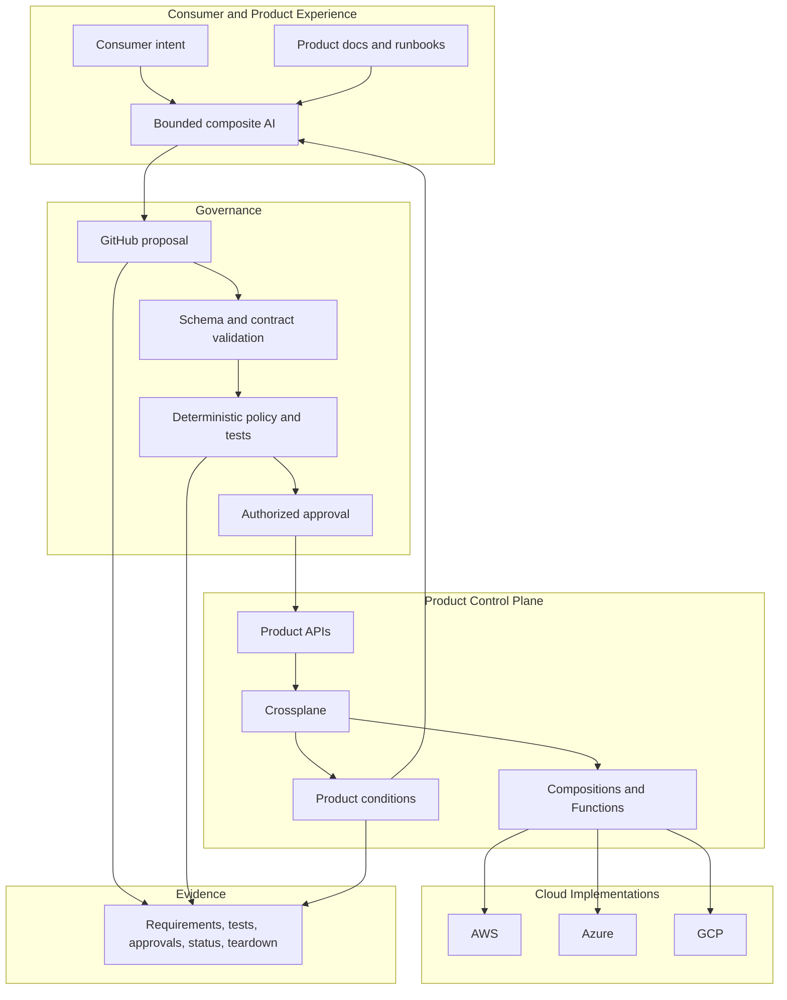
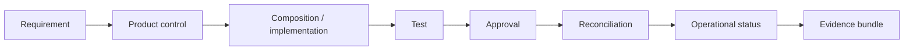

# Product-Control-Plane Architecture

## Purpose

The current architecture makes the **infrastructure product contract** the stable boundary and Crossplane the maintained product control plane.

## Layers

### Layer 0 — external trust prerequisites

A cloud organization/tenant relationship, billing, initial administration, approved management environment, audit path, and source repository may exist before Crossplane can operate.

### Layer 1 — minimal trusted seed

The seed installs Crossplane, establishes its namespace/security boundary, package/version controls, identity path, and basic auditability. The seed remains deliberately small and independently governed.

### Layer 2 — foundation products

Examples include account/project boundaries, workload identity, network zones, logging baselines, encryption baselines, security-monitoring connections, budget guardrails, and `CloudFoundationEnvironment`.

### Layer 3 — consumer infrastructure products

Application, Kubernetes, data, integration, AI workload, storage, and other supported environments build on the minimum viable foundation.

### Layer 4 — evidence-led product learning

Operational status, exceptions, demand, product adoption, and cost-to-serve identify new product candidates, weak abstractions, control friction, provider gaps, and retirement opportunities.

## Consumer boundary

Consumers should not need to understand:

- Crossplane managed-resource internals;
- provider resource kinds;
- cloud-specific naming conventions that do not affect the requested outcome;
- Terraform state/workspaces/modules;
- pipeline topology; or
- implementation migration details.

## Resource ownership

One external resource has one authoritative reconciler. Crossplane may observe dependencies owned elsewhere, but the accelerator does not support active co-management.

## GitHub role

GitHub is the product-development and change-governance plane: source, review, policy, tests, ADRs, releases, evidence, and compatibility records. It is not a replacement for every ticketing, CMDB, catalog, or records-management system.

## Evidence chain

