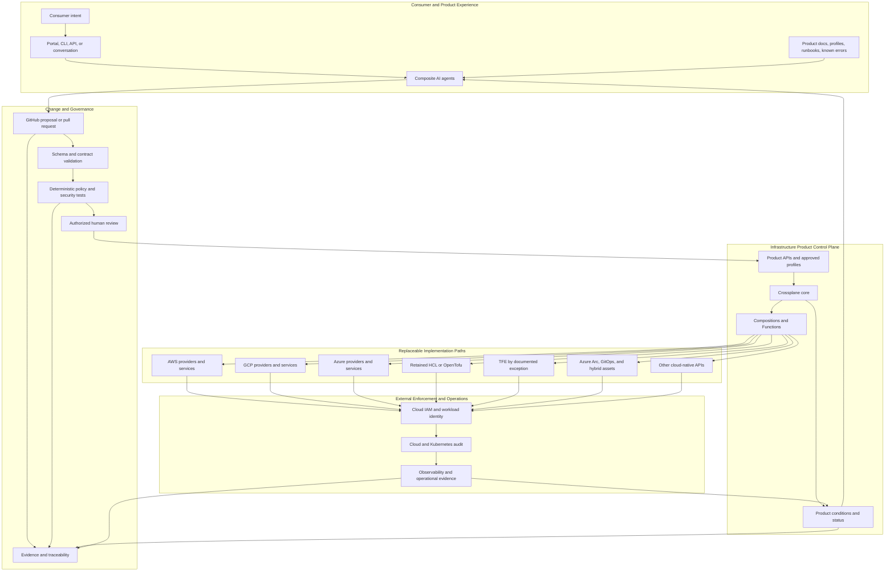
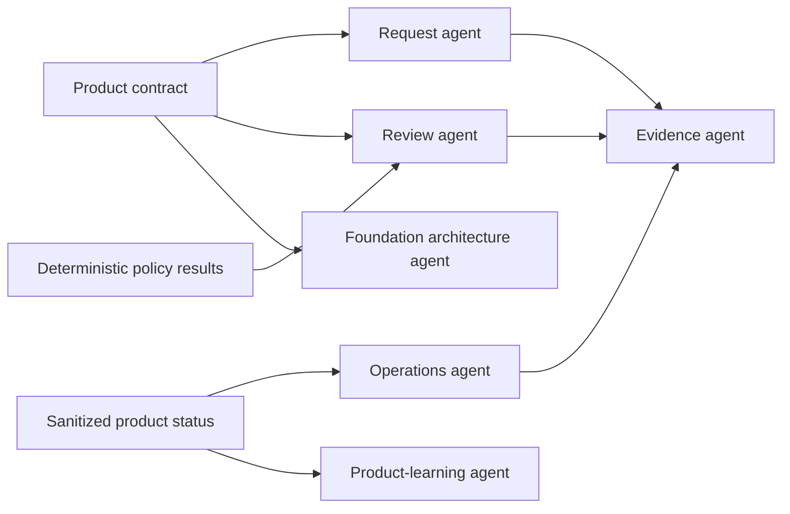
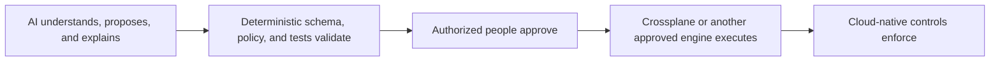
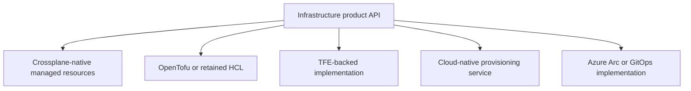
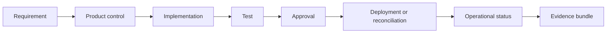

# Product-Control-Plane Architecture

## Purpose

This is the current strategic architecture for the AI-Powered Infrastructure-as-a-Product program.

It defines a multi-cloud model in which:

- infrastructure is exposed through stable product APIs;
- Crossplane provides the persistent product control plane;
- composite AI supplies bounded intent, review, operations, and evidence capabilities;
- GitHub provides change governance and traceability;
- deterministic policy remains authoritative;
- cloud-native identity and controls enforce final boundaries; and
- TFE, OpenTofu, Terraform CLI, Azure Arc, Backstage, and cloud-native APIs are optional implementation capabilities rather than mandatory consumer dependencies.

> **IaaS is what we buy; infrastructure-as-a-product is what we build.**

## Logical architecture



## Architectural center of gravity

The architecture is deliberately centered on the **product contract** rather than on a specific infrastructure execution tool.

The product contract defines:

- consumer outcomes;
- supported clouds and profiles;
- required business metadata;
- security and classification boundaries;
- lifecycle choices;
- guarantees and exclusions;
- status semantics; and
- versioning behavior.

The contract must not require the consumer to understand:

- Terraform modules;
- TFE workspaces or Stacks;
- provider resource kinds;
- state backends;
- pipeline topology;
- Crossplane managed-resource internals; or
- cloud-specific implementation details that do not change the product outcome.

## Foundation layers

### Layer 0 — External trust prerequisites

Some prerequisites exist before the product control plane can act:

- a cloud organization, tenant, or billing relationship;
- initial administrative authority;
- an approved management environment;
- network access to required APIs;
- an audit path; and
- a source repository.

These prerequisites may be created manually or through a small bootstrap mechanism. They do not justify making that bootstrap mechanism the permanent center of every future product.

### Layer 1 — Minimal trusted seed

The seed installs and constrains the product control-plane runtime.

Expected responsibilities include:

- Crossplane installation;
- package registry and version controls;
- a bounded namespace;
- Pod Security and active network-policy validation;
- an initial AI identity with no authority;
- deployment and teardown automation; and
- machine-readable POC boundaries.

The seed must not own product APIs, cloud credentials, complete landing zones, or production authorization.

### Layer 2 — Foundation products

The control plane begins establishing selected minimum-viable-foundation capabilities through product APIs.

Possible products include:

- `CloudAccountBoundary`;
- `CloudProjectBoundary`;
- `WorkloadIdentity`;
- `NetworkZone`;
- `LoggingBaseline`;
- `EncryptionBaseline`;
- `SecurityMonitoringConnection`;
- `BudgetGuardrail`; and
- `CloudFoundationEnvironment`.

Each product may have provider-specific implementations while preserving stable product semantics.

### Layer 3 — Consumer platform products

The foundation supports higher-level outcomes such as:

- application environments;
- Kubernetes environments;
- data-platform environments;
- integration environments;
- AI workload environments;
- secure object-storage products; and
- approved managed-service profiles.

### Layer 4 — Product portfolio learning

Operational evidence and consumer demand inform:

- new product candidates;
- weak abstractions;
- repeated exceptions;
- product adoption and cost-to-serve;
- provider coverage gaps;
- deprecation candidates; and
- TFE, module, or platform retirement decisions.

## Composite AI responsibilities

Composite AI is a set of bounded responsibilities, not one unrestricted autonomous platform administrator.



### Allowed responsibilities

- interpret supplied intent and metadata;
- ask for missing required information;
- draft a product request;
- explain product profiles and deterministic policy results;
- summarize lifecycle and risk implications;
- diagnose sanitized conditions, events, and known errors;
- assemble redacted evidence; and
- propose product-roadmap improvements.

### Prohibited responsibilities

- direct infrastructure apply or delete;
- unrestricted Kubernetes or cloud administration;
- credential or secret access;
- Terraform state access;
- policy or tool self-modification;
- approval or merge of its own changes;
- creation of privileged identities; and
- autonomous authorization or compliance claims.

## Authority chain



The chain must remain intact even when a live model or new tool adapter is introduced.

## Multi-cloud product contract

The product layer should preserve common outcomes while avoiding artificial sameness.

Example:

```yaml
apiVersion: platform.example.gov/v1alpha1
kind: CloudFoundationEnvironment
metadata:
  name: payments-dev
  namespace: platform-poc
  annotations:
    platform.example.gov/change-id: POC-101
spec:
  cloud: aws
  profile: standard-dev
  environment: development
  region: us-east-1
  dataClassification: internal
  owner: payments-team
  costCenter: CC12345
  deletionPolicy: Delete
```

The same kind can select GCP or a later Azure implementation. Provider differences remain behind the product contract.

| Product outcome | AWS example | GCP example | Azure example |
|---|---|---|---|
| Network boundary | VPC | VPC Network | Virtual Network |
| Private subnet | Subnet | Subnetwork | Subnet |
| Workload identity | IAM Role | Service Account | Managed Identity or federated principal |
| Private object storage | S3 with public block | Cloud Storage with public-access prevention | Storage Account with public access disabled |
| Product health | Crossplane conditions | Crossplane conditions | Crossplane conditions |

The product contract should not expose resource kinds unless they are part of a deliberate provider-specific product.

## Replaceable implementation paths



### Crossplane-native

Preferred for strategic products when provider coverage, lifecycle behavior, and operational support are sufficient.

### Retained HCL or OpenTofu

Useful when existing modules have material value or provider coverage is stronger than the native Crossplane option.

### TFE-backed implementation

Allowed for a documented exception, brownfield boundary, accredited control, or economic justification. It must not leak workspace or state concepts into the consumer contract.

### Cloud-native service

Appropriate when a provider-managed service offers the required product outcome with less custom control-plane complexity.

### Azure Arc and Backstage

Useful for hybrid inventory, GitOps, developer experience, catalog presentation, and legacy accelerator compatibility. They are not required to be the universal control plane or the product itself.

## Resource ownership

One external resource must have one authoritative owner.

A resource may be:

- actively managed by Crossplane;
- actively managed by TFE, OpenTofu, or another engine;
- actively managed by a cloud-native service; or
- observed as an external dependency.

It must never be actively managed by multiple engines simultaneously.

Ownership should be explicit in:

- implementation metadata;
- product documentation;
- operational runbooks;
- evidence artifacts; and
- migration plans.

## GitHub role

GitHub provides the product-development and change-governance plane:

- source and version history;
- product contracts and Compositions;
- policy and tests;
- pull-request review;
- protected environments;
- evidence artifacts;
- ADRs and runbooks;
- release and compatibility records; and
- immutable upstream locks for integration tests.

GitHub is not a replacement for every ticketing, catalog, CMDB, or records-management capability. The repository should link to authoritative records where duplication would create conflict.

## Evidence architecture

Evidence should be generated as part of the product lifecycle rather than reconstructed after engineering is complete.



Evidence examples include:

- commit and pull-request identifiers;
- product-contract version;
- schema and policy results;
- rendered or selected implementation;
- package and provider versions;
- workload-identity configuration evidence;
- product conditions;
- drift and failure scenario outcomes;
- teardown and orphan checks; and
- redacted agent decisions and inferences.

OSCAL may be used as an export or integration format where it adds value. It should not replace the underlying product evidence.

## Operating model

The technology architecture requires a product and operations architecture.

| Role | Accountability |
|---|---|
| Product owner | Consumer outcomes, roadmap, adoption, lifecycle, and investment. |
| Responsible engineer | Technical quality, contracts, implementation health, compatibility, and breaking changes. |
| Platform security | Policies, identity boundaries, exception criteria, and control evidence. |
| Product operations or SRE | Health, runbooks, known errors, incidents, upgrades, and support. |
| Composite-AI governance | Tool boundaries, evaluations, model changes, redaction, and prompt-injection controls. |
| Cloud implementation owner | Provider-specific correctness, quotas, permissions, and service behavior. |

## POC mapping

| Architecture capability | Evidence repository |
|---|---|
| Minimal trusted seed | `crossplane-multicloud-seed-poc` |
| Stable AWS/GCP product contract | `multicloud-foundation-product-poc` |
| Bounded composite AI | `composite-ai-infrastructure-product-poc` |
| Integrated acceptance and evidence | `multicloud-foundation-poc-integration` |
| Program thesis and preserved accelerator | `ai-powered-infrastructure-as-a-product` |

## Current limitations

The current POCs do not yet prove:

- live AWS and GCP resource creation through the integration harness;
- live-model benefit over the deterministic baseline;
- production-grade provider identity and package operations;
- live drift and product-upgrade performance;
- account, subscription, or project vending;
- full enterprise routing, DNS, security-monitoring, or authorization integration;
- a fair TFE lifecycle comparison; or
- a final TFE investment decision.

Those limitations are deliberate evidence gates.

## Decision principle

> **The product contract is stable. The implementation mechanism is replaceable.**

And the program mental model remains:

> **IaaS is what we buy; infrastructure-as-a-product is what we build.**
