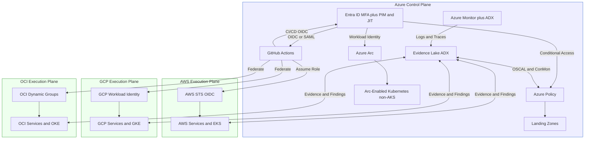

# Preserved V1 Reference Architecture — Azure Control Plane with AWS/GCP/OCI Execution Planes

> **Status:** Preserved implementation pattern. This is no longer the universal strategic target architecture.
>
> The current target is the [Product-Control-Plane Architecture](product-control-plane.md), in which stable infrastructure-product contracts, Crossplane, bounded composite AI, GitHub governance, and replaceable implementation paths form the strategic center.
>
> Azure Arc, Backstage, Terraform, policy-as-code, observability, and OSCAL assets remain valid and may be used behind product contracts when they are the best implementation fit. See [Preserved V1 Azure Arc and Terraform Pattern](v1-azure-arc-terraform-pattern.md).

This document defines the original **AI-PIaP** (AI-powered Infrastructure-as-a-Product) reference architecture that uses **Azure as the control plane** and **AWS, GCP, OCI as execution planes**. The model was designed to align with FedRAMP, FISMA, NIST SP 800-53 Rev. 5, CISA Zero Trust, and TIC 3.0-oriented network telemetry.

The document is preserved to retain the original architecture, diagrams, implementation rationale, and regulated-environment design material. It should now be read as one approved candidate implementation pattern rather than a required product architecture.

## High-Level View

### Control Plane (Azure)

- **Identity**: Entra ID with **MFA**, **Privileged Identity Management (PIM)**, **Just-In-Time (JIT)** access.
- **Policy & Governance**: **Azure Policy** for org guardrails; codified initiatives and assignments.
- **Observability & Evidence**: **Azure Monitor** (Container Insights, AMA) with **ADX** as the evidence lake.
- **Azure Arc**: Extends Azure governance to non-AKS Kubernetes clusters and hybrid environments.

### Execution Planes (AWS/GCP/OCI)

- **Federated CI/CD**: GitHub Actions OIDC → Entra federated credential (Azure); AWS STS assume-role via GitHub OIDC; GCP Workload Identity Federation; OCI Dynamic Groups & compartment policies.
- **Workloads**: Deployed to EKS/GKE/OKE and cloud-native services; policy baselines enforced via native config (AWS Config, Policy Controller) and Kubernetes Gatekeeper.

## DR & HA Objectives

| Class       | Target RTO (p95) | Target RPO | Notes |
|-------------|-------------------|------------|-------|
| Stateless   | ≤ **5 minutes**   | ≤ **15 min** | Blue/green or canary with anycast fronting; multi-region ready. |
| Stateful    | ≤ **1 hour**      | ≤ **15 min** | Managed databases with cross-region replicas and peering; failover runbook. |

**DNS & Anycast**: Anycast WAF/CDN in front; **Route 53** primary DNS, **Cloud DNS/OCI DNS** secondaries; health-checked failover with pre-staged zone data and automation.

## Evidence & Observability

- **Evidence Lake**: **Azure Data Explorer (ADX)** tables for policy outcomes, IaC pipeline results, and DNS failover events.
- **OSCAL**: Automated generation of `assessment-results` referencing policy conformance across Azure/AWS/GCP/OCI.
- **ConMon**: Scheduled queries and exports from ADX produce attestations for ATO packages.

## Promotion Model

- **Environments**: `dev` → `test` → `prod` with **immutable artifacts**, SBOMs, and signed containers.
- **Gates**: Policy-as-code layers at org, product, and workload levels. Evidence streamed to ADX and exported as OSCAL.
- **Zero Trust**: Per-request authentication and authorization; short-lived credentials using OIDC/JWT across planes.

## Current interpretation

Within the current architecture, this pattern can be selected behind a stable infrastructure-product contract when:

- Azure is the established enterprise management plane;
- Arc inventory, GitOps, or hybrid governance is required;
- Backstage is the approved developer-experience layer;
- the Terraform estate is mature and economically valuable; and
- the pattern satisfies product lifecycle, resource ownership, evidence, and support requirements.

It should not require consumers to understand Azure Arc attachment, Terraform state, TFE workspaces, module topology, or provider-specific implementation details unless those are explicit product features.
