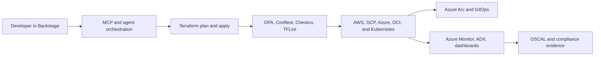
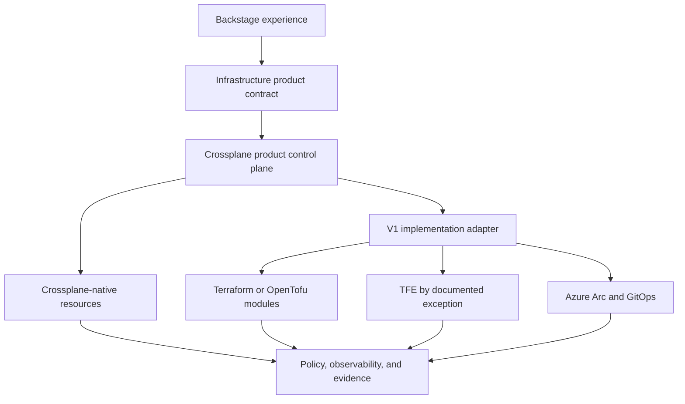

# Preserved V1 Pattern — Azure Arc, Backstage, and Terraform

## Status

**Preserved implementation pattern — not the current universal target architecture.**

The original AI-Powered Infrastructure-as-a-Product accelerator centered Azure Arc, Backstage, Terraform, policy-as-code, MCP tools, observability, and OSCAL evidence. Those assets remain valuable and are intentionally retained.

The architecture has evolved. The current strategic center is now the stable infrastructure-product contract, Crossplane product control plane, bounded composite AI, GitHub governance, and replaceable implementation paths.

This document prevents two unhelpful outcomes:

1. deleting useful prior intellectual property merely because the architecture evolved; and
2. continuing to present one prior implementation pattern as a mandatory enterprise control plane.

> **IaaS is what we buy; infrastructure-as-a-product is what we build.**

## Original pattern

This pattern was designed to provide:

- a Backstage-based developer experience;
- cloud-specific Terraform modules;
- plan, policy, approval, and apply workflows;
- Azure Arc inventory and hybrid governance;
- workload identity and short-lived credentials;
- OPA, Gatekeeper, Kyverno, Checkov, and TFLint controls;
- Cosign, SBOM, and provenance controls;
- observability through Azure Monitor and ADX; and
- OSCAL-oriented evidence generation.

## Why the pattern is being reframed

The original pattern made several implementation choices part of the strategic architecture:

- Azure as the principal control plane;
- Azure Arc as the multi-cloud unifier;
- Backstage as the primary consumer experience;
- Terraform plan and apply as the central infrastructure lifecycle; and
- MCP tools oriented heavily around Terraform and Azure.

The newer POC portfolio demonstrates a different architectural possibility:

Under the newer model:

- the product contract is the consumer boundary;
- Crossplane provides persistent reconciliation and live product status;
- AI operates against product intent and sanitized evidence rather than broad infrastructure tools;
- Backstage is an optional experience layer;
- Azure Arc is an optional hybrid governance and inventory capability;
- Terraform and TFE are optional implementations; and
- evidence is tied to the product lifecycle regardless of implementation engine.

## What remains strategically useful

### Backstage

Backstage remains useful for:

- presenting the product catalog;
- product documentation and TechDocs;
- approved template discovery;
- ownership and component metadata;
- links to runbooks, dashboards, and support; and
- a graphical developer experience.

It should present or initiate infrastructure products rather than define the product architecture itself.

### Terraform assets

Existing Terraform modules remain useful for:

- brownfield infrastructure;
- specialized provider coverage;
- resources not yet supported adequately by Crossplane providers;
- controlled migration paths;
- comparative execution experiments; and
- implementation reuse behind a stable product API.

Terraform code does not by itself require TFE, and the product contract should not expose state, workspace, module, or provider topology to consumers.

### Azure Arc

Azure Arc remains useful for:

- hybrid and multi-cloud inventory;
- Arc-enabled Kubernetes and server governance;
- GitOps and extension management;
- Azure Policy integration;
- operational visibility where Azure is already the management plane; and
- selected regulated-environment patterns.

It is no longer assumed to be the universal control plane for every infrastructure product.

### MCP and agents

The MCP concepts remain useful for bounded read, validation, documentation, policy explanation, and evidence tools.

The newer authority model requires each agent to receive only the minimum tool set necessary for its role. No general planner should gain unrestricted cloud, Kubernetes, Terraform, TFE, approval, or remediation authority.

### Policy, supply chain, observability, and OSCAL

These capabilities remain core:

- policy-as-code;
- admission and runtime controls;
- workload identity;
- signed artifacts and SBOMs;
- provenance and immutable audit records;
- telemetry and product health;
- evidence generation; and
- OSCAL exports where appropriate.

The change is that these controls follow the product lifecycle instead of being coupled to one execution path.

## Mapping V1 assets into the current model

| V1 asset | Current role |
|---|---|
| Backstage templates | Optional product discovery and request experience. |
| Terraform modules | Reusable implementation assets behind product contracts. |
| Terraform plan/apply | One possible execution lane, not the universal lifecycle. |
| TFE | Optional bounded execution and brownfield capability. |
| Azure Arc | Optional hybrid inventory, governance, and GitOps implementation. |
| MCP Terraform/Azure tools | Bounded specialist tools where approved. |
| OPA, Gatekeeper, Kyverno | Deterministic product and runtime policy controls. |
| Checkov and TFLint | Implementation-specific validation for Terraform paths. |
| Azure Monitor and ADX | Optional observability and evidence sinks. |
| OSCAL generation | Evidence export and authorization integration. |
| Backstage catalog ownership | Product metadata and documentation, not the sole source of product truth. |

## Coexistence architecture

The product contract remains stable even when a V1 implementation is used.

## Resource-ownership rule

A resource may be managed by Crossplane, Terraform/TFE, OpenTofu, Azure Arc/GitOps, or a cloud-native service. It must never be actively managed by more than one authoritative engine.

A V1 implementation path must define:

- the authoritative engine;
- state and lifecycle ownership;
- credential boundary;
- drift behavior;
- failure and recovery procedures;
- migration and exit criteria; and
- evidence generated for the product status surface.

## Preserved repository assets

The following material remains part of the accelerator and should not be removed merely to align the thesis:

- [`docs/AZURE-ARC.md`](../AZURE-ARC.md)
- [`docs/architecture/target-architecture.md`](target-architecture.md)
- [`adr/ADR-0001-azure-arc-control-plane.md`](../../adr/ADR-0001-azure-arc-control-plane.md)
- [`adr/0001-control-plane-on-azure.md`](../../adr/0001-control-plane-on-azure.md)
- [`scripts/azure/README-arc.md`](../../scripts/azure/README-arc.md)
- [`runbooks/arc-gitops.md`](../../runbooks/arc-gitops.md)
- [`docs/runbooks/arc-gitops.md`](../runbooks/arc-gitops.md)
- [`terraform/`](../../terraform/)
- [`iac/`](../../iac/)
- [`backstage/`](../../backstage/)
- [`catalog/`](../../catalog/)
- [`policy/`](../../policy/)
- [`observability/`](../../observability/)
- [`evidence/`](../../evidence/)
- [`docs/agents/`](../agents/)

Some paths contain overlapping or experimental assets from earlier phases. They should be rationalized through normal product backlog and ADR decisions rather than deleted wholesale.

## When to choose this implementation pattern

The V1 pattern remains a reasonable choice when:

- the enterprise is Azure-centered and Arc is already strategic;
- Backstage is the approved developer portal;
- the Terraform estate is mature and well governed;
- TFE or another runner already satisfies accredited controls;
- hybrid inventory and governance are primary requirements;
- migration cost exceeds the expected benefit; or
- Crossplane provider coverage is insufficient for the product.

It should not be selected automatically when:

- the only rationale is historical familiarity;
- the consumer must understand workspace and state topology;
- permanent duplication of TFE and Crossplane controls is required;
- Azure-specific governance is imposed on unrelated product semantics; or
- the implementation prevents the product contract from remaining stable.

## Relationship to the current target architecture

The current architecture is documented in [Product-Control-Plane Architecture](product-control-plane.md).

The associated decision is documented in [ADR-0002: Adopt the Product Contract and Crossplane Control Plane as the Strategic Center](../../adr/ADR-0002-product-control-plane.md).

The original architecture is preserved in [Original Azure Control-Plane Architecture](target-architecture.md).

## Final framing

The V1 accelerator is not being rejected. It is being placed at the correct layer:

> **A valuable implementation pattern within an infrastructure-product architecture—not the product contract and not a mandatory enterprise control plane.**
