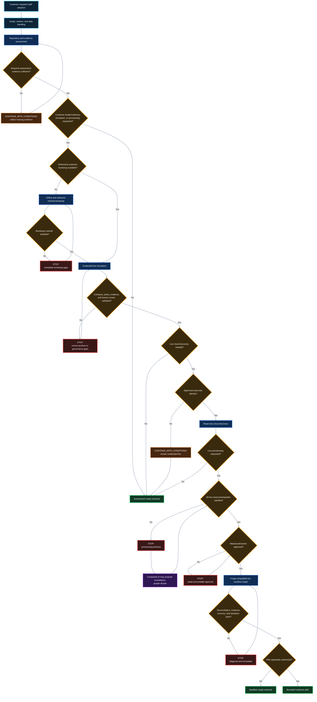

# IaaP Bootstrap and Foundation Readiness

| Attribute | Definition |
|---|---|
| Status | Approved public architecture contract and implementation target |
| Version | 0.1 |
| Deployment direction | Customer-hosted |
| Initial scope | Assessment, advisory, simulation, controlled discovery, and gated nonproduction validation |
| Runtime claim | This package does not claim that Guard V1, Forge V1, or the IaaP Console currently implements these requirements |

This package defines the smallest trusted starting point and the readiness
decisions needed to establish and evolve cloud foundations through governed
infrastructure products.

It consolidates the existing minimal-seed, product-control-plane,
foundation-product, bounded Composite AI, human-authorization, and evidence
models into one navigable customer-facing contract.

> Guard V1 and Forge V1 remain frozen at their supported boundaries. This
> documentation does not change their schemas, decisions, authority,
> deployment model, or implemented behavior. Product implementation requires
> separate protected changes and acceptance evidence.

The package follows the repository's
[public publication boundary](../PUBLICATION-BOUNDARY.md). It describes
requirements, responsibilities, permitted patterns, and public interfaces
without publishing private rules, scoring logic, prompts, role mechanics,
cloud identifiers, credentials, commercial controls, or operational internals.

## Purpose

The bootstrap and readiness model enables a customer to:

- [begin repository assessment](prerequisites/assessment-prerequisites.md) without cloud provisioning credentials;
- [identify what already exists and what remains undecided](readiness-gates/gate-1-assessment.md);
- [host approved advisory and product-control-plane capabilities](architecture/customer-hosted-deployment.md) inside a
  customer-controlled boundary;
- [use Composite AI](composite-ai/advisory-operating-model.md) to interpret approved inputs and draft reviewable proposals;
- [validate requirements through deterministic controls](architecture/authority-and-trust-boundaries.md);
- [route material decisions to accountable people](decisions/human-review-and-risk-acceptance.md);
- [progress from credential-free simulation to narrowly bounded cloud access](architecture/progression-and-decision-model.md);
- [establish foundation capabilities incrementally as products](foundation-domains/infrastructure-product-contracts.md); and
- [retain evidence from requirement through operation and retirement](evidence/retention-traceability-and-export.md).

A complete enterprise landing zone is not required to begin assessment or
design. Live discovery and provisioning remain blocked until their applicable
readiness gates are satisfied.

## Canonical terms

| Term | Meaning |
|---|---|
| External trust prerequisites | Layer 0 customer capabilities that must exist before a customer-hosted runtime can operate, including approved administration, identity, source, audit, connectivity, and ownership boundaries. |
| Customer bootstrap | The authorized customer-controlled environment, prerequisite decisions, and operating responsibilities needed for the requested IaaP stage. |
| Minimal trusted seed | Layer 1 technical subset of the bootstrap that establishes the bounded Crossplane product-control-plane runtime. It is not the complete cloud foundation. |
| Foundation products | Layer 2 governed capabilities such as resource hierarchy, workload identity, network zones, logging, encryption, security integration, and budget guardrails. |
| Minimum viable foundation | The smallest approved combination of foundation products needed to support a defined consumer-product portfolio and risk boundary. |
| Foundation readiness decision | A stage-specific `CONTINUE`, `CONTINUE_WITH_CONDITIONS`, or `STOP` advisory outcome. It is not a Guard V1 verdict or a production authorization. |

The existing
[product-control-plane architecture](../architecture/product-control-plane.md)
remains authoritative for the Layer 0 through Layer 4 model. This package
expands those layers into customer decisions, evidence, and readiness gates.

## Entry paths

The starting point depends on the requested outcome.

| Requested outcome | Smallest starting point | Cloud access |
|---|---|---|
| Repository assessment and planning | Approved repositories or exports, named reviewers, and evidence handling | None |
| Composite-AI-assisted advisory | Customer-hosted advisory runtime plus approved inputs and human review | None by default |
| Credential-free lifecycle simulation | Minimal trusted seed, product contracts, deterministic policy, and review workflow | None |
| Read-only cloud discovery | Approved, revocable discovery identity and bounded target scope | Read only |
| Live sandbox provisioning | All live-cloud prerequisites, workload identity, authorization, evidence, recovery, and teardown | Narrow nonproduction write |
| Pilot or production consideration | Separate customer authorization, operations, security, recovery, support, cost, and evidence decisions | Explicitly approved scope only |

Guard's supported repository-assessment boundary does not require customer
cloud, Kubernetes, Terraform/TFE, AI, or personal-access-token credentials.
The customer-hosted bootstrap becomes necessary only for the capabilities the
customer elects to operate inside that boundary.

## Responsibility separation

| Participant | Architecture responsibility | Authority not granted by this contract |
|---|---|---|
| IaaP Console target experience | Guide onboarding, present readiness, support review, and expose traceability | Does not reproduce private Guard or Forge logic and does not reconcile cloud resources |
| IaaP Guard | Preserve its supported assessment, evidence, materiality, and planning boundary | This package does not add shipped readiness rules or provisioning authority to Guard V1 |
| Composite AI | Interpret approved evidence, identify gaps, draft alternatives, explain controls, and assemble proposal provenance | Cannot approve, merge, deploy, grant privileges, accept risk, or declare compliance |
| Deterministic controls | Validate public schemas, required fields, allowed values, and stage constraints | Cannot accept organizational risk or substitute for authorization |
| Accountable people | Decide material architecture, security, operational, and risk questions | Cannot make an undocumented bypass part of the product contract |
| IaaP Forge | Target consumer of approved evidence and product intent for governed lifecycle work | This package does not extend Forge V1 or permit bypass of policy and approval gates |
| Crossplane or an approved adapter | Reconcile an authorized product definition | Does not define consumer intent, approve a proposal, or co-manage an externally owned resource |
| Cloud-native controls | Enforce final provider identity, network, service, encryption, and resource boundaries | Do not define the customer's complete IaaP operating model |

The fixed authority rule remains:

> Composite AI proposes and explains. Deterministic controls validate.
> Authorized people approve. The product control plane reconciles. Cloud-native
> controls enforce the final boundary.

## Readiness decision map

This map is an architecture decision model, not evidence that the workflow is
already automated by Guard, Forge, or the Console.

The color language is consistent across this package:

- [**Blue** — controlled assessment or IaaP activity](architecture/progression-and-decision-model.md);
- [**Amber** — a required decision](decisions/human-review-and-risk-acceptance.md);
- [**Orange** — conditional continuation](decisions/foundation-readiness-decisions.md);
- [**Red** — blocked activity](decisions/foundation-readiness-decisions.md);
- [**Purple** — bounded Composite AI assistance](composite-ai/advisory-operating-model.md); and
- [**Green** — an approved stage outcome](readiness-gates/gate-0-intake.md).

See the
[progression and decision model](architecture/progression-and-decision-model.md)
for gate semantics, reassessment, and conditions.

## Readiness progression

| Gate | Permitted activity | Required outcome |
|---|---|---|
| [Gate 0: Intake](readiness-gates/gate-0-intake.md) | Repository and approved document collection | Scope, ownership, authority, and data handling accepted |
| [Gate 1: Assessment](readiness-gates/gate-1-assessment.md) | Evidence review, findings, and planning | Gaps, dependencies, and material decisions identified |
| [Gate 2: Simulation](readiness-gates/gate-2-simulation.md) | Credential-free product lifecycle | Contracts, controls, approvals, status, and evidence verified |
| [Gate 3: Read-only discovery](readiness-gates/gate-3-read-only-discovery.md) | Controlled cloud inspection | Current state verified without modification |
| [Gate 4: Live sandbox](readiness-gates/gate-4-live-sandbox.md) | Bounded nonproduction provisioning | Workload identity, policy, reconciliation, recovery, and teardown proven |
| [Gate 5: Pilot](readiness-gates/gate-5-pilot.md) | Limited customer workload use | Support, recovery, cost, security, and evidence duties demonstrated |
| [Gate 6: Production consideration](readiness-gates/gate-6-production-consideration.md) | Customer authorization process | Accountable customer authorities decide whether production use may proceed |

Passing one gate never authorizes a later gate.

## Documentation map

Each linked page defines what the requirement means, why it exists, when it
applies, the customer decisions and evidence required, permitted Composite AI
assistance, human authority, readiness behavior, and the future product
handoff.

### Architecture

- [Bootstrap reference architecture](architecture/bootstrap-reference-architecture.md) — Layers, component responsibilities, data flows, and the minimum trusted technical boundary.
- [Authority and trust boundaries](architecture/authority-and-trust-boundaries.md) — Separation among AI, deterministic controls, people, product control plane, and cloud enforcement.
- [Customer-hosted deployment](architecture/customer-hosted-deployment.md) — Target placement, isolation, operations, data custody, portability, and deployment profiles.
- [Progression and decision model](architecture/progression-and-decision-model.md) — Gate transitions, readiness decisions, conditions, reassessment, and expiration.

### Prerequisites

- [Assessment prerequisites](prerequisites/assessment-prerequisites.md) — Minimum scope, ownership, repository access, and data-handling decisions needed to begin.
- [Bootstrap runtime prerequisites](prerequisites/bootstrap-runtime-prerequisites.md) — Compute, identity, storage, audit, network, source, package, backup, budget, and operations requirements.
- [Discovery prerequisites](prerequisites/discovery-prerequisites.md) — Approved read-only identities, target scope, logging, redaction, and revocation.
- [Provisioning prerequisites](prerequisites/provisioning-prerequisites.md) — Workload identity, targets, networks, DNS, logging, encryption, change, recovery, and execution authorization.
- [Production-pilot prerequisites](prerequisites/production-pilot-prerequisites.md) — Separate customer authorization, support, SLO, recovery, security, cost, and evidence obligations.

### Foundation domains

- [Governance and ownership](foundation-domains/governance-and-ownership.md) — Accountable ownership for products, platforms, controls, operations, exceptions, and risk.
- [Resource hierarchy](foundation-domains/resource-hierarchy.md) — Organization, tenant, account, subscription, project, folder, and environment boundaries.
- [Identity and access](foundation-domains/identity-and-access.md) — Human authentication, authorization, privilege, federation, and access review.
- [Workload identity](foundation-domains/workload-identity.md) — Narrow, auditable nonhuman identity without preferred reliance on static long-lived keys.
- [Networking and connectivity](foundation-domains/networking-and-connectivity.md) — Segmentation, routing, private connectivity, shared services, and ownership.
- [DNS responsibilities](foundation-domains/dns-responsibilities.md) — Public and private namespace ownership, delegation, resolution, records, logging, and incident response.
- [Ingress and egress](foundation-domains/ingress-and-egress.md) — Exposure, outbound destinations, inspection, exceptions, and evidence.
- [Logging and monitoring](foundation-domains/logging-and-monitoring.md) — Audit, platform, application, retention, alerting, and operational visibility.
- [Security-event integration](foundation-domains/security-event-integration.md) — Security destinations, triage, escalation, response ownership, and evidence.
- [Encryption and key management](foundation-domains/encryption-and-key-management.md) — Key ownership, access, rotation, recovery, and separation of duties.
- [Secrets management](foundation-domains/secrets-management.md) — Secret custody, retrieval, rotation, revocation, and prohibited exposure.
- [Delivery and change governance](foundation-domains/delivery-and-change-governance.md) — Proposal, validation, review, approval, promotion, rollback, and emergency change.
- [Infrastructure-product contracts](foundation-domains/infrastructure-product-contracts.md) — Stable consumer outcomes, profiles, lifecycle, guarantees, exclusions, and status.
- [Operations and support](foundation-domains/operations-and-support.md) — Monitoring, support, incidents, known errors, upgrades, deprecation, and retirement.
- [Backup, recovery, and continuity](foundation-domains/backup-recovery-and-continuity.md) — Recovery objectives, backups, restoration, failure testing, and ownership.
- [Cost ownership and FinOps](foundation-domains/cost-ownership-and-finops.md) — Budgets, allocation, forecasting, lifecycle cost, and cost-to-serve.
- [Evidence and traceability](foundation-domains/evidence-and-traceability.md) — Requirement-to-operation lineage, integrity, access, retention, and export.
- [Data classification](foundation-domains/data-classification.md) — Approved data classes, handling, residency, redaction, sharing, and disposal.
- [AI governance](foundation-domains/ai-governance.md) — Approved data, model and tool boundaries, evaluations, human review, and prohibited authority.

### Composite AI

- [Advisory operating model](composite-ai/advisory-operating-model.md) — How bounded AI supports discovery, design, review, explanation, diagnosis, and evidence.
- [Approved inputs and proposals](composite-ai/approved-inputs-and-proposals.md) — Permitted sources and the current-state, gap, alternative, decision, backlog, control, and evidence-plan outputs AI may propose.
- [Authority, provenance, and human review](composite-ai/authority-provenance-and-human-review.md) — Prohibited authority, source and model-context lineage, generated-output labels, and material decisions requiring named people.

### Readiness decisions

- [Foundation readiness decisions](decisions/foundation-readiness-decisions.md) — Stage-specific CONTINUE, CONTINUE_WITH_CONDITIONS, and STOP definitions and required records.
- [Exceptions and expiration](decisions/exceptions-and-expiration.md) — Bounded, owned, expiring exceptions without silent control bypass.
- [Human review and risk acceptance](decisions/human-review-and-risk-acceptance.md) — Customer authority, scope, duration, evidence, and separation among technical review, approval, and risk acceptance.

### Evidence

- [Evidence requirements](evidence/evidence-requirements.md) — Minimum inputs, findings, proposals, validations, approvals, status, and lifecycle records.
- [Evidence integrity](evidence/evidence-integrity.md) — Provenance, timestamps, versions, hashes or equivalent integrity metadata, and tamper visibility.
- [Reference evidence map](evidence/reference-evidence-map.md) — Exact distinction among bounded POC proof, partial design evidence, and new architecture targets.
- [Retention, traceability, and export](evidence/retention-traceability-and-export.md) — Customer policy, requirement-to-operation lineage, access, portability, disposal, and records obligations.
- [Reference evidence map](evidence/reference-evidence-map.md) — Distinguishes bounded POC proof, partial design evidence, and new architecture targets.

### Provider guidance

- [Provider-neutral contract](providers/provider-neutral-contract.md) — Common outcomes and decision semantics without lowest-common-denominator implementation.
- [AWS foundation profile](providers/aws-foundation-profile.md) — AWS-specific questions and acceptable pattern categories without private implementation details.
- [Azure foundation profile](providers/azure-foundation-profile.md) — Azure-specific questions and acceptable pattern categories without claiming current public POC coverage.
- [GCP foundation profile](providers/gcp-foundation-profile.md) — GCP-specific questions and acceptable pattern categories without private implementation details.

### Public schema targets

- [Customer bootstrap profile](schemas/customer-bootstrap-profile.md) — Versioned target contract for deployment mode, stage, identity, evidence, AI, discovery, provisioning, and review.
- [Foundation readiness assessment](schemas/foundation-readiness-assessment.md) — Target representation for findings, requirements, decisions, conditions, ownership, and evidence.
- [Cloud foundation environment](schemas/cloud-foundation-environment.md) — Stable product-facing request example and its implementation-independent boundary.
- [Foundation target](schemas/foundation-target.md) — Separately versioned attach-existing and vend-new target product, provider-native adapter boundary, lifecycle, and typed environment reference.

These are public architecture schema targets. They are not asserted as shipped
Guard V1 or Forge V1 schemas.

### Responsibility matrices

- [Bootstrap RACI](responsibility-matrices/bootstrap-raci.md) — Accountability for authorization, hosting, operation, security, evidence, and lifecycle.
- [Foundation-domain owners](responsibility-matrices/foundation-domain-owners.md) — Required owner types and decision responsibilities for each domain.
- [Provider and partner boundaries](responsibility-matrices/provider-partner-boundaries.md) — Customer, cloud provider, implementation partner, and IaaP responsibilities.

## Detailed-page contract

Each detailed requirement page uses stable `BFR-*` identifiers and follows a
common structure:

1. requirement;
2. why the requirement exists;
3. applicability by readiness gate;
4. customer decisions;
5. minimum acceptable state;
6. acceptable implementation patterns;
7. provider considerations where relevant;
8. permitted Composite AI assistance;
9. deterministic validation target;
10. human approval;
11. required evidence;
12. readiness decision behavior;
13. future Forge-compatible handoff;
14. exceptions and expiration;
15. prohibited shortcuts; and
16. related requirements.

The identifiers are documentation requirements, not shipped Guard rule codes.
They must not reuse or imply compatibility with private diagnostic, scoring, or
materiality identifiers.

## Evidence chain

Evidence must remain scoped to the stage and claim it supports. A successful
simulation does not prove live-cloud behavior; a sandbox result does not prove
production readiness; and no architecture page declares certification,
compliance, an assessment conclusion, an authorization to operate, or customer
production approval.

## Relationship to existing decisions

This package implements the documentation decision recorded by
[ADR-0006: Bootstrap and Foundation Readiness](https://github.com/SAABOLImpactVenture/ai-powered-infrastructure-as-a-product/blob/main/adr/ADR-0006-bootstrap-foundation-readiness.md).
It remains subordinate to the established product-contract, Crossplane,
bounded-AI, TFE-optionality, supersession, and public publication boundaries.

Cloud-provider or implementation-partner advisory may help establish the
provider-specific runway. The IaaP architecture contract remains responsible
for product-oriented readiness, authority separation, and evidence continuity.
