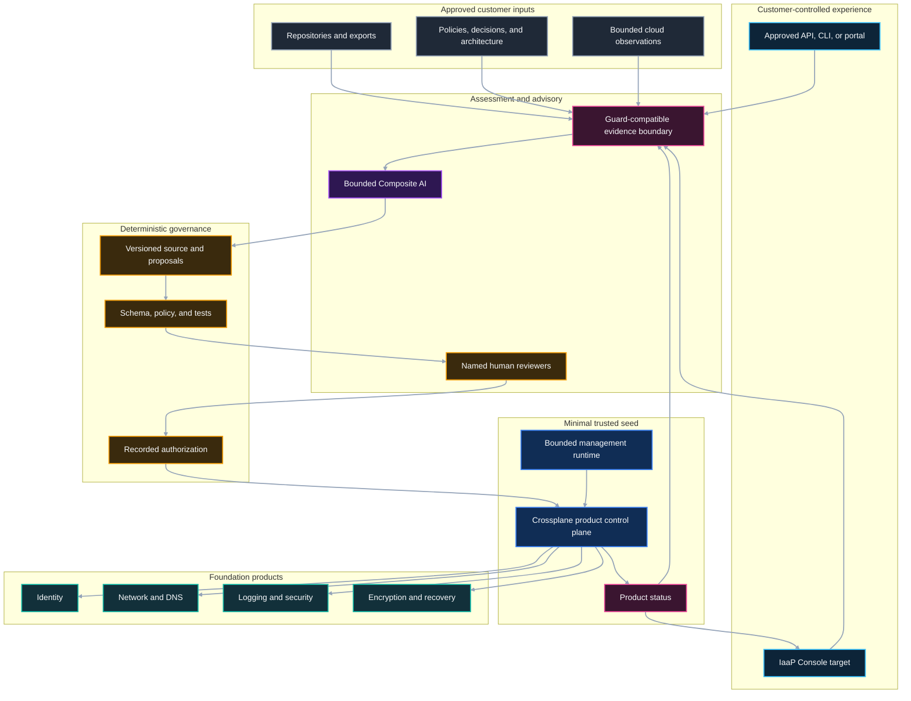

# Bootstrap Reference Architecture

| Attribute | Definition |
|---|---|
| Status | Public architecture contract and implementation target |
| Scope | Customer prerequisites, customer-hosted runtime boundary, minimal trusted seed, and foundation-product handoff |
| Current-product claim | None; this page does not assert new Guard V1, Forge V1, or Console functionality |

## Requirement set

| ID | Requirement |
|---|---|
| `BFR-ARC-001` | Repository assessment must remain available without requiring customer cloud, Kubernetes, Terraform/TFE, AI, or personal-access-token credentials. |
| `BFR-ARC-002` | The customer bootstrap and the minimal trusted seed must remain distinct: the seed is a technical subset, not the complete foundation. |
| `BFR-ARC-003` | Composite AI, deterministic validation, human authorization, reconciliation, and cloud enforcement must remain separate authority domains. |
| `BFR-ARC-004` | Customer assessment evidence, configuration, model context, secrets, and operational data must remain inside approved customer-controlled boundaries. |
| `BFR-ARC-005` | Cloud access must advance from none, to read only, to narrowly bounded nonproduction write only through explicit readiness gates. |
| `BFR-ARC-006` | One external resource must have one authoritative reconciler. |
| `BFR-ARC-007` | Requirements, decisions, validation, authorization, execution, status, and evidence must remain traceable. |
| `BFR-ARC-008` | Consumer contracts must remain independent of replaceable storefront, model, provider, and execution-adapter choices. |

These identifiers are public documentation requirements. They are not shipped
Guard diagnostics, private scoring rules, or evidence of implemented product
behavior.

## Architectural position

The reference architecture supports three related but independently gated
paths:

1. **Assessment path** — repository and document assessment without cloud
   access or a product-control-plane seed.
2. **Advisory and simulation path** — customer-hosted analysis, review, and
   credential-free product lifecycle simulation.
3. **Cloud lifecycle path** — separately authorized discovery and
   nonproduction reconciliation through bounded workload identity.

The assessment path can begin before the customer-hosted runtime or cloud
foundation exists. The later paths build on the approved evidence rather than
turning the assessment component into an infrastructure executor.

## Logical architecture

The diagram expresses the target responsibility flow. It does not claim that
the IaaP Console currently hosts, invokes, or automates the depicted
capabilities.

## Layer 0 — external trust prerequisites

Layer 0 consists of customer capabilities that the IaaP product system cannot
create for itself without circular authority:

- a cloud organization, tenant, or equivalent customer relationship where
  cloud use is requested;
- billing and financial ownership;
- approved initial administration;
- an identity authority and privileged-access process;
- an approved management environment;
- source repositories and change governance;
- a customer audit destination;
- approved connectivity and package-source policy;
- named architecture, security, operations, evidence, and risk owners; and
- data classification and handling decisions.

Layer 0 is broader than infrastructure. It contains organizational decisions
that remain human-owned even when Composite AI helps identify missing
information or draft alternatives.

See
[bootstrap runtime prerequisites](../prerequisites/bootstrap-runtime-prerequisites.md)
and [bootstrap RACI](../responsibility-matrices/bootstrap-raci.md).

## Assessment path — independent starting point

The assessment path consumes explicitly approved repositories, exports,
documents, and evidence. It must not require:

- customer cloud write credentials;
- Kubernetes administrator access;
- Crossplane;
- Terraform or TFE credentials;
- an AI model;
- a customer personal access token;
- execution of repository code; or
- permission to merge or remediate changes.

The path can generate findings and planning material inside Guard's existing
supported boundary. This architecture package adds no new Guard V1 rule,
decision, or runtime behavior.

When customer-hosted Composite AI assistance is requested, approved assessment
evidence may become input to the advisory path only after data handling and
model/tool boundaries are accepted.

See [assessment prerequisites](../prerequisites/assessment-prerequisites.md)
and
[approved AI inputs and proposals](../composite-ai/approved-inputs-and-proposals.md).

## Customer bootstrap — operating boundary

The customer bootstrap is the approved environment and operating model needed
for the stage the customer requests. Its minimum capabilities are:

| Capability | Required public outcome |
|---|---|
| Hosting | Bounded, nonproduction compute under customer-approved administration |
| Human identity | Federated or otherwise approved authentication, role separation, and access review |
| Workload identity | Narrow, revocable, auditable identity for each authorized integration |
| Data custody | Encrypted customer-controlled storage with classification, retention, export, and disposal rules |
| Secrets and keys | Approved custody, retrieval, rotation, revocation, recovery, and audit |
| Connectivity | Explicit source, model, package, evidence, and provider paths with ingress/egress policy |
| Audit and monitoring | Central activity logs, health monitoring, alerting, and named response ownership |
| Source and delivery | Versioned configuration, reviewed change, deterministic validation, promotion, and rollback |
| Operations | Named service owner, support path, incident process, backup, recovery, upgrade, and retirement |
| Financial control | Cost owner, allocation metadata, budget, alerts, and usage limits |

Not every stage needs every integration enabled. Unused capabilities remain
disabled rather than pre-authorized for possible future use.

See
[customer-hosted deployment](customer-hosted-deployment.md).

## Layer 1 — minimal trusted seed

The minimal trusted seed is the bounded technical runtime required before
Crossplane can establish and manage foundation products. It contains:

- an approved management-cluster or equivalent runtime;
- Crossplane and required package lifecycle controls;
- a dedicated namespace or equivalent isolation boundary;
- a workload-identity path;
- source and deployment integration;
- ingress and egress enforcement;
- audit, monitoring, and status visibility;
- backup and recovery for control-plane state and configuration;
- pinned and validated packages; and
- a separately governed upgrade and rollback path.

The seed does not itself constitute:

- a complete landing zone;
- organization-wide account, subscription, or project vending;
- enterprise network or identity redesign;
- a production authorization boundary;
- a regulated-data processing approval;
- a complete product catalog;
- a ticketing, CMDB, or records-management replacement; or
- permission for Composite AI to execute infrastructure changes.

The technical reference may use Crossplane, but the public consumer contract
must not expose provider configuration, managed-resource topology, credentials,
or package internals.

## Layer 2 — foundation products

After the seed is accepted, the control plane may target approved foundation
capabilities as versioned products. Examples include:

- organization, account, subscription, project, folder, and environment
  boundaries;
- workload identity;
- network zones, routing, connectivity, DNS, ingress, and egress;
- logging, monitoring, and security-event connections;
- encryption, key management, secrets, backup, and recovery;
- service, region, tagging, and data-classification policy;
- budget, allocation, and cost guardrails; and
- stable `CloudFoundationEnvironment`-style consumer outcomes.

Provider-specific implementations may differ. The product-facing outcome,
metadata, lifecycle, conditions, evidence, and exception behavior remain the
stable boundary.

See [foundation domains](../README.md#foundation-domains) and the
[provider-neutral contract](../providers/provider-neutral-contract.md).

## Interfaces and data movement

| Interface | Permitted data | Required control |
|---|---|---|
| Repository to assessment | Approved source and metadata | Read-only scope, source/version provenance, and no repository-code execution |
| Customer documents to advisory | Approved, classified inputs | Data minimization, redaction, access control, and retention |
| Advisory to proposal | Labeled AI-generated or human-authored proposal | Source attribution, deterministic validation, and human review |
| Proposal to product API | Approved product-level intent | Schema, policy, tests, recorded authorization, and change identity |
| Product control plane to cloud | Only the authorized lifecycle operation | Workload identity, target restriction, cloud-native enforcement, and audit |
| Product status to experience | Sanitized product status and evidence references | Data classification, integrity, and least disclosure |

Customer content must not be silently used to expand the model, tool, tenant,
provider, or product authority boundary.

## Cloud-access progression

The architecture recognizes three cloud-access modes:

| Mode | Purpose | Default |
|---|---|---|
| No cloud access | Assessment, planning, advisory, and simulation | Initial state |
| Read only | Verify approved current-state configuration | Disabled until Gate 3 |
| Narrow nonproduction write | Reconcile and remove an approved sandbox product | Disabled until Gate 4 |

Static long-lived cloud credentials are not the preferred pattern. Any
exception requires explicit ownership, scope, rotation, revocation, expiration,
and evidence.

See [workload identity](../foundation-domains/workload-identity.md),
[discovery prerequisites](../prerequisites/discovery-prerequisites.md), and
[provisioning prerequisites](../prerequisites/provisioning-prerequisites.md).

## Failure containment

The target implementation must fail closed when:

- required ownership or authority is absent;
- evidence is missing, stale, unverifiable, or outside the approved scope;
- an identity exceeds the approved stage;
- a proposal cannot be distinguished from an approval;
- deterministic validation is unavailable or fails;
- two systems would actively manage the same external resource;
- teardown or recovery cannot be demonstrated for a live sandbox;
- an AI component requests execution, approval, secret, or unrestricted access;
  or
- a later stage is inferred from evidence that proves only an earlier stage.

A narrower activity may proceed only through an explicit
`CONTINUE_WITH_CONDITIONS` decision with scope, owner, due date, expiration,
and reassessment criteria.

## Required architecture evidence

The minimum architecture evidence target is:

- approved scope and requested readiness gate;
- current topology and trust-boundary diagrams;
- named customer owners and authorities;
- identity and access mode;
- data classification and flow inventory;
- source, package, model, and provider integration inventory;
- deterministic validation results;
- human decisions and authorization references;
- product status and lifecycle results;
- recovery and teardown results when applicable;
- conditions, exceptions, owners, due dates, and expiration; and
- versions, timestamps, sources, and integrity metadata.

Evidence must substantiate only the property claimed. A credential-free
simulation cannot prove provider behavior, and a nonproduction sandbox cannot
authorize a pilot or production workload.

## Product handoff

The future Forge-compatible handoff contains only approved product intent and
evidence references, such as:

- product and profile identifier;
- target environment and approved provider/region;
- owner and cost metadata;
- data classification;
- dependency contracts;
- policy and approval references;
- lifecycle and deletion policy; and
- evidence requirements.

It must not expose internal assessment scoring, private rules, AI prompts,
provider credentials, raw IAM policies, or implementation topology to the
consumer.

## Related architecture

- [Authority and trust boundaries](authority-and-trust-boundaries.md)
- [Customer-hosted deployment](customer-hosted-deployment.md)
- [Progression and decision model](progression-and-decision-model.md)
- [Product-Control-Plane Architecture](../../architecture/product-control-plane.md)
- [Infrastructure-as-a-Product Thesis](../../THESIS.md)
- [Public Publication Boundary](../../PUBLICATION-BOUNDARY.md)
