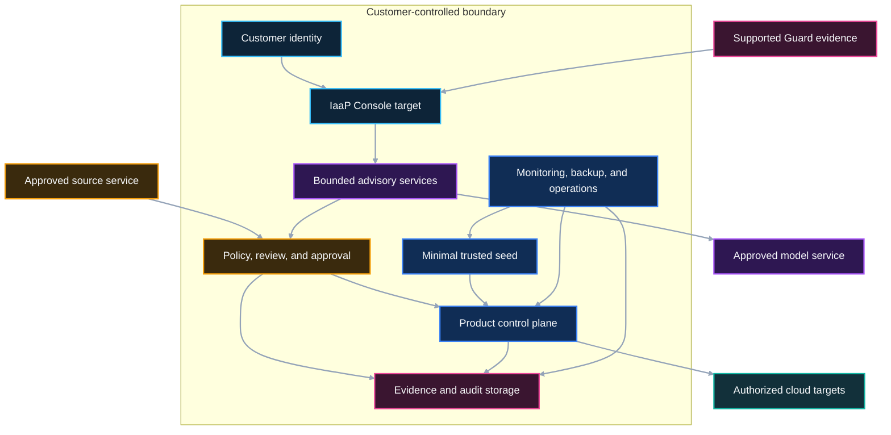

# Customer-Hosted Deployment

| Attribute | Definition |
|---|---|
| Status | Public architecture contract and implementation target |
| Scope | Target hosting, isolation, data custody, connectivity, operations, recovery, portability, and lifecycle |
| Current-product claim | None; this page does not claim a currently available customer-hosted Guard V1, Forge V1, or Console distribution |

## Requirement set

| ID | Requirement |
|---|---|
| `BFR-DEP-001` | The customer must approve and control the hosting boundary used for customer evidence, configuration, model context, product state, and operational data. |
| `BFR-DEP-002` | External services and integrations must be explicit, least privileged, revocable, logged, and governed by customer data-handling decisions. |
| `BFR-DEP-003` | Assessment, advisory, simulation, discovery, and provisioning capabilities must be independently enableable. |
| `BFR-DEP-004` | The deployment must default to no cloud access and must add read or write access only at the applicable readiness gate. |
| `BFR-DEP-005` | Human identity, workload identity, secrets, keys, data, logs, and control-plane state must have named customer ownership. |
| `BFR-DEP-006` | Backup, restoration, continuity, upgrade, rollback, decommissioning, export, and disposal must be defined before the relevant stage. |
| `BFR-DEP-007` | The deployment must expose supported product contracts rather than private Guard or Forge implementation internals. |
| `BFR-DEP-008` | A customer must be able to replace an approved storefront, model provider, or execution adapter without redefining the consumer outcome. |
| `BFR-DEP-009` | Production use must remain unavailable until separately authorized by the customer. |

These requirements describe a target deployment contract. They do not assert
that the current products package or enforce the contract.

## Meaning of customer-hosted

Customer-hosted means the customer approves and controls:

- where the IaaP management experience and target runtime operate;
- which identities can access them;
- where customer evidence, configuration, product state, and audit data reside;
- which external services may receive approved data;
- which networks, repositories, models, packages, and cloud targets are
  reachable;
- who operates, supports, upgrades, recovers, and retires the deployment; and
- how information and configuration are exported or destroyed.

Customer-hosted does not require every dependency to run on customer-owned
hardware. A customer may approve GitHub, a cloud model endpoint, a package
registry, or another external service. Each remains an explicit integration,
not an invisible extension of the trust boundary.

## Deployment profiles

| Profile | Customer-hosted runtime required? | Enabled capability | Cloud authority |
|---|---:|---|---|
| Assessment only | No technical seed required | Approved repository assessment and planning within the supported Guard boundary | None |
| Advisory | Yes | Customer-controlled evidence intake and bounded Composite AI proposals | None by default |
| Simulation | Yes, including minimal trusted seed | Product contracts, policy, review, simulated reconciliation, and evidence | None |
| Discovery | Yes | Approved current-state observation and evidence collection | Read only |
| Live sandbox | Yes | Narrow nonproduction product reconciliation and teardown | Explicit workload identity |
| Pilot | Yes | Separately authorized limited customer use | Explicit pilot scope |
| Production consideration | Customer-defined | Formal authorization activity | Not granted by this architecture contract |

The customer may stop at any profile. Selecting one profile does not
pre-authorize the next.

## Reference placement

This is a logical placement, not a physical implementation diagram. It does
not reveal or prescribe internal product services, private roles, provider
resource names, or deployment topology.

Guard V1 remains a GitHub-native assessment product with its existing trust
boundary. “Supported Guard evidence” means an approved evidence input; it does
not mean this target deployment has repackaged Guard V1.

## Minimum runtime capabilities

Before customer-hosted advisory or simulation begins, the approved environment
must provide:

- bounded nonproduction compute;
- customer authentication and role-based access;
- workload identity for each external integration;
- encrypted storage;
- secrets and key management;
- audit logging;
- monitoring and alerting;
- network isolation and enforced ingress/egress policy;
- approved source and package access;
- backup and restoration;
- cost ownership, budgets, and alerts;
- versioned configuration and protected change;
- an operations owner and incident path; and
- an inventory of external dependencies.

The customer determines the implementation. This contract defines the required
outcome, not a provider-specific bill of materials.

See
[bootstrap runtime prerequisites](../prerequisites/bootstrap-runtime-prerequisites.md).

## Identity and access

The target deployment uses customer-approved human authentication and separate
workload identities for:

- source and repository reads;
- approved model calls;
- evidence storage and export;
- monitoring and security integration;
- read-only cloud discovery; and
- nonproduction reconciliation.

Capabilities that are not enabled have no identity provisioned for that
purpose. Access is reviewed, logged, and revocable. Privileged emergency access
has a separately approved process and follow-up evidence.

Static long-lived cloud credentials are not the preferred pattern. No
credential or secret may be supplied to Composite AI merely because AI helps
prepare the request.

See [identity and access](../foundation-domains/identity-and-access.md),
[workload identity](../foundation-domains/workload-identity.md), and
[secrets management](../foundation-domains/secrets-management.md).

## Data custody and separation

The customer must classify and assign ownership for:

- repository content and metadata;
- architecture and policy documents;
- cloud configuration exports;
- prompts, context, responses, and model telemetry;
- findings and proposed decisions;
- product definitions and lifecycle status;
- approvals, exceptions, and risk records;
- credentials, secrets, and key metadata;
- operational and security logs; and
- retained evidence and exports.

Data movement outside the customer-controlled boundary requires an approved
purpose, destination, data class, minimization or redaction rule, identity,
retention rule, and revocation path.

Customer data from one deployment must not become context for another customer
or an unrestricted product-development dataset.

See [data classification](../foundation-domains/data-classification.md) and
[retention, traceability, and export](../evidence/retention-traceability-and-export.md).

## Connectivity

Every connection is denied or absent until its purpose is approved.

| Connection | Direction | Minimum decision |
|---|---|---|
| Human access | Inbound to experience and review surfaces | Identity, device or network expectations, session controls, and audit |
| Source service | Bidirectional only where separately authorized; read only for assessment | Repository scope, metadata, proposal path, webhook or polling model, and revocation |
| Model service | Outbound request and response | Approved model, endpoint, data classes, logging, retention, and usage ceiling |
| Package registries | Outbound retrieval | Approved publishers, versions, integrity checks, mirrors, and update process |
| Evidence destinations | Outbound or internal | Data class, encryption, integrity, retention, access, and export |
| Cloud discovery | Outbound API access | Read-only identity, accounts or projects, services, regions, logging, and expiry |
| Cloud reconciliation | Outbound API access | Nonproduction targets, workload identity, services, policy, lifecycle, and teardown |
| Security and monitoring | Outbound events and operational telemetry | Destination ownership, triage, response, retention, and data minimization |

The contract does not assume public internet access. Private endpoints,
customer proxies, mirrors, or approved gateways are valid implementation
patterns when they satisfy the same product outcome.

## Source and change governance

Configuration, public schema targets, deployment declarations, integration
scope, and product definitions must be versioned and reviewed.

The target change path includes:

1. authenticated proposal;
2. source and author provenance;
3. schema and policy validation;
4. security and supply-chain checks;
5. human review for material changes;
6. recorded authorization;
7. bounded promotion;
8. observed status;
9. rollback or remediation; and
10. retained evidence.

An emergency path may be faster but cannot be undocumented.

See
[delivery and change governance](../foundation-domains/delivery-and-change-governance.md).

## Model and tool integration

The customer approves:

- model or model-provider category;
- endpoint and hosting boundary;
- permitted input classifications;
- redaction and minimization;
- response and telemetry retention;
- tool access;
- usage and cost limits;
- failure and fallback behavior;
- evaluation expectations; and
- the human-review boundary.

The advisory service must continue to function safely when a model is
unavailable. Unavailability may pause AI assistance, but it must not bypass
deterministic validation or human authorization.

See
[Composite AI advisory operating model](../composite-ai/advisory-operating-model.md).

## Operations and support

Before simulation, the customer identifies at least:

- service and product owner;
- platform engineering owner;
- security owner;
- operations and incident owner;
- evidence and records owner;
- financial owner; and
- AI governance owner when AI is enabled.

Operational responsibilities include:

- health and dependency monitoring;
- alert triage and incident response;
- access review;
- capacity, quota, and budget review;
- vulnerability and package maintenance;
- compatibility and upgrade testing;
- backup and restoration;
- evidence retention and export;
- known-error and runbook maintenance;
- deprecation and retirement; and
- customer support boundaries.

The implementation team must not silently inherit all ownership roles.

See [operations and support](../foundation-domains/operations-and-support.md)
and [bootstrap RACI](../responsibility-matrices/bootstrap-raci.md).

## Backup, recovery, and continuity

The customer defines recovery requirements for:

- configuration and product definitions;
- approval and decision records;
- evidence and integrity metadata;
- control-plane state;
- secrets and keys, including recovery controls;
- operational documentation; and
- integration configuration.

A backup is not accepted evidence of recoverability until restoration is
tested at the stage-appropriate scope. Recovery must not restore expired
privileges, revoked integrations, obsolete policies, or superseded product
definitions without review.

See
[backup, recovery, and continuity](../foundation-domains/backup-recovery-and-continuity.md).

## Upgrade and compatibility

The target deployment records:

- supported versions and compatibility;
- pinned or otherwise governed dependencies;
- upgrade owner and maintenance process;
- validation before promotion;
- rollback criteria;
- schema and evidence migration;
- provider and model compatibility; and
- deprecation and end-of-support dates.

An upgrade must not silently expand access, data sharing, model authority,
cloud targets, product scope, or external dependencies.

## Portability and exit

The customer must be able to obtain, subject to its policy:

- public configuration and schema-target versions;
- product definitions and status;
- decisions, conditions, exceptions, and approvals;
- evidence and integrity metadata;
- dependency and integration inventory;
- operational runbooks;
- supported export formats; and
- verified deletion or retention status.

Portability does not require disclosure of private Guard or Forge
implementation internals. It requires that customer-owned content and the
public product contract are not trapped in an undocumented deployment.

## Decommissioning

Decommissioning includes:

- disabling ingress and external integrations;
- revoking workload identities and credentials;
- stopping reconciliation;
- handling managed resources under the approved deletion or orphan policy;
- exporting customer-owned records;
- retaining or disposing of evidence under customer policy;
- deleting secrets and keys when authorized;
- removing package and model access;
- verifying residual resources and access; and
- recording completion and unresolved obligations.

Destruction of cloud resources or evidence is never inferred from
decommissioning intent; it requires explicit authorization and verification.

## Required deployment evidence

At the relevant stage, retain:

- approved deployment profile and environment;
- owner and authority assignments;
- logical topology and data flows;
- identity classes and access reviews;
- integration inventory and target scopes;
- network-policy and isolation results;
- encryption, secrets, and key-ownership records;
- source, package, and version provenance;
- monitoring, incident, backup, restore, and continuity results;
- budget and usage controls;
- change, upgrade, rollback, and decommissioning records;
- conditions and exceptions with expiration; and
- status and evidence-integrity metadata.

Public evidence must remain sanitized under the
[publication boundary](../../PUBLICATION-BOUNDARY.md).

## Readiness behavior

- `CONTINUE` requires all mandatory deployment responsibilities and evidence
  for the requested profile.
- `CONTINUE_WITH_CONDITIONS` may allow a narrower profile with disabled
  integrations and explicit remediation.
- `STOP` applies when data custody, identity, hosting authority, audit,
  recovery, ownership, or the requested cloud-access boundary is unresolved.

These values belong to the Foundation Readiness architecture target and do not
modify Guard V1.

## Prohibited shortcuts

- Treating a complete landing zone as a prerequisite for repository
  assessment.
- Treating the minimal trusted seed as the complete foundation.
- Reusing one privileged credential across assessment, AI, discovery, and
  reconciliation.
- Giving AI execution secrets or approval authority.
- Enabling cloud write access during installation for possible future use.
- Sending customer content to an unapproved model or support boundary.
- Using a successful deployment as proof of production authorization.
- Running two active reconcilers for the same external resource.
- Omitting backup, restoration, rollback, decommissioning, or evidence
  ownership.
- Publishing private implementation or operational details as customer
  guidance.

## Related architecture

- [Bootstrap reference architecture](bootstrap-reference-architecture.md)
- [Authority and trust boundaries](authority-and-trust-boundaries.md)
- [Progression and decision model](progression-and-decision-model.md)
- [Bootstrap runtime prerequisites](../prerequisites/bootstrap-runtime-prerequisites.md)
- [Provider-neutral contract](../providers/provider-neutral-contract.md)
- [Provider and partner boundaries](../responsibility-matrices/provider-partner-boundaries.md)
