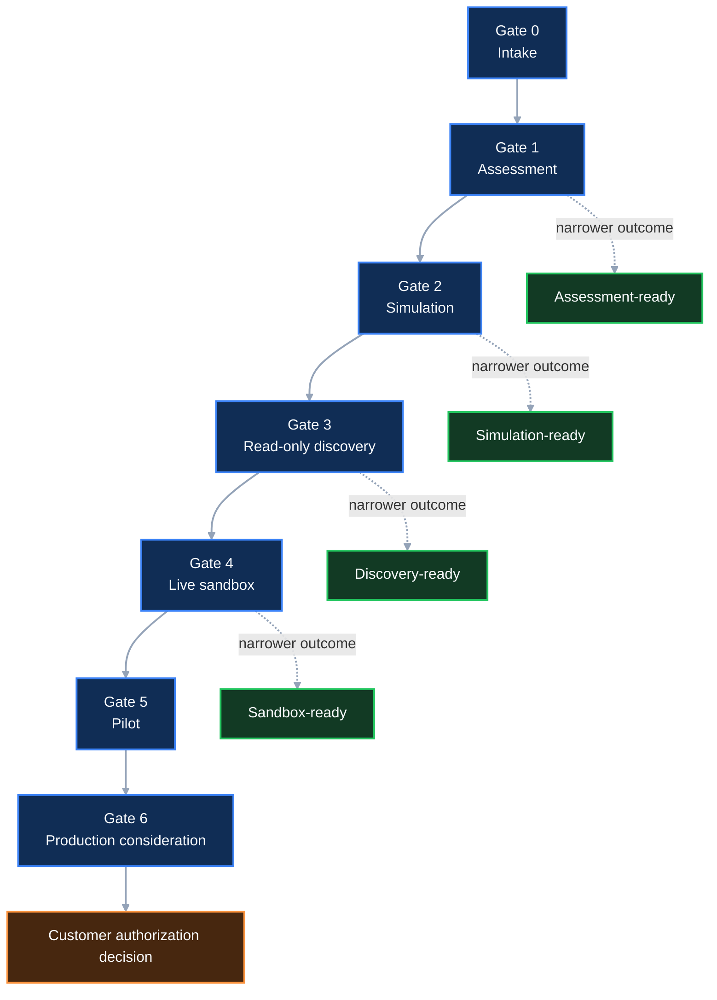

# Progression and Decision Model

| Attribute | Definition |
|---|---|
| Status | Public architecture contract and implementation target |
| Scope | Gate entry, evidence, decisions, conditions, expiration, reassessment, and stage advancement |
| Current-product claim | None; this model is not asserted as shipped Guard V1, Forge V1, or Console behavior |

The
[overview decision map](../README.md#readiness-decision-map)
shows the yes/no progression and its color language. This page defines what
each transition means.

## Requirement set

| ID | Requirement |
|---|---|
| `BFR-PROG-001` | Readiness must be decided for a named requested gate and bounded scope. |
| `BFR-PROG-002` | Passing one gate must not authorize or imply readiness for a later gate. |
| `BFR-PROG-003` | A readiness decision must identify requirements, evidence, scope, decision owner, time, and reassessment criteria. |
| `BFR-PROG-004` | `CONTINUE_WITH_CONDITIONS` must define the narrower permitted activity, unresolved items, owners, due dates, expiration, and automatic stop conditions. |
| `BFR-PROG-005` | `STOP` must fail closed for the requested activity while identifying remediation and any independently permissible narrower activity. |
| `BFR-PROG-006` | Material decisions and risk acceptance must remain human-owned. |
| `BFR-PROG-007` | Composite AI may propose and explain a decision but must not issue the authoritative readiness record. |
| `BFR-PROG-008` | Any material change, expired evidence, incident, failed control, or scope expansion must trigger reassessment. |
| `BFR-PROG-009` | A readiness decision must not be represented as certification, compliance, an assessment conclusion, an ATO, or production approval. |
| `BFR-PROG-010` | Decision semantics must remain distinct from Guard V1 verdicts and private diagnostic codes. |

## Decision namespace

`FoundationReadinessDecision` is a public architecture concept with three
values:

| Value | Meaning | What it does not mean |
|---|---|---|
| `CONTINUE` | Mandatory requirements and evidence for the named scope and requested gate are satisfied | Approval for a later gate, compliance, certification, or production |
| `CONTINUE_WITH_CONDITIONS` | A specifically narrower activity may proceed while documented conditions remain open | A waiver of the unresolved requirement or permission to exceed the recorded scope |
| `STOP` | A required control, authority, decision, or evidence item blocks the requested activity | A permanent rejection of every narrower or future path |

These values do not replace Guard V1 `PASS`, `WARNING`, `FAIL`, materiality, or
other supported semantics. Product adoption of this target requires separate
versioned implementation and compatibility decisions.

See
[foundation readiness decisions](../decisions/foundation-readiness-decisions.md).

## Gate sequence

The sequence is ordered by increasing authority and operational consequence,
not by organizational prestige. A customer may deliberately remain at an
earlier stable outcome.

## Decision record

Every authoritative readiness record identifies:

- decision identifier and version;
- customer-approved scope;
- requested gate and permitted activity;
- decision value;
- evaluated public `BFR-*` requirements;
- input and evidence references;
- deterministic validation results;
- material decisions and named human reviewers;
- unresolved conditions or failed requirements;
- exceptions and risk-acceptance references;
- responsible owners;
- decision time, review date, and expiration;
- automatic stop or reassessment triggers;
- superseded decision reference when applicable; and
- explicit statement of what is not authorized.

The record must distinguish:

- an AI proposal;
- a deterministic result;
- a technical recommendation;
- an architecture or security approval;
- an exception;
- risk acceptance;
- a readiness decision; and
- a customer pilot or production authorization.

One record may reference the others, but it must not collapse them into an
ambiguous “approved” status.

## Gate 0 — intake

### Purpose

Establish what the customer is asking to do, who has authority, what evidence
may be collected, and how it may be handled.

### Entry

A customer sponsor or authorized platform representative requests assessment
or adoption.

### Mandatory outcome

- scope and requested gate;
- named product/platform owner;
- named architecture and security reviewers;
- approved repository, export, document, and interview sources;
- data classification and handling;
- evidence storage and retention;
- customer-hosted deployment intent where applicable; and
- known legal, records, contractual, or authorization constraints.

### Decision behavior

- `CONTINUE` — assessment may begin.
- `CONTINUE_WITH_CONDITIONS` — only the approved source subset may be assessed.
- `STOP` — ownership, authority, source permission, or data handling is absent.

See [Gate 0](../readiness-gates/gate-0-intake.md).

## Gate 1 — assessment

### Purpose

Describe the current state, identify gaps and dependencies, and surface
material decisions without requiring cloud provisioning access.

### Entry

Gate 0 permits assessment of the identified sources.

### Mandatory outcome

- source and version inventory;
- evidence-quality and missing-information record;
- findings by foundation domain;
- current ownership and authority gaps;
- material decisions;
- dependency and sequencing analysis;
- proposed target outcomes and alternatives;
- initial remediation backlog and acceptance evidence; and
- explicit boundary between observed fact, inference, and proposal.

### Decision behavior

- `CONTINUE` — assessment evidence supports the requested next activity.
- `CONTINUE_WITH_CONDITIONS` — planning may continue with named evidence gaps,
  but discovery or provisioning remains unavailable.
- `STOP` — required sources, owners, or trustworthy evidence are absent.

Gate 1 does not require customer cloud, Kubernetes, Terraform/TFE, AI, or
personal-access-token credentials.

See [Gate 1](../readiness-gates/gate-1-assessment.md).

## Gate 2 — credential-free simulation

### Purpose

Test the proposed product contract, policy, review, status, evidence, and
lifecycle without customer cloud credentials or live resources.

### Entry

The customer has approved the bootstrap/simulation boundary, product intent,
and required human review.

### Mandatory outcome

- versioned product and profile contract;
- deterministic positive and negative validation;
- bounded AI authority validation when AI is enabled;
- human-review and approval-path validation;
- simulated reconciliation and product conditions;
- error, rollback, deletion, and teardown behavior;
- evidence generation and integrity; and
- no cloud credentials or live provider mutations.

### Decision behavior

- `CONTINUE` — the contract and governance path may advance to separately
  authorized discovery.
- `CONTINUE_WITH_CONDITIONS` — simulation may continue within a narrower
  product or provider profile.
- `STOP` — contract, policy, authority, lifecycle, evidence, or containment
  fails.

Simulation success is not live-cloud evidence.

See [Gate 2](../readiness-gates/gate-2-simulation.md).

## Gate 3 — read-only discovery

### Purpose

Verify approved current-state cloud facts without changing customer resources.

### Entry

The customer approves targets, read-only identity, collected data, logging,
retention, revocation, and named discovery owner.

### Mandatory outcome

- bounded accounts, subscriptions, projects, folders, regions, and services;
- revocable read-only workload identity;
- verified inability to mutate the target;
- logged discovery activity;
- approved collection, minimization, and redaction;
- current-state evidence tied to source and time;
- identified drift, uncertainty, and inaccessible scope; and
- revoked or expired access after the approved window where required.

### Decision behavior

- `CONTINUE` — current-state evidence supports consideration of a live sandbox.
- `CONTINUE_WITH_CONDITIONS` — assessment may continue credential-free or
  within a narrower discovery target.
- `STOP` — identity, scope, collection, audit, data handling, or revocation is
  unresolved.

Read-only discovery does not authorize infrastructure changes.

See [Gate 3](../readiness-gates/gate-3-read-only-discovery.md).

## Gate 4 — live sandbox

### Purpose

Validate one bounded nonproduction product lifecycle through approved workload
identity, cloud-native controls, operational evidence, recovery, and teardown.

### Entry

All live-cloud prerequisites for the named product, target, provider, and
environment are satisfied and material decisions are approved.

### Mandatory outcome

- protected and versioned approved product definition;
- nonproduction target and budget;
- narrowly scoped reconciliation identity;
- approved network, DNS, logging, security, encryption, key, secret, tagging,
  and cost dependencies;
- deterministic policy and human authorization;
- observed cloud-native enforcement and product status;
- failure and known-error handling;
- recovery or rollback evidence;
- deterministic teardown;
- residual-resource and access verification; and
- sanitized retained evidence.

### Decision behavior

- `CONTINUE` — the bounded sandbox result may support separate pilot
  consideration.
- `CONTINUE_WITH_CONDITIONS` — the sandbox may remain available inside a
  narrower scope with conditions; pilot remains blocked.
- `STOP` — identity, authority, policy, reconciliation, security, recovery,
  teardown, evidence, or cost control fails.

A sandbox pass is not production readiness.

See [Gate 4](../readiness-gates/gate-4-live-sandbox.md).

## Gate 5 — pilot

### Purpose

Evaluate limited customer consumption, support, resilience, cost, adoption,
and product outcomes under separately approved pilot conditions.

### Entry

The customer explicitly authorizes a pilot population, product profile,
workload scope, data class, environment, duration, support model, and exit
criteria.

### Mandatory outcome

- approved consumers and workload boundary;
- service objectives and support hours;
- incident, escalation, and communications process;
- backup, restoration, continuity, and failure testing;
- security monitoring and response;
- budgets, quotas, allocation, and cost-to-serve;
- product adoption and outcome measures;
- exception and human-correction evidence;
- upgrade, rollback, deprecation, and exit path; and
- pilot completion or extension decision.

### Decision behavior

- `CONTINUE` — pilot objectives are satisfied for the approved scope and may
  inform Gate 6.
- `CONTINUE_WITH_CONDITIONS` — pilot may continue within explicit limits and
  expiration.
- `STOP` — customer impact, security, support, resilience, cost, evidence, or
  authority exceeds the approved boundary.

See [Gate 5](../readiness-gates/gate-5-pilot.md).

## Gate 6 — production consideration

### Purpose

Assemble the product, operational, security, risk, and evidence record for the
customer's formal production-authorization process.

### Entry

The customer has identified the applicable authorizing authorities, scope,
controls, evidence, records, and decision process.

### Mandatory outcome

- authoritative production scope and data classes;
- accountable owners and support commitments;
- validated security, identity, network, encryption, monitoring, resilience,
  recovery, continuity, cost, lifecycle, and evidence obligations;
- open findings, exceptions, risk records, and expiration;
- product and dependency support status;
- customer authorization decision and constraints; and
- continuing-assessment or reassessment expectations.

The IaaP architecture package does not issue the customer authorization, make
an ATO determination, or declare certification or compliance.

See
[Gate 6](../readiness-gates/gate-6-production-consideration.md).

## Conditions

A valid condition records:

| Field | Required meaning |
|---|---|
| Requirement | The exact public `BFR-*` requirement or customer requirement not yet satisfied |
| Scope | The environment, product, provider, resource class, data class, and activity affected |
| Permitted activity | The narrower activity that remains allowed |
| Prohibited activity | The activity that remains blocked |
| Owner | Accountable remediation owner |
| Evidence | Current basis for the conditional decision |
| Remediation | Required work and acceptance evidence |
| Due date | Expected completion or review date |
| Expiration | Time after which the conditional permission ends |
| Stop trigger | Event that immediately blocks continued activity |
| Reassessment | Criteria and responsible reviewer for a new decision |

A condition without an owner and expiration is an undocumented exception and
cannot support continued activity.

See [exceptions and expiration](../decisions/exceptions-and-expiration.md).

## Reassessment triggers

Reassessment is required when:

- requested scope, environment, provider, region, service, consumer, or data
  class changes;
- a product, schema, policy, model, tool, dependency, or control-plane version
  changes materially;
- an identity or permission changes;
- evidence expires or its source becomes unavailable;
- an exception expires;
- a control fails or is bypassed;
- recovery or teardown fails;
- an incident or material vulnerability occurs;
- an authoritative external system changes ownership or interface;
- a proposed activity crosses into a later gate; or
- an accountable reviewer withdraws or supersedes a decision.

Reassessment may preserve still-valid evidence, but it must record why that
evidence remains applicable.

## Expiration and revocation

The architecture distinguishes:

- evidence expiration;
- condition expiration;
- exception expiration;
- identity expiration or revocation;
- decision supersession;
- product-version end of support; and
- pilot end date.

Expiration fails closed for the activity that depends on the expired item.
Removal of access or permission must not depend solely on a person remembering
to revisit a document.

## Composite-AI participation

Composite AI may:

- identify the candidate gate from customer intent;
- list missing requirements and evidence;
- draft a readiness recommendation;
- explain the consequence of each decision path;
- propose narrower conditional scope;
- assemble source-linked evidence;
- identify expired or conflicting records; and
- draft remediation and reassessment criteria.

Composite AI must label its output as a proposal. It cannot issue the
authoritative decision, approve a condition, accept risk, or advance a gate.

## Deterministic validation target

Machine-testable validation should confirm:

- decision value and requested gate are allowed;
- required fields and references are present;
- evidence is within the approved scope and validity period;
- mandatory human reviewers are recorded;
- conditional decisions contain scope, owner, date, expiration, and stop
  trigger;
- `STOP` decisions do not enable the blocked activity;
- later-stage access is absent from earlier gates;
- exceptions are active and bounded;
- product and policy versions are compatible; and
- superseded decisions cannot be used as current authorization.

Deterministic validation does not decide whether the evidence or risk is
organizationally acceptable.

## Decision examples

| Request | Evidence state | Correct readiness behavior |
|---|---|---|
| Repository assessment with approved source scope | Owners and data handling accepted | `CONTINUE` to Gate 1 |
| Assessment missing one nonmaterial policy document | Repository assessment remains safe; owner and due date recorded | `CONTINUE_WITH_CONDITIONS` for assessment only |
| Read-only discovery without approved identity | Assessment evidence remains usable | `STOP` discovery; optionally continue credential-free assessment |
| Live sandbox with unresolved DNS authority | Simulation is valid; cloud change could affect an unowned namespace | `STOP` live provisioning |
| Sandbox passes but recovery was not tested | Reconciliation result exists; lifecycle obligation is incomplete | `CONTINUE_WITH_CONDITIONS` for bounded sandbox operations or `STOP` pilot |
| Pilot request based only on simulated evidence | No live operational proof | `STOP` pilot |
| Production request after a sandbox pass | Customer authorization evidence is absent | `STOP` production activity; proceed only with Gate 6 preparation |

## Evidence and publication

The retained record must support the decision without publishing private
implementation detail. Public summaries may show:

- requested gate and bounded scope category;
- public requirements assessed;
- decision value;
- sanitized evidence result;
- open conditions and expiration;
- whether recovery or teardown was verified; and
- limitations needed to interpret the result.

They must not disclose customer data, private diagnostic logic, prompts,
credentials, IAM details, live resource identifiers, secret topology, or
unsanitized operational output.

## Related documentation

- [Bootstrap and Foundation Readiness](../README.md)
- [Bootstrap reference architecture](bootstrap-reference-architecture.md)
- [Authority and trust boundaries](authority-and-trust-boundaries.md)
- [Customer-hosted deployment](customer-hosted-deployment.md)
- [Foundation readiness decisions](../decisions/foundation-readiness-decisions.md)
- [Human review and risk acceptance](../decisions/human-review-and-risk-acceptance.md)
- [Evidence requirements](../evidence/evidence-requirements.md)
- [Public Publication Boundary](../../PUBLICATION-BOUNDARY.md)
