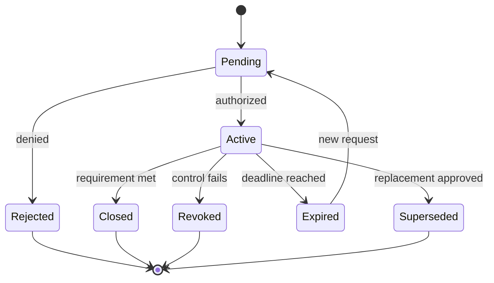

# Exceptions and expiration

**Requirement ID:** `BFR-DEC-002`

> **Status:** Architecture target. No current POC implements customer exception approval or time-bound readiness waivers. POC negative tests and boundary declarations are evidence of fail-closed design, not an exception system.

## Requirement

An exception must be explicit, narrow, owned, time-bounded, independently reviewable, and linked to compensating controls. Expiration returns the affected requirement to an unmet state unless closure or renewal is approved before the deadline.

## Required exception fields

- exception identifier and affected BFR requirement;
- exact product, target, environment, data, and activity scope;
- business justification and why the standard path cannot be met;
- risk statement and affected stakeholders;
- compensating controls and their evidence;
- prohibited activities that remain blocked;
- requestor, control owner, risk authority, and operations owner;
- issue, effective, review, and expiration dates;
- objective closure criteria;
- reassessment triggers; and
- final status: pending, active, expired, closed, revoked, or superseded.

## Non-waivable boundaries

This package must not use an exception to:

- grant Composite AI approval, risk-acceptance, secret, or execution authority;
- disguise production as assessment, simulation, discovery, sandbox, or pilot;
- use cloud administrator credentials as a convenience path;
- process data without lawful customer authorization;
- suppress a failed or missing evidence result;
- authorize a target, provider, region, or product revision outside the recorded scope;
- permit unowned risk or an unnamed operator; or
- treat this package as an ATO or compliance certification.

## Lifecycle

## Expiration behavior

- Notify the owner before expiration according to customer policy.
- Re-evaluate the affected gate using current evidence.
- Stop new activity that depended on the exception when it expires.
- Define whether existing resources remain, enter a safe hold, or are retired; never infer this behavior.
- Preserve the expired record and link any replacement.
- Treat a missed review as expiration, not tacit renewal.

## Relationship to decisions

An active exception may support `CONTINUE_WITH_CONDITIONS` only when the requested activity remains inside the exception scope. It does not require a positive decision and never permits a later stage by inheritance.

A failed compensating control, material scope change, or expired exception normally changes the dependent readiness decision to `STOP` until a human re-evaluates the evidence.

## Required evidence

- exception request and domain finding;
- compensating-control design and test result;
- risk authority's signed or integrity-protected disposition;
- system-generated effective and expiration times;
- periodic review evidence;
- alerts, incidents, or changes affecting the exception; and
- closure, revocation, expiry, or supersession record.

## Composite AI boundary

Composite AI may identify exception candidates, summarize evidence, draft risk language, and detect upcoming expiry. It may not approve, renew, close, or conceal an exception, select the risk owner, or judge residual risk acceptable.

## Related requirements

- [Foundation readiness decisions](foundation-readiness-decisions.md)
- [Human review and risk acceptance](human-review-and-risk-acceptance.md)
- [Retention, traceability, and export](../evidence/retention-traceability-and-export.md)
- [Gate 4 — live sandbox](../readiness-gates/gate-4-live-sandbox.md)
