# Foundation target product

**Requirement ID:** `BFR-SCH-004`

> **Status:** Approved separately versioned architecture contract and sanitized public capability reference. Protected Forge successor increments implement credential-free schemas, simulations, reconciliation, and an inert executor protocol; credentialed provider fulfillment remains unimplemented and unauthorized. This contract is not a Guard V1, Forge V1, or Console V1 schema and does not change the existing `CloudFoundationEnvironment` POC contract.

## Product boundary

`FoundationTarget` represents the governed cloud container into which a `CloudFoundationEnvironment` is attached. It separates account, subscription, and project acquisition from environment capabilities.

The product supports exactly two request modes:

- `attach-existing`: discover and validate a customer-supplied account, subscription, or project without transferring ownership or silently adopting resources;
- `vend-new`: request a new account, subscription, or project through one approved provider-native vending adapter.

The consumer selects a registered target profile and supplies accountable metadata. The platform selects implementation details. A target cannot be managed concurrently by multiple vending engines.

## Illustrative request

**Illustrative, non-executable YAML — not a shipped Forge or Crossplane schema:**

```yaml
apiVersion: iaap.example/v1alpha1
kind: FoundationTarget
metadata:
  id: target-example-001
  changeRef: change-example-001
spec:
  mode: vend-new
  provider: aws
  providerProfileRef: aws-foundation-target-standard
  organizationBoundaryRef: customer-organization
  environmentClass: development
  owner: application-team
  costCenter: cost-reference
  lifecyclePolicyRef: standard-foundation-target-lifecycle
  decisionRef: decision-example-001
```

For `attach-existing`, the request additionally supplies an opaque, provider-scoped `externalTargetRef`. It must not embed credentials, raw IAM policy, provider configuration, execution commands, or secret cloud identifiers in public evidence.

## Formal environment reference

The protected Forge `CloudFoundationEnvironment v1alpha2` successor implements one required typed reference; this public example remains illustrative and name-addressed:

```yaml
spec:
  foundationTargetRef:
    apiVersion: iaap.example/v1alpha1
    kind: FoundationTarget
    name: target-example-001
```

The reference resolves only after the target reports a valid, stage-appropriate readiness condition. It replaces ambiguous free-form attachment selection in that successor contract; it does not mutate, rename, or reinterpret the existing `CloudFoundationEnvironment` POC XRD or frozen Forge V1.

## Provider-native adapter interface

Each adapter is an integration behind the product boundary, not a separate product or mandatory runtime dependency.

| Provider | Attach-existing observation | Vend-new implementation target |
|---|---|---|
| AWS | Account identity, organization membership, region/service constraints, audit and ownership evidence | Approved AWS Organizations/Control Tower account-factory path |
| Azure | Subscription identity, tenant/management-group placement, policy and ownership evidence | Approved Azure subscription-vending path |
| GCP | Project identity, organization/folder placement, billing and policy evidence | Approved Google Cloud project-factory or provider-native project creation path |

Every adapter must:

- declare an immutable adapter identity and supported contract versions;
- accept only a validated `FoundationTarget` request and separately authorized execution context;
- use short-lived workload identity and customer-controlled credentials;
- expose deterministic proposal, observed status, and sanitized evidence;
- fail closed on unsupported mode, ambiguous ownership, prohibited scope, or expired authorization;
- avoid creating a second authoritative reconciler for an attached target; and
- remain removable without breaking contract validation or attach-only simulation.

HCP Terraform, TFE, Crossplane/Upbound, Backstage, GitHub App, and Composite AI remain optional integrations. They may implement or present the contract but do not define the product.

## Lifecycle

| State | Meaning | Authority boundary |
|---|---|---|
| `Proposed` | Request validated; no external action | Deterministic validation only |
| `AwaitingAuthorization` | Proposal and evidence are ready for named human review | No apply or vending |
| `Attaching` / `Vending` | Separately authorized adapter operation is in progress | Exact target and change scope only |
| `Ready` | Provider observation and required evidence satisfy the stage | Does not imply production authorization |
| `Degraded` | Target exists but a required condition is not satisfied | Environment attachment may fail closed |
| `RetirementRequested` | Owner requested retirement and impact evidence is assembled | No deletion yet |
| `Retained` | External target remains under customer ownership or retention policy | Management authority is removed or reduced |
| `Retired` | Product relationship is closed with retained evidence | Provider deletion is separately evidenced |
| `Failed` | Operation failed without a trusted ready state | Recovery or human review required |

Retirement must distinguish detaching management, closing the product relationship, retaining the external target, and deleting the provider container. No mode permits automatic irreversible deletion. Vend-new does not imply delete-on-retire.

## Evidence and traceability

The target record must retain:

- request and proposal digests;
- exact contract, profile, adapter, and policy versions;
- mode, provider, organization boundary, ownership, cost, and change references;
- human authorization reference without embedding secret approval data;
- provider operation identity and sanitized observations;
- target reference issued to `CloudFoundationEnvironment`;
- lifecycle transitions, failures, recovery, detach, retention, and retirement evidence; and
- authority flags proving that proposal, approval, execution, and deletion remain distinct.

## Deterministic acceptance targets

1. Unknown fields, modes, providers, profiles, lifecycle states, and adapters fail closed.
2. `attach-existing` requires an external reference and cannot request creation.
3. `vend-new` rejects caller-supplied existing-target identity.
4. Credentials, commands, raw policy, provider configuration, and execution-engine selection are prohibited from the consumer request.
5. Exactly one provider-native adapter owns an external target operation.
6. `CloudFoundationEnvironment` accepts only a typed reference to a compatible `Ready` target in the same approved boundary.
7. Retirement cannot imply or perform irreversible deletion.
8. Synthetic simulation is deterministic and credential-free.
9. Live sandbox, pilot, and production each require a separate readiness decision and human authorization.
10. Guard V1, Forge V1, and Console V1 compatibility tests remain byte- and behavior-stable.

## Flow

```mermaid
flowchart LR
  R[FoundationTarget request] --> M{Mode}
  M -->|attach-existing| A[Observe existing target]
  M -->|vend-new| V[Provider-native vending proposal]
  A --> G[Deterministic gates]
  V --> G
  G --> H{Human authorization?}
  H -->|No| B[AwaitingAuthorization]
  H -->|Yes, separately authorized| X[Adapter operation]
  X --> O[Provider observation]
  O --> T{Target Ready?}
  T -->|No| D[Degraded or Failed]
  T -->|Yes| F[Typed foundationTargetRef]
  F --> E[CloudFoundationEnvironment]
  E --> L[Lifecycle evidence]
  L --> Q{Retirement requested?}
  Q -->|No| E
  Q -->|Yes| P[Detach, retain, or separately authorize deletion]

  classDef request fill:#0D2438,stroke:#38BDF8,stroke-width:2px,color:#F8FAFC
  classDef decision fill:#3A2A0D,stroke:#F59E0B,stroke-width:2px,color:#F8FAFC
  classDef product fill:#123A24,stroke:#22C55E,stroke-width:2px,color:#F8FAFC
  classDef blocked fill:#3A1530,stroke:#EC4899,stroke-width:2px,color:#F8FAFC
  class R,A,V,F,E,L request
  class M,G,H,T,Q decision
  class X,O product
  class B,D,P blocked
```



## Implementation status

Completed in protected, synthetic-only Forge successor increments:

1. Public architecture contract accepted.
2. Forge hardening baseline completed.
3. Separately versioned `FoundationTarget v1alpha1` schema and deterministic simulator added.
4. Credential-free provider-native adapter interfaces and synthetic fixtures added.
5. Typed `foundationTargetRef` required by `CloudFoundationEnvironment v1alpha2`.
6. Offline positive, negative, lifecycle, drift, retry, retirement, and executor-protocol behavior validated.

Deferred: a credentialed customer-hosted executor and any provider sandbox, pilot, or production operation. Those require separate credential, permission, cost, third-party, data, and deployment authorization.

## Related requirements

- [Cloud foundation environment](cloud-foundation-environment.md)
- [Provider-neutral contract](../providers/provider-neutral-contract.md)
- [Infrastructure-product contracts](../foundation-domains/infrastructure-product-contracts.md)
- [Provisioning prerequisites](../prerequisites/provisioning-prerequisites.md)
- [Retention, traceability, and export](../evidence/retention-traceability-and-export.md)
