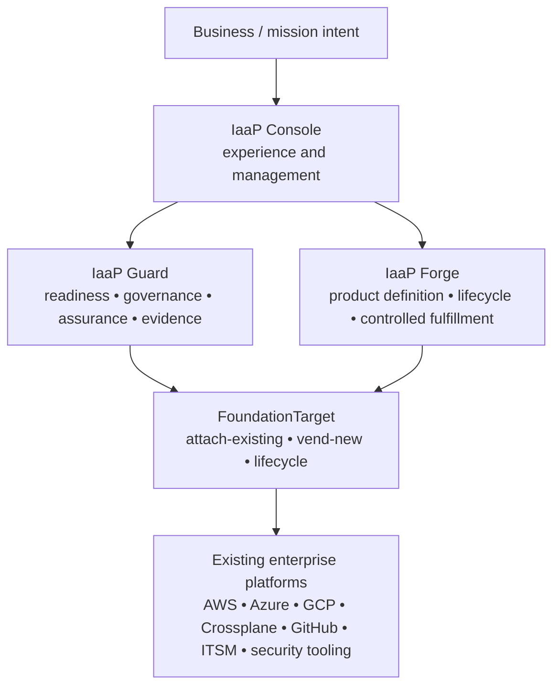

# IaaP Suite Overview

## One sentence

Infrastructure as a Product (IaaP) turns cloud and infrastructure capabilities into governed, supported, measurable products that consumers can request without inheriting unnecessary implementation complexity.

## Suite at a glance

## Executive interpretation

### IaaP Guard — Can and should we proceed?

Guard provides deterministic assessment, materiality decisions, governance, readiness, evidence, continuity, planning, and human-review boundaries. Its purpose is to make risk and readiness explicit before automation becomes authority.

### IaaP Forge — What infrastructure product are we delivering?

Forge defines the product contract, composition, lifecycle, governance, and controlled fulfillment model. It separates a consumer-facing product outcome from the lower-level implementation mechanisms used to deliver it.

### IaaP Console — How does the customer experience and manage the suite?

Console is the customer-hosted experience and management layer. It consumes Guard and Forge contracts without duplicating their authority, enabling onboarding, assessment results, review queues, evidence, product catalog and lifecycle views, and operational administration.

### FoundationTarget — Where will the product live?

FoundationTarget represents the destination foundation as a separately versioned product. It supports attaching to an existing foundation or vending a new governed target, along with lifecycle and retirement handling.

## What remains outside the suite's authority

The suite does not become the final authority for every enterprise system. Existing identity, security, cloud, network, financial, records, approval, and operations systems retain their lawful and technical boundaries.

The intended pattern is orchestration with explicit authority separation, not centralization for its own sake.

## Stable principle

> **Consumer intent should remain stable even when implementation mechanisms change.**

That lets an organization replace a storefront, execution mechanism, provider adapter, or supporting tool without forcing consumers to relearn the infrastructure product itself.
