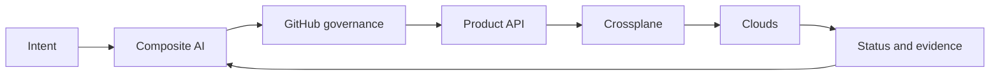

# AI-Powered Infrastructure as a Product

> **IaaS is what we buy; infrastructure-as-a-product is what we build.**

The maintained accelerator is now centered on **stable product contracts, Crossplane, bounded composite AI, GitHub governance, deterministic policy, and evidence**.

Earlier Terraform, TFE, Azure Arc, Backstage, and legacy execution-MCP implementations are preserved in Git history but are not maintained dependencies of the current accelerator.

## Start here

- [Thesis](THESIS.md)
- [Product-Control-Plane Architecture](architecture/product-control-plane.md)
- [IaaP Bootstrap and Foundation Readiness](bootstrap-foundation-readiness/README.md)
- [Operating Model](OPERATING-MODEL.md)
- [POC Portfolio](poc-portfolio.md)
- [Credential-Free Evidence Baseline](poc-baselines/2026-08-07-credential-free-multicloud-foundation.md)
- [Interoperability](INTEROPERABILITY.md)
- [TFE Investment Evaluation](TFE-INVESTMENT.md)
- [Supersession Record](SUPERSESSION.md)
