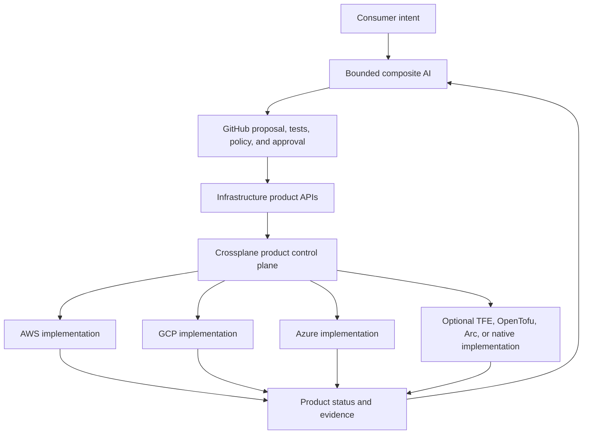
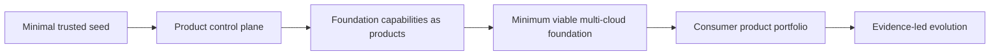
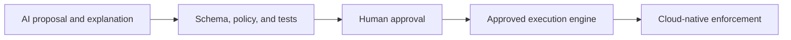

  

# AI-Powered Infrastructure as a Product

> **IaaS is what we buy; infrastructure-as-a-product is what we build.**

This site is the program-level front door for a product-led multi-cloud foundation architecture based on:

- stable infrastructure-product contracts;
- a minimal trusted Crossplane seed;
- Crossplane Compositions and continuous reconciliation;
- bounded composite AI for intent, review, operations, and evidence;
- GitHub change governance and traceability;
- deterministic policy and human approval;
- cloud-native workload identity and enforcement; and
- replaceable implementation paths, including TFE, OpenTofu, Terraform, Azure Arc, Backstage, and cloud-native services where justified.

## Strategic architecture

The architectural center is the **product contract**, not a mandatory execution tool.

## Start here

- [The Infrastructure-as-a-Product Thesis](THESIS.md)
- [Product-Control-Plane Architecture](architecture/product-control-plane.md)
- [POC Portfolio](poc-portfolio.md)
- [Preserved V1 Azure Arc and Terraform Pattern](architecture/v1-azure-arc-terraform-pattern.md)
- [Original Azure Control-Plane Architecture](architecture/target-architecture.md)

## POC portfolio

| Repository | Purpose |
|---|---|
| [`crossplane-multicloud-seed-poc`](https://github.com/SAABOLImpactVenture/crossplane-multicloud-seed-poc) | Minimal trusted Crossplane seed with bounded runtime and security evidence. |
| [`multicloud-foundation-product-poc`](https://github.com/SAABOLImpactVenture/multicloud-foundation-product-poc) | Stable `CloudFoundationEnvironment` product contract with AWS/GCP implementations. |
| [`composite-ai-infrastructure-product-poc`](https://github.com/SAABOLImpactVenture/composite-ai-infrastructure-product-poc) | Bounded request, review, operations, and evidence agents. |
| [`multicloud-foundation-poc-integration`](https://github.com/SAABOLImpactVenture/multicloud-foundation-poc-integration) | Credential-free acceptance and evidence harness consuming pinned upstream commits. |
| [`ai-powered-infrastructure-as-a-product`](https://github.com/SAABOLImpactVenture/ai-powered-infrastructure-as-a-product) | Thesis, architecture, operating model, roadmap, and preserved accelerator assets. |

## Foundation establishment model

The control plane does not need to wait for three complete landing zones before productization begins. Crossplane and composite AI can help establish selected minimum-viable-foundation capabilities after the irreducible trust boundary exists.

## Authority model

> **AI proposes and explains. Deterministic controls validate. Authorized people approve. Crossplane or another approved engine executes. Cloud-native controls enforce the final boundary.**

## Preserved accelerator assets

The repository predates the newer POC portfolio and contains substantial implementation intellectual property:

- Terraform and cloud-specific IaC;
- Azure Arc onboarding and GitOps;
- Backstage catalog and templates;
- MCP concepts and agent workflows;
- OPA, Gatekeeper, Kyverno, Checkov, and TFLint controls;
- workload identity and supply-chain security;
- Azure Monitor, ADX, dashboards, and evidence pipelines;
- OSCAL-oriented compliance material; and
- runbooks and ADRs.

These assets are retained and reframed as optional implementation patterns behind product contracts. They are not being deleted simply because the strategic architecture evolved.

## TFE position

The program does not assume that TFE is obsolete. It also does not assume TFE is mandatory.

The evidence question is:

> **After the product control plane and surrounding governance provide the strategic operating model, what capabilities remain uniquely dependent on TFE, and does their value justify platform-level cost?**

The answer requires live and comparative evidence, not preference.

## Documentation scope

The site also contains material on:

- identity and workload federation;
- policy-as-code and regulated-environment controls;
- supply-chain integrity;
- observability and evidence;
- agent roles and operating models;
- Azure Arc and hybrid implementation patterns;
- runbooks and golden demos; and
- prior phase artifacts.

Use the navigation and search to explore both the current product-control-plane model and the preserved implementation material.
