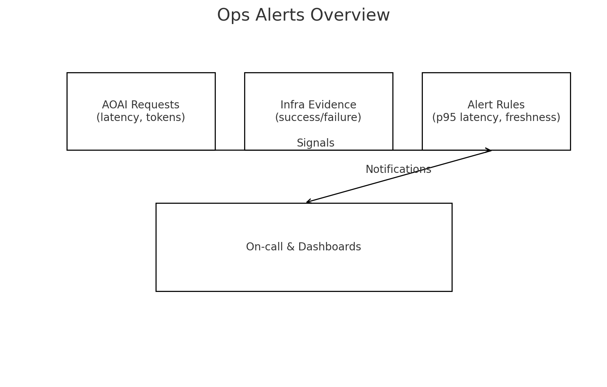

# Ops Alerts (AOAI & Drift)

Examples of Azure Monitor Scheduled Query Rules for:
- AOAI latency anomalies
- Drift freshness (no evidence seen recently)

Use these as starting points; update your resource IDs and action groups.

