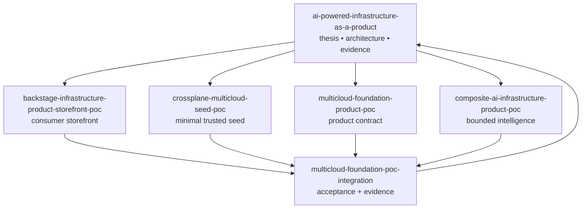
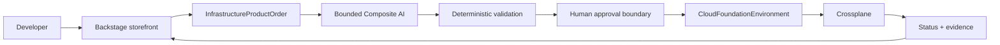

# POC Portfolio

The program separates responsibilities into bounded repositories so each architectural claim can be tested independently without turning the program hub into another implementation monolith.

> **IaaS is what we buy; infrastructure-as-a-product is what we build. Backstage is where developers shop.**

## Responsibilities

### `backstage-infrastructure-product-storefront-poc`

Owns the optional reference **consumer experience** for infrastructure products: browse, configure, order, and track.

The storefront:

- presents curated product-level inputs;
- emits a narrow `InfrastructureProductOrder` artifact;
- opens a human-reviewable GitHub order path;
- hides Crossplane, ProviderConfig, cloud credentials, IAM JSON, Terraform/TFE, and composition internals; and
- never becomes the provisioning control plane.

Backstage is therefore a replaceable experience layer. A CLI, API, service portal, or conversational interface could submit the same product intent without changing the product-control-plane architecture.

### `crossplane-multicloud-seed-poc`

Owns the minimal trusted Crossplane runtime. No product APIs, cloud credentials, production, consumer storefront, or TFE dependency.

### `multicloud-foundation-product-poc`

Owns the `CloudFoundationEnvironment` contract, provider-specific implementations, policy, examples, product status, and lifecycle experiments.

### `composite-ai-infrastructure-product-poc`

Owns bounded request, review, operations, and evidence-agent contracts and evaluations. No direct execution authority.

### `multicloud-foundation-poc-integration`

Owns pinned upstream integration, including the storefront handoff, clean-cluster acceptance, active network-policy proof, AI authority checks, simulated reconciliation, evidence, teardown, scorecard, and cross-repository storefront/product contract compatibility.

The integrated consumer path is:

### `ai-powered-infrastructure-as-a-product`

Owns the thesis, architecture, product operating model, decisions, frozen evidence baselines, portfolio boundaries, and investment framing. It intentionally does not duplicate runtime implementation code.

## Product-system mental model

| Layer | Reference implementation | Responsibility |
|---|---|---|
| Program | `ai-powered-infrastructure-as-a-product` | Thesis, architecture, evidence, decisions, roadmap framing. |
| Experience | `backstage-infrastructure-product-storefront-poc` | Browse, configure, order, track. |
| Intelligence | `composite-ai-infrastructure-product-poc` | Interpret, propose, review, explain, diagnose, evidence. |
| Governance | GitHub + deterministic policy + people | Change, tests, approval, traceability. |
| Product contract | `multicloud-foundation-product-poc` | Stable infrastructure-product API and lifecycle semantics. |
| Control plane | Crossplane | Reconciliation and product status. |
| Bootstrap | `crossplane-multicloud-seed-poc` | Minimal trusted runtime required for the control plane. |
| Acceptance | `multicloud-foundation-poc-integration` | End-to-end evidence across the bounded components. |
| Realization | AWS / Azure / GCP | Cloud-native services and enforcement. |

## Evidence gates

1. **Credential-free control-plane integration** — passed and retained as v1.
2. **Storefront-to-product integration** — passed as historical v2.
3. **Storefront/product accepted-domain compatibility** — corrected and passed as current v3 across Kubernetes 1.34/1.35/1.36 at 100/100.
4. **Build/supply-chain reproducibility correction** — next correction gate before treating live-cloud evidence as an enterprise control demonstration.
5. **Backstage runtime smoke** — execute the reference template/action in an actual Backstage runtime while preserving the same authority boundary.
6. **Live AWS sandbox** — first live-cloud gate after the correction gates are satisfied.
7. **Live GCP sandbox** — after AWS is repeatable.
8. **Live model adapter** — same tool and authority boundary as the deterministic baseline.
9. **Residual TFE comparison** — observed evidence only for remaining justified use cases.
10. **Production pilot** — authorization, SLOs, recovery, support, and lifecycle evidence.

See [POC Baseline Lineage](poc-baselines/README.md) for the frozen evidence history.

## Boundary principle

> **The storefront is where the consumer shops. The product API defines what is being bought. Crossplane controls the product lifecycle. The cloud realizes it.**
