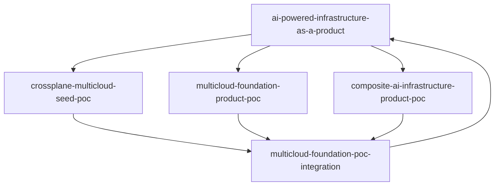

# POC Portfolio

The program separates responsibilities into bounded repositories so each architectural claim can be tested independently.

## Responsibilities

### `crossplane-multicloud-seed-poc`
Minimal trusted Crossplane runtime. No product APIs, cloud credentials, production, or TFE dependency.

### `multicloud-foundation-product-poc`
Owns the `CloudFoundationEnvironment` contract, provider-specific implementations, policy, examples, product status, and lifecycle experiments.

### `composite-ai-infrastructure-product-poc`
Owns bounded request, review, operations, and evidence-agent contracts and evaluations. No direct execution authority.

### `multicloud-foundation-poc-integration`
Owns pinned upstream integration, clean-cluster acceptance, active network-policy proof, AI authority checks, simulated reconciliation, evidence, teardown, and scorecard.

### `ai-powered-infrastructure-as-a-product`
Owns the thesis, architecture, product operating model, decisions, frozen evidence baselines, and investment framing. It intentionally does not duplicate runtime implementation code.

## Evidence gates

1. **Credential-free integration** — passed.
2. **Live AWS sandbox** — next.
3. **Live GCP sandbox** — after AWS is repeatable.
4. **Live model adapter** — same tool/authority boundary as deterministic baseline.
5. **Residual TFE comparison** — only the remaining justified use cases.
6. **Production pilot** — authorization, SLOs, recovery, support, and lifecycle evidence.
