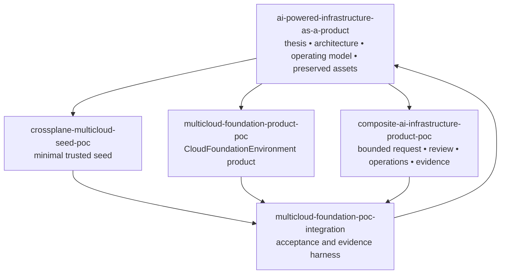
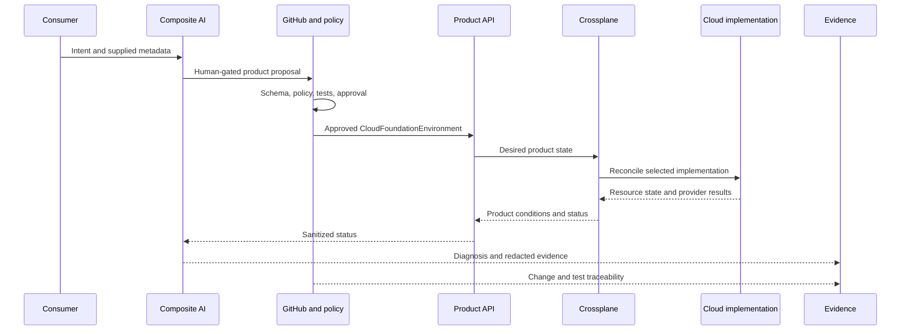
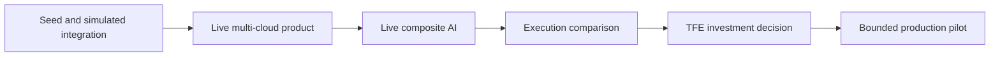

# POC Portfolio

## Purpose

The AI-Powered Infrastructure-as-a-Product program is decomposed into bounded repositories so each architectural claim can be tested independently and then integrated through pinned, repeatable evidence.

This prevents one large repository from becoming:

- an ambiguous source of truth;
- a mixture of bootstrap, product, AI, and integration authority;
- a hidden credential boundary;
- a predetermined TFE replacement project; or
- a demonstration whose conclusions cannot be attributed to specific components.

> **IaaS is what we buy; infrastructure-as-a-product is what we build.**

## Portfolio view

## Repository responsibilities

### `ai-powered-infrastructure-as-a-product`

**Role:** Program front door and durable intellectual-property repository.

Owns:

- the strategic thesis;
- current and preserved architectures;
- the infrastructure-product operating model;
- security and evidence principles;
- product portfolio and roadmap;
- prior Terraform, Azure Arc, Backstage, policy, observability, and OSCAL assets; and
- architecture decisions that explain evolution.

Does not own:

- the source implementation of the bounded POCs;
- cloud credentials for the POC repositories;
- the final TFE investment decision; or
- claims that have not passed their evidence gates.

Repository: <https://github.com/SAABOLImpactVenture/ai-powered-infrastructure-as-a-product>

### `crossplane-multicloud-seed-poc`

**Role:** Minimal trusted Crossplane bootstrap.

Owns:

- pinned Crossplane installation;
- package registry and version boundaries;
- non-production POC namespace;
- Pod Security controls;
- active ingress and egress NetworkPolicy proof;
- deployment and teardown automation;
- machine-readable seed boundaries; and
- an AI identity placeholder with no effective authority.

Explicitly excludes:

- product XRDs and Compositions;
- ProviderConfigs and cloud credentials;
- production;
- complete landing-zone establishment;
- TFE as a mandatory dependency; and
- AI runtime authority.

Repository: <https://github.com/SAABOLImpactVenture/crossplane-multicloud-seed-poc>

### `multicloud-foundation-product-poc`

**Role:** First infrastructure product built on the seed.

Owns:

- namespaced `CloudFoundationEnvironment` API;
- stable AWS and GCP consumer contract;
- simulated and live-sandbox Composition profiles;
- deterministic schema and admission policy;
- product examples and negative cases;
- product status;
- provider identity guidance;
- runbooks and known errors; and
- TFE optionality experiment structure.

Explicitly excludes:

- production;
- complete landing zones;
- account, subscription, or project vending in the first iteration;
- committed cloud credentials;
- direct AI execution; and
- migration of existing Terraform state.

Repository: <https://github.com/SAABOLImpactVenture/multicloud-foundation-product-poc>

### `composite-ai-infrastructure-product-poc`

**Role:** Bounded composite-AI interaction and operations layer.

Owns:

- request agent;
- review agent;
- operations agent;
- evidence agent;
- structured input and output contracts;
- deterministic policy baseline;
- prompt-injection tests;
- secret redaction;
- path-safety tests;
- local pull-request proposals; and
- offline repeatable evaluations.

Explicitly excludes:

- Kubernetes, cloud, Terraform, OpenTofu, TFE, or GitHub credentials;
- direct apply, delete, approval, merge, or remediation;
- policy self-modification;
- production or regulated data; and
- a live model dependency in the first milestone.

Repository: <https://github.com/SAABOLImpactVenture/composite-ai-infrastructure-product-poc>

### `multicloud-foundation-poc-integration`

**Role:** Executable acceptance and evidence harness.

Owns:

- exact upstream repository and commit locks;
- clean Kind cluster orchestration;
- Kubernetes version matrix;
- seed deployment and validation;
- active network-policy evidence;
- composite-AI scenario execution;
- simulated product reconciliation;
- deterministic negative admission;
- AI authority checks;
- evidence collection;
- teardown and orphan checks; and
- machine-readable scorecard.

Explicitly excludes:

- AWS and GCP credentials;
- TFE credentials;
- live cloud provisioning;
- production;
- duplication of upstream source; and
- direct AI apply or remediation.

Repository: <https://github.com/SAABOLImpactVenture/multicloud-foundation-poc-integration>

## Contract flow

## Current evidence gates

### Gate 0 — Credential-free integrated proof

Repository: `multicloud-foundation-poc-integration`

Required evidence includes:

- upstream locks verified;
- seed deployment succeeds;
- ingress and egress NetworkPolicy enforcement passes;
- AI authority remains bounded;
- valid AWS and GCP requests are accepted;
- production and invalid regions are denied;
- missing ownership metadata returns `needs_input`;
- AI-generated product instances reconcile;
- invalid manifests are rejected at admission;
- operational prompt injection is contained; and
- teardown leaves no simulated product orphans.

The full matrix run is intentionally separate from static repository validation.

### Gate 1 — Live AWS and GCP sandbox

Future or follow-on evidence should include:

- workload-identity-backed ProviderConfigs;
- live network, identity, storage, and guardrail resources;
- create and update lifecycle;
- external drift detection and remediation;
- provider permission and quota failures;
- product version upgrade and rollback;
- deletion and cloud orphan checks; and
- sanitized operational diagnosis.

### Gate 2 — Live model adapter

The live model must preserve the same structured contracts and tool boundary.

Measure:

- accepted-request completion;
- missing-information detection;
- hallucinated business metadata;
- policy bypass attempts;
- prompt-injection resistance;
- diagnosis accuracy;
- evidence completeness;
- time to valid proposal; and
- human corrections required.

### Gate 3 — Fair execution comparison

Compare:

- Crossplane-native;
- TFE-centered; and
- Crossplane with retained HCL or OpenTofu.

Use the same scenarios:

1. initial provisioning;
2. invalid request;
3. external drift;
4. product upgrade;
5. provider permission failure;
6. implementation replacement; and
7. decommissioning.

Scores must follow observed evidence. Comparison templates should begin unscored rather than pre-awarding one implementation.

### Gate 4 — TFE residual-value decision

Evaluate:

- unique capabilities;
- active and projected utilization;
- compliance and risk reduction;
- brownfield dependency;
- operational simplification or duplication;
- avoided migration cost;
- licensing and resources-under-management cost;
- hosting and upgrades;
- specialist labor;
- integration cost; and
- opportunity cost.

The decision may be:

- retain TFE as a strategic platform;
- retain a bounded TFE service;
- stop expanding TFE and allow attrition; or
- exit TFE after dependencies are retired.

## Dependency rules

### Immutable integration

The integration repository must consume exact upstream commits and must not vendor their source.

### Separate trust boundaries

The seed, product, AI, and integration repositories have different owners, release cadences, permissions, and blast radii.

### One authoritative engine

Crossplane and TFE or another engine must never actively manage the same external resource.

### No unearned claims

A repository may document a future live path without claiming it was executed. Static validation, simulated integration, live sandbox proof, and investment decisions are distinct milestones.

## Roadmap relationship

The portfolio should grow only when a new repository creates a genuinely different trust boundary, implementation responsibility, or evidence question. It should not fragment simply to create more repositories.
