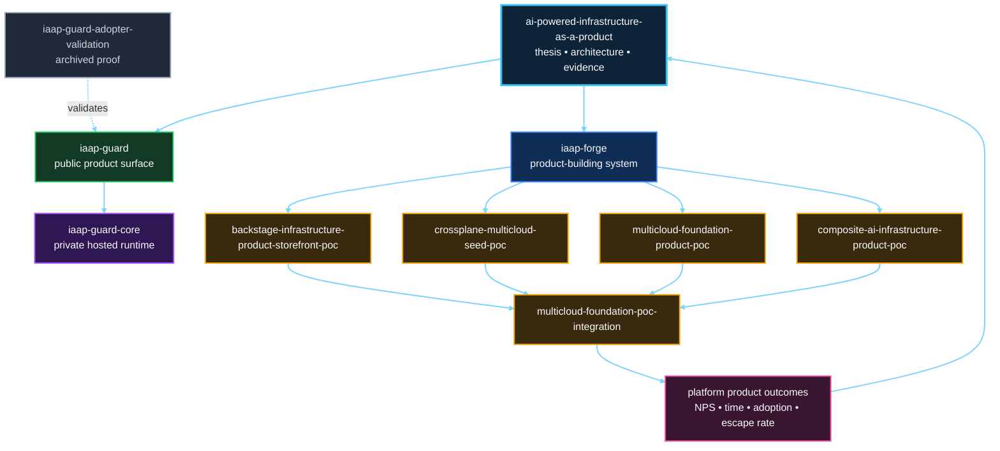
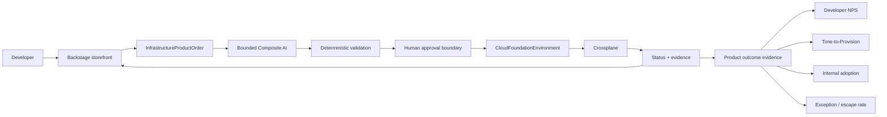

# POC Portfolio

The program separates responsibilities into bounded repositories so each architectural claim can be tested independently without turning the program hub into another implementation monolith.

> **IaaS is what we buy; infrastructure-as-a-product is what we build. Backstage is where developers shop.**

## Product repositories around the POCs

- [`iaap-guard`](https://github.com/SAABOLImpactVenture/iaap-guard) is the active public product, adoption, contract, support, security, and sanitized assurance surface.
- [`iaap-guard-core`](https://github.com/SAABOLImpactVenture/iaap-guard-core) is the protected private engine, hosted GitHub App runtime, deployment, internal test, and operational-evidence repository.
- [`iaap-forge`](https://github.com/SAABOLImpactVenture/iaap-forge) consumes bounded Guard evidence and owns the active product-building, Composite AI, GitHub governance, Crossplane lifecycle, and outcome system.
- [`iaap-guard-adopter-validation`](https://github.com/SAABOLImpactVenture/iaap-guard-adopter-validation) is archived clean-adopter proof, not an active runtime or supported distribution.
- [`ai-powered-infrastructure-as-a-product`](https://github.com/SAABOLImpactVenture/ai-powered-infrastructure-as-a-product) remains the public thesis, architecture, evidence, and portfolio front door.

## Responsibilities

### `backstage-infrastructure-product-storefront-poc`

Owns the optional reference **consumer experience** for infrastructure products: browse, configure, order, and track.

The storefront:

- presents curated product-level inputs;
- emits a narrow `InfrastructureProductOrder` artifact;
- can open a human-reviewable GitHub order path when publication is intentionally enabled with an authorized integration;
- hides Crossplane, ProviderConfig, cloud credentials, IAM JSON, Terraform/TFE, and composition internals; and
- never becomes the provisioning control plane.

Backstage is therefore a replaceable experience layer. A CLI, API, service portal, or conversational interface could submit the same product intent without changing the product-control-plane architecture.

The storefront repository now also carries a bounded runtime smoke that starts an actual Backstage backend, registers the reference template in the Software Catalog, and executes `fetch:template` plus `publish:github:pull-request` through Backstage's supported dry-run path. That runtime evidence deliberately provides no real GitHub write credential and creates no real order PR.

### `crossplane-multicloud-seed-poc`

Owns the minimal trusted Crossplane runtime. No product APIs, cloud credentials, production, consumer storefront, or TFE dependency.

### `multicloud-foundation-product-poc`

Owns the `CloudFoundationEnvironment` contract, provider-specific implementations, policy, examples, product status, and lifecycle experiments.

### `composite-ai-infrastructure-product-poc`

Owns bounded request, review, operations, and evidence-agent contracts and evaluations. No direct execution authority.

### `multicloud-foundation-poc-integration`

Owns pinned upstream integration, including the storefront handoff, clean-cluster acceptance, active network-policy proof, AI authority checks, simulated reconciliation, evidence, teardown, scorecard, cross-repository storefront/product contract compatibility, and workflow/bootstrap reproducibility checks.

The integrated consumer path is:

### Platform product outcomes

Product success is measured by developer outcomes in addition to engineering and runtime health. The minimum outcome set is Developer NPS, Order-to-Ready and Approval-to-Ready Time-to-Provision, Internal Adoption Rate, Repeat Consumption Rate, and Exception / Escape Rate.

Infrastructure code volume is an implementation activity metric, not a product-success metric. Terraform lines of code, number of modules, pipelines, pull requests, and tickets can help manage engineering work but do not prove that the platform is useful, fast, adopted, or preferred.

The detailed measurement and telemetry contract is defined in [Platform Product Outcomes](platform-product-outcomes.md).

### `ai-powered-infrastructure-as-a-product`

Owns the thesis, architecture, product operating model, decisions, frozen evidence baselines, portfolio boundaries, outcome measurement model, and investment framing. It intentionally does not duplicate runtime implementation code.

## Product-system mental model

| Layer | Reference implementation | Responsibility |
|---|---|---|
| Program | `ai-powered-infrastructure-as-a-product` | Thesis, architecture, evidence, decisions, roadmap framing. |
| Guard product | `iaap-guard` | Public product, contracts, adoption, support, security, and assurance. |
| Guard implementation | `iaap-guard-core` | Private deterministic engine, hosted runtime, deployment, and regression evidence. |
| Product builder | `iaap-forge` | Guard consumption, bounded Composite AI, governed proposals, Crossplane lifecycle, and outcomes. |
| Experience | `backstage-infrastructure-product-storefront-poc` | Browse, configure, order, track. |
| Intelligence | `composite-ai-infrastructure-product-poc` | Interpret, propose, review, explain, diagnose, evidence. |
| Governance | GitHub + deterministic policy + people | Change, tests, approval, traceability. |
| Product contract | `multicloud-foundation-product-poc` | Stable infrastructure-product API and lifecycle semantics. |
| Control plane | Crossplane | Reconciliation and product status. |
| Bootstrap | `crossplane-multicloud-seed-poc` | Minimal trusted runtime required for the control plane. |
| Acceptance | `multicloud-foundation-poc-integration` | End-to-end evidence across the bounded components. |
| Retained validation | `iaap-guard-adopter-validation` | Archived clean-adopter proof for Guard. |
| Outcomes | Cross-layer telemetry + developer feedback | Developer NPS, Time-to-Provision, adoption, repeat use, exceptions. |
| Realization | AWS / Azure / GCP | Cloud-native services and enforcement. |

## Evidence gates

1. **Credential-free control-plane integration** — passed and retained as v1.
2. **Storefront-to-product integration** — passed as historical v2.
3. **Storefront/product accepted-domain compatibility** — corrected and passed as historical v3 across Kubernetes 1.34/1.35/1.36 at 100/100.
4. **Workflow/bootstrap supply-chain reproducibility** — passed as historical v4 across Kubernetes 1.34/1.35/1.36 at 100/100, with immutable GitHub Action revisions, pinned Python, hash-locked CI dependencies, and publisher SHA-256 verification for Kind/kubectl/Helm.
5. **Backstage runtime smoke + repinned integration** — **passed as current v5**. An actual Backstage backend registered and dry-ran the reference template/action without a real GitHub write credential, and the resulting merged storefront revision was pinned into a fresh hardened Kubernetes 1.34/1.35/1.36 integration run that remained 100/100.
6. **Product live-cloud readiness corrections** — **passed** in integration run `31256619696` across Kubernetes 1.34/1.35/1.36 at 100/100. The product now enforces semantic RFC1918 CIDR validity/containment, platform-owned lifecycle policy, neutral observed-evidence-only TFE comparison inputs, and explicit expected admission-denial evidence.
7. **Platform product outcome instrumentation** — **current pre-live-cloud gate**. Establish correlation/timing events and product-outcome evidence contracts before live AWS. POC timing may be labeled `poc-observed`; Developer NPS, adoption, repeat use, and real exception behavior remain `not-observed` until an actual developer population exists.
8. **Live AWS sandbox** — first live-cloud gate after outcome instrumentation is present; use workload identity rather than static cloud credentials and capture Time-to-Provision evidence from the first live order.
9. **Live GCP sandbox** — after AWS is repeatable.
10. **Live model adapter** — same tool and authority boundary as the deterministic baseline.
11. **Residual TFE comparison** — observed evidence only for remaining justified use cases.
12. **Production pilot** — authorization, SLOs, recovery, support, lifecycle evidence, Developer NPS, adoption, and repeat-consumption evidence.

The v5 runtime proof is intentionally narrower than a production Backstage deployment: the GitHub publication action ran in dry-run mode, no browser/UI journey was executed, and the generated Backstage dependency graph is not claimed immutable across future runs.

See [POC Baseline Lineage](poc-baselines/README.md) for the frozen evidence history.

## Boundary principle

> **The storefront is where the consumer shops. The product API defines what is being bought. Crossplane controls the product lifecycle. The cloud realizes it. Success is measured by developer outcomes, not infrastructure code volume.**
