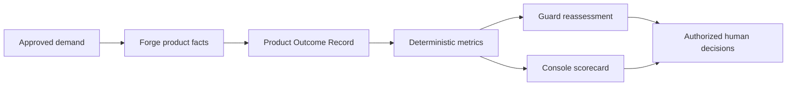

# IaaP Product Outcome Telemetry

Infrastructure-as-a-Product is not complete when infrastructure is merely provisioned. It must be measurable as a supported product.

This package defines the canonical, provider-neutral outcome contract used to observe whether an infrastructure product is fast, reusable, governed, reliable, auditable, supportable, economical, and usable.

## Purpose

The telemetry model creates one evidence boundary for executive and product-management outcomes without giving any component additional authority.

- **Forge emits product facts** from approved demand, deterministic policy, lifecycle, reconciliation, evidence, cost, and support observations.
- **Guard consumes immutable outcome evidence** for reassessment, materiality, planning, and human review. Guard does not rewrite Forge facts.
- **Console presents authorized views** of the same observations and calculated metrics. Console does not become the source of truth for product state.
- **Composite AI may explain trends and missing information** but cannot manufacture observations, change metric definitions, approve exceptions, or alter lifecycle state.

## Executive outcome domains

The canonical model supports eight outcome domains:

1. approved demand to Ready time;
2. product adoption and reuse;
3. policy rejection and exception rates;
4. failed reconciliation and recovery rates;
5. evidence completeness and audit traceability;
6. upgrade, teardown, and lifecycle success;
7. infrastructure-product cost-to-serve; and
8. consumer experience and support demand.

See [Metric Definitions](METRICS.md) for formulas and null behavior and [Producer and Consumer Boundaries](BOUNDARIES.md) for suite responsibilities.

## Integrity rules

1. **Observed facts are not estimates.** Missing observations remain absent or `null`.
2. **Empty denominators return `null`.** They never become zero and never imply success.
3. **Timestamps retain provenance.** Every lifecycle time must identify its source system or evidence reference.
4. **Costs identify scope and currency.** Estimated, allocated, and observed costs cannot be silently mixed.
5. **Support and experience samples identify their population and period.**
6. **Metric formulas are deterministic and versioned.** AI cannot redefine them at runtime.
7. **One product observation may have many evidence references, but one event has one authoritative source.**
8. **The record is evidence, not authorization.** A favorable score never approves a deployment, exception, or production use.

## Contract status

`IaaPProductOutcomeRecord v1alpha1` is an architecture and interoperability contract. It does not claim that every repository or customer environment currently emits every field. Capability gaps remain explicit in the record and in the instrumentation matrix.
