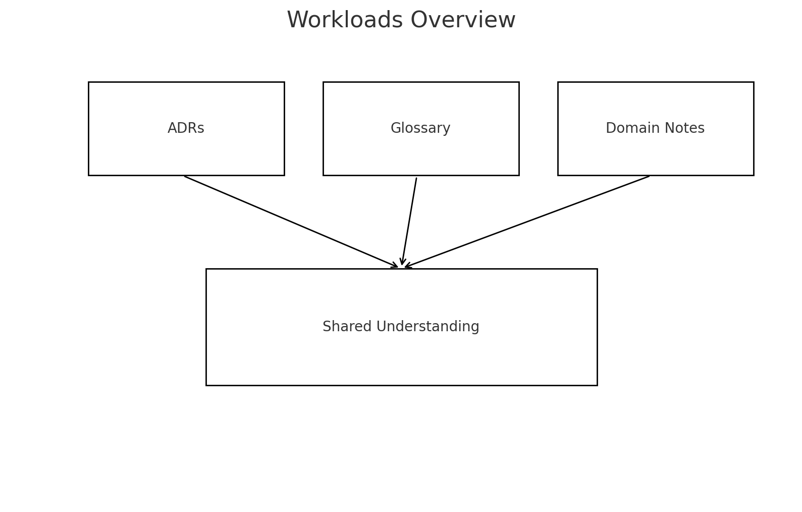

# Workloads

This folder captures decisions, glossaries, and reference notes for the IaaP approach.

- See `decisions/` for ADRs that anchor the architecture.
- `glossary.md` centralizes terms.
- `multiCLOUD/` and `iasip/` store focused references.

